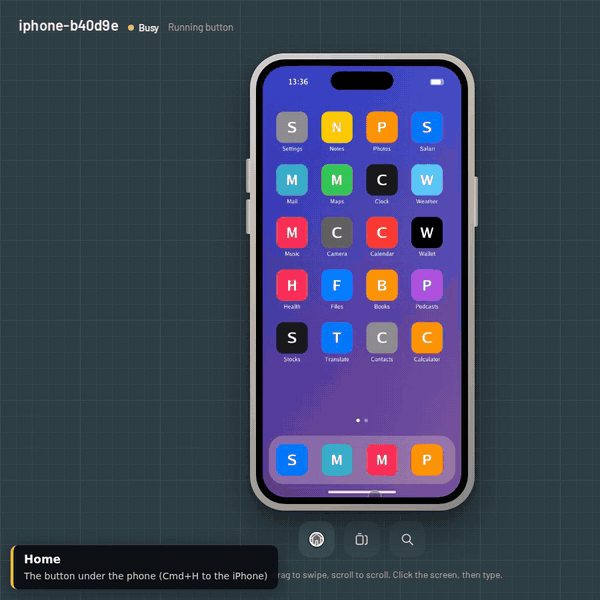

# iphone-hid

**Remote touch, keyboard and screen for real iPhones.** One small box per phone. People use it from
a browser; test frameworks use its HTTP API or the Python SDK.

[](docs/media/console-demo.mp4)

**Demo videos:** [the console through every state](docs/media/console-demo.mp4) (2 min: touch, typing, the
phone's buttons, a test script running, the cable unplugged, the phone asleep, the picture lost, a
second operator, the box going away) and [on a phone](docs/media/console-demo-mobile.mp4) (20 s).
Recorded against the simulated iPhone with `make demo`.

## What it does

- **Live screen** in the browser, cut to the phone, at the phone's frame rate.
- **Touch as it happens.** Click to tap, drag to swipe or move things, scroll with the wheel, hold for
  a long press. The box drives the iPhone's absolute pointer, so every touch lands where it was made.
- **Keyboard.** Type straight onto the phone, or paste text (printable ASCII).
- **Phone buttons.** Home, App Switcher, Search, volume, mute, play/pause, and wake.
- **Automation.** A REST API with an OpenAPI description, a WebSocket for live control, a Python SDK
  and the `ihc` command. Boxes announce themselves on the local network.
- **One file to install.** A 3.4 MB self-installing bundle for ARM64 boards.

## How it works


- **Touch and keys.** The board's USB-C port runs as a USB device: an absolute pointer whose range
  covers the whole screen, a keyboard, and media keys. iOS shows the pointer through AssistiveTouch.
  The box sends each report as soon as the input arrives. While a report waits for the iPhone to
  collect it, newer moves replace the waiting one, so the pointer follows the hand without a queue;
  presses and releases always keep their order.
- **Screen.** The iPhone mirrors its screen over HDMI into the board's HDMI input. The box cuts the
  phone out of each 1080p frame, encodes it as JPEG with libjpeg-turbo, and sends it to each viewer
  as soon as the viewer has drawn the previous one.
- **Software.** `ihcd`, one static Go binary: the API, the console, the USB gadget set-up and the
  video capture.

## Performance

| Path | Measured | Where |
|---|---|---|
| Touch on the box: from the input arriving to its report queued on the USB port | under 0.1 ms typical, 0.3 ms at worst | `ihcd`, simulated iPhone, development machine |
| The iPhone collecting a queued report | 2.6 ms | Orange Pi 5 Plus and iPhone 15, earlier box software |
| JPEG encoding of the phone screen (498 × 1080) | 3.0 ms per frame | development machine (x86-64); not yet measured on the board |

A scripted tap takes about 260 ms by design: the pointer settles for 80 ms after a jump, the press
lasts 80 ms, then the releases. The picture runs at the iPhone's mirror rate, up to 60 fps with the
box's 1080p60 EDID; the glass-to-glass video latency on the board is not measured yet. On each box,
the console's top bar shows the touch latency, the picture rate and age, and the network round trip,
live.

## Status

- **On a real iPhone:** the box's USB gadget and its absolute pointer were confirmed on an iPhone 15
  with the earlier box software (iOS version not recorded). `ihcd` sets up the same gadget; its run
  through the [hardware check](docs/guide/hardware-check.md) on a board is pending, and its results
  will be published in `docs/test-logs/`.
- **Everything else** (the console, the API, the SDK, the touch engine, the fault states) is tested
  against the simulated iPhone, in CI and in the demo videos.
- **Pre-release:** versions 0.x are pre-releases, not yet tested as a whole on real hardware; the
  API may still change before 1.0. Changes are listed in the [changelog](CHANGELOG.md).

## Limits

- One pointer: taps, drags, swipes, long presses and the wheel. No pinch or other multi-touch.
- Typing takes printable ASCII on the U.S. hardware keyboard layout; other text is refused, not
  mistyped.
- The AssistiveTouch pointer shows on the screen, and so in screenshots.
- Apps that protect their content (DRM video) show black over HDMI.
- The box works as a person with a mouse and keyboard would: it does not install apps, read logs or
  inspect the UI tree.

## Security

- Every call except `/api/health` needs the box's token, a random string in `/var/lib/ihc/token`
  that only the service can read. WebSockets and image URLs pass it as `?token=`.
- The box serves plain HTTP on port 8000 of every interface. Keep boxes on a network of their own,
  or serve HTTPS (`--tls-cert`, `--tls-key`) and bind one interface (`--addr`): see
  [install](docs/guide/install.md#network-and-security).
- Pages of other origins are refused, and so are host names the box does not know (DNS names need
  `--allow-host`).
- Whoever has the token drives the phone like a person holding it; with the phone's passcode off,
  guard the token like the phone. Report vulnerabilities as [SECURITY.md](SECURITY.md) says.

## What each box needs

| Part | Notes |
|---|---|
| Orange Pi 5 Plus and its 5 V / 4 A supply | Runs the box: USB device port, HDMI input, network |
| USB-C hub with HDMI, USB-A and a USB-C PD charging input | HDMI through DisplayPort Alt Mode, e.g. UGREEN Revodok 105 (15495) |
| USB-C charger, 30 W or more | Into the hub's PD input: powers the hub, charges the phone |
| HDMI cable | Hub to the board's HDMI IN |
| USB-A to USB-C cable (data) | Hub's USB-A to the board's Type-C USB 3 port |
| Ethernet | API and console |

Phones: iPhone 15 and later with USB-C, except iPhone 16e, iPhone 17e and iPhone Air, which have no
video output. Each box drives one phone; a lab runs one box per phone.


## Install

1. Download `ihc-box-<version>-linux-arm64.run` from the newest of the
   [releases](https://github.com/pravrilgreen/iphone-hid/releases) (0.x releases are pre-releases) and
   copy it to the board.
2. `sudo sh ihc-box-*-linux-arm64.run`. It installs `ihcd`, the USB gadget and the service, and
   starts them. The API token is in `/var/lib/ihc/token`.
3. Open `http://<board address>:8000`.

`ihcd doctor` examines the board and the box, part by part, and says how to fix each problem;
`sudo ihcd doctor --fix` fixes what it can (the installer runs it). The
[install guide](docs/guide/install.md) covers the board image, the HDMI input and troubleshooting.

## Set up the iPhone

Once per phone: AssistiveTouch on, the pointer never hidden, Auto-Lock set to Never, the wired
accessory allowed, the U.S. hardware keyboard layout, and the middle pointer button mapped to App
Switcher. Step by step: [iPhone setup](docs/guide/iphone-setup.md). The
[hardware check](docs/guide/hardware-check.md) tries every button on the real phone.

## Use it

**In the browser.** Hover moves the phone's pointer; click taps; drag swipes, scrolls lists or moves
icons; the wheel scrolls. Click the screen, then type: the keyboard goes to the phone, and
Cmd/Ctrl+V types the clipboard. The volume keys and the side button on the drawn phone press the
real ones; Home, App Switcher and Search sit under it. The guide button (top right) shows these
drawings in the console, and the box's own state on the wiring: a cable at fault blinks, with what
to check.



**From code.**

```python
from ihc import Farm

phone = Farm.discover().devices()[0]        # or Farm("http://box.local:8000", token="...")
phone.tap(0.5, 0.93)                         # fractions of the screen: (0, 0) top left
phone.swipe(0.5, 0.8, 0.5, 0.2)
phone.drag(0.2, 0.3, 0.7, 0.3)
phone.type("hello\n")
phone.home()
phone.screenshot("screen.png")
```

```sh
curl -H "Authorization: Bearer $TOKEN" -H "Content-Type: application/json" \
     -d '{"x": 0.5, "y": 0.93}' http://box.local:8000/api/devices/iphone-b40d9e/tap
```

`pip install "iphone-hid[discovery] @ git+https://github.com/pravrilgreen/iphone-hid"` installs the
SDK and the `ihc` command (it is not on PyPI). The API is described
at `/api/openapi.json` on every box and in the [API reference](docs/dev/api.md).

## Roadmap

| Stage | Status |
|---|---|
| Orange Pi 5 Plus box: touch, keyboard, buttons, screen, API, console | Software done and tested against the simulated iPhone; the absolute pointer confirmed on an iPhone 15; the hardware check of `ihcd` pending |
| Purpose-built box: the iPhone's USB-C straight into an LT7911D bridge, a CH32V305 USB controller, an RV1106 SoC running `ihcd` ([how it is wired](box/web/guide/box.svg)) | Schematic designed to pin level: [hardware/box-v1](hardware/box-v1/README.md) (KiCad 8, sheets, BOM, checks); the LT7911D pinout awaits the vendor datasheet. Study: [custom box](docs/research/custom-box.md) |

## Repository

| Path | What |
|---|---|
| `box/` | `ihcd`, the box software (Go): touch engine, USB gadget, video, API, console (`box/web`), simulated iPhone |
| `src/ihc/` | Python SDK and the `ihc` command |
| `packaging/` | systemd units, udev rules, installer, bundle header |
| `hardware/box-v1/` | The purpose-built box's schematic: netlist as code, KiCad 8 project, sheets, BOM, design checks |
| `scripts/` | bundle build and smoke test, diagrams, demo recording |
| `docs/` | guides, API, architecture, research ([index](docs/README.md)), demo videos (`docs/media`) |

## Development

```sh
make dev          # Python SDK in .venv with the test tools
make sim          # the box with a simulated iPhone on http://localhost:8000
make test         # gofmt, go vet, the Go tests, the SDK tests against a simulated box
make box          # dist/ihc-box-<version>-linux-arm64.run (Go, cmake, zig 0.13)
make check-box    # smoke-test the bundle (under qemu-aarch64 elsewhere)
make demo         # record docs/media/console-demo*.mp4 against a simulated box (pip install -e ".[demo]")
```

Changes are listed in the [changelog](CHANGELOG.md).

## License

[Apache License 2.0](LICENSE), for the software and the hardware design files alike. The box
binary also carries third-party components under their own licences: [box/THIRD_PARTY.md](box/THIRD_PARTY.md).
