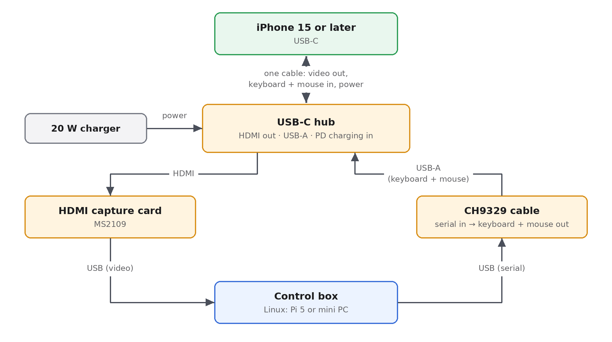
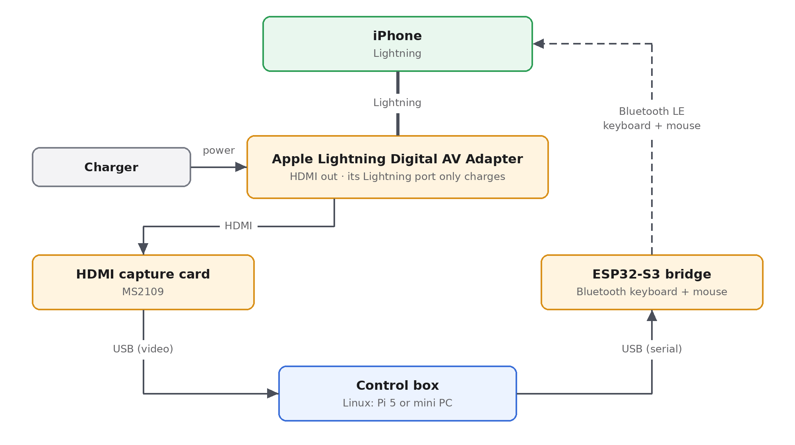

# iphone-hid

**Drive real iPhones from a test framework using only external hardware.** A small box watches each
iPhone's screen over HDMI and operates it through a plug-in keyboard and mouse. To the iPhone this is
just an external display and an ordinary keyboard and mouse:

- no jailbreak and no Developer Mode;
- no app installed on the phone;
- no Apple or third-party iPhone tooling on the host.

This project is the **iPhone control layer** of a larger automation framework. The framework asks for
things like "tap here", "swipe from here to there", "type this", "take a screenshot". The box handles the
hardware, the pointer and the accuracy, and exposes plain HTTP/WebSocket APIs plus a Python SDK. Boxes
announce themselves on the network, so a test runner finds them without configuration.

> **Status:** the software is complete and runs end to end on **simulated iPhones** (a detailed simulator
> of the chip, the pointer, the screen and the capture card). No hardware has been bought yet, so nothing
> has been verified on a real phone. Every simulated behaviour follows the chip maker's protocol document,
> documented iOS behaviour, or comparable open-source projects. Each assumption that still needs a real
> phone has a matching hardware test in the checklist (see [Roadmap](#roadmap)).

*The box's web console with four simulated iPhones: home screen, a tap-accuracy test app, Settings, and a
locked phone that the health check reports as "HID not connected".*

---

## How it works, end to end

1. **Seeing.** The iPhone mirrors its screen to HDMI. A cheap capture card turns that into a compressed
   (MJPEG) video stream, and the box forwards those frames to the browser or SDK as they are. Nothing is
   decoded and re-encoded, so one small box can serve several phones.
2. **Acting.** A HID chip plugged into the phone looks like a keyboard and a mouse. The box sends it short
   serial commands ("move the mouse by 24 units", "press Cmd+Space"), and the chip acknowledges every one.
3. **Pointing.** iOS shows a mouse pointer through the AssistiveTouch accessibility feature. The box never
   looks at the screen to find the pointer. It knows where the pointer is from a per-phone calibration
   (see [Tapping the right spot](#tapping-the-right-spot-without-looking)).

## How each iPhone is wired

**USB-C iPhones (iPhone 15 and later):** one hub carries video out and keyboard/mouse in.

**Lightning iPhones:** video through Apple's HDMI adapter, keyboard and mouse over Bluetooth.

### Why Lightning needs an ESP32, and USB-C does not

- **USB-C iPhones can do two things through one port at once:** send video out over HDMI and accept
  USB devices. A standard hub gives both, and the CH9329 (a cheap, ready-made "serial in, USB keyboard
  and mouse out" chip) plugs into the hub like any wired keyboard and mouse.
- **A Lightning iPhone has one port, and the video adapter needs it.** The adapter's second port only
  charges; it carries no data. There is nowhere left to plug a wired keyboard or mouse, so input has to
  arrive over **Bluetooth**.
- **The CH9329 has no Bluetooth.** The ESP32-S3 is a low-cost microcontroller with Bluetooth. Its firmware
  (in this repository) makes it a Bluetooth keyboard and mouse, and it speaks exactly the same serial
  protocol as the CH9329. The box software is the same for both kinds of phone.
- **Why not use Bluetooth for USB-C phones too?** Wired is better where it is possible: no pairing, no
  radio congestion when many phones sit side by side, lower and steadier latency, and over USB the phone
  can accept an absolute pointer, the most precise mode (next section).
- **The same ESP32-S3 can also replace the CH9329 on USB-C phones.** Its firmware has a USB mode that plugs
  into the hub like the CH9329, and it can time pointer movements on the chip itself, which removes the
  host's timing noise entirely (see [No lost commands](#no-lost-commands)). One board for both phone
  families is the long-term plan.

## Tapping the right spot without looking

The box does no image recognition. It must know where the pointer is at every moment, and it has two
ways to do that. Calibration picks the right one for each phone automatically.

- **Absolute pointer (preferred).** One report puts the pointer straight on the target, like a finger.
  About 0.2 s per tap with sub-point error. Several independent projects in 2026 drive iPhones this way over
  USB on iOS 26, with AssistiveTouch on; reports suggest Bluetooth works too. iOS glides the cursor to the new
  spot, so calibration measures how long to wait before clicking. What remains to verify on hardware is the
  CH9329's own absolute report; the ESP32-S3 in USB mode is the reference layout if it does not work.
- **Relative pointer (fallback).** iOS accelerates mouse movement, so
  the same report does not always move the same distance. The box makes movement repeatable anyway:
  1. **anchor:** slam the pointer into the nearest screen corner, where it stops at the edge, so its
     position is known exactly;
  2. **run:** move one axis at a time with same-size reports at a fixed pace, starting from rest, so a run
     of *n* reports always covers the same distance. Calibration measures that distance for every
     direction;
  3. **tap**, then start the next action from a corner again, so errors never add up.

### One-time calibration per phone, through Safari

The box opens a small web page in Safari on the phone (via Spotlight). The page reports exactly where
each click lands, numbers its events and sends a heartbeat, so the box can tell a click that missed from
one whose report is merely late. From click to click the box measures how far the pointer really travels,
and checks whether the phone follows absolute positioning. Calibration takes seconds in absolute mode and
under a minute in relative mode. It never clicks blindly: every move is sized so that even the fastest
possible pointer stays on the page, and a lost or late event stops the calibration instead of letting it
click on. The result is validated with taps from the centre outwards and refused if any lands more than
3 pt off. Redo it only if the phone's Tracking Speed setting changes.

## No lost commands

- **Every command is acknowledged by the chip.** No acknowledgement means the box knows at once; it never
  "sends and hopes".
- **State reports** (keys, buttons, absolute position) are simply resent after an ambiguous failure.
- **Movement reports** may or may not have been applied, so the box does not guess: it redoes the whole
  move from a fresh corner.
- **Pacing is checked.** With the CH9329, the box times each report on a fixed schedule and verifies
  afterwards that none went out more than 1.5 ms off its slot. A stray report means the move is redone.
  With the ESP32 bridge, the chip times whole runs itself, so a busy host cannot disturb the pointer at
  all. Over Bluetooth the pace is also matched to the link's schedule (below).
- **Nothing stays pressed.** Any action that fails half-way releases every key and button, on both the
  relative and the absolute pointer, before anything else happens. If the release itself cannot be
  confirmed, the next move releases first.
- **Health is watched continuously:** chip reachable, phone accepting input (a locked phone or an accessory
  prompt shows up here), video frames arriving, fresh and not black. A replugged chip is reopened
  automatically.

### Why timing matters so much in relative mode

iOS accelerates the pointer by speed, so a report that arrives a few milliseconds late moves the pointer
a different distance. On the left, a host that sometimes stalls: without the pace check some taps miss by
more than 10 pt; with it, the stray moves are redone and every tap lands; with the ESP32 bridge timing the
runs, nothing needs redoing. On the right, a Bluetooth link that delivers reports every 15 ms: a 20 ms
pace makes the spacing iOS sees alternate between 15 and 30 ms and taps miss by up to 30 pt, while a
30 ms pace (a multiple of the link's schedule, which the bridge reports and calibration uses) lands
within 1 pt.

## Accuracy on the simulator

Measured by the simulator (random targets across the whole screen, four configurations):

| Mode | Worst tap error | Time per tap (median) | Calibration time |
|---|---|---|---|
| Absolute pointer | 0.17 pt | 0.18 s | about 8 s |
| Relative, slow Tracking Speed (0.4) | 0.5 pt | 1.49 s | about 52 s |
| Relative, default Tracking Speed (1.0) | 0.83 pt | 1.28 s | about 48 s |
| Relative, fast Tracking Speed (2.5) | 0.72 pt | 1.22 s | about 48 s |

The target is 95% of taps within 4 pt (about 5 pixels on a 1080p capture). On a real phone, relative mode
is the one to watch: its accuracy depends on how repeatable iOS pointer acceleration is, which only the
hardware tests can tell.

### The simulator

Everything above runs today without hardware. The simulator plays each part of a real rig:

- **the HID chip:** byte-exact protocol replies, timing on a 9600-baud serial line, fault injection (lost,
  late or corrupted replies, unplugged cable, locked phone);
- **the ESP32 bridge:** the same protocol plus runs timed on the chip;
- **the iPhone:** home screen, Settings, Spotlight, the app switcher, a tap-accuracy test app and Safari with
  the calibration page, with an accelerated pointer, an optional absolute pointer, and lock and signal loss;
- **the capture card:** letterboxed HDMI frames, limited colour range, capture latency and JPEG artifacts.

### How this compares with what is on the market

Every iPhone automation product that needs no jailbreak and no app does the same thing at its core: a USB or
Bluetooth keyboard and mouse driving AssistiveTouch. The cheap Chinese "phone farm" boxes use one HID board per
phone like this project, calibrate the pointer with a web page on the phone, and take video over AirPlay
instead of HDMI. Touch-screen (digitizer) emulation stopped working in iOS 13.4, so nobody relies on it. Details,
with sources: [absolute pointer research](docs/research/absolute-pointer.md) and
[market survey](docs/research/china-market.md).

## Using it

**Plug and play.** The box is meant to be a closed appliance:

1. Cable each phone (hub, capture card, HID chip) to the box. The box pairs each HID chip with the capture
   card on the same USB hub and names the rig after its USB port, so names survive reboots and replugging.
2. Power it on. The service starts by itself, finds the rigs, and re-scans when something is plugged in or
   out.
3. It announces itself on the local network (mDNS / DNS-SD). Test runners discover every box without
   configuration.
4. Calibrate each phone once, from the console or through the API.

**From a test framework** (HTTP/WebSocket API or the Python SDK). Coordinates are fractions of the phone
screen (0 to 1), so they do not depend on the capture resolution or the phone model:

| Group | Actions |
|---|---|
| Touch | tap, long press, swipe or drag, scroll |
| Keys | type text, key combos (Cmd+Space...), Home, App Switcher, media keys, open a URL |
| Screen | screenshot (cropped to the phone), live MJPEG stream, frames over WebSocket |
| State | per-phone status: ready, busy, locked or not accepting input, no video, offline |
| Farm | list boxes and phones; the SDK treats several boxes as one farm |
| Live control | a WebSocket that forwards a remote mouse and keyboard with no planning (KVM style) |

The API describes itself (OpenAPI), and a command-line tool covers the same actions for scripts.

**For an operator** the web console shows every phone live. Opening one gives two modes: *Precise tap*
(clicking on the picture taps that exact spot, dragging swipes) and *Live control* (the operator's mouse
and keyboard go straight to the phone). Home, App Switcher, Spotlight, typing and calibration are one
click away.

## What each iPhone needs

| Part | USB-C phones | Lightning phones | Notes |
|---|---|---|---|
| USB-C hub with HDMI + USB-A + PD charging | ✔ | | try 2–3 models; Apple's USB-C Digital AV Multiport Adapter is the reference |
| CH9329 cable (CH9329 + CH340, USB-A on both ends) | ✔ | | ready to use, no soldering |
| Apple Lightning Digital AV Adapter | | ✔ | genuine Apple only |
| ESP32-S3 DevKit | optional | ✔ | firmware in this repository (Bluetooth or USB mode) |
| HDMI-to-USB capture card (MS2109 chip) | ✔ | ✔ | the kind that outputs MJPEG |
| USB-C PD charger, 20 W or more | ✔ | ✔ | |
| Linux box | | | Raspberry Pi 5 for 1–2 phones; an x86 mini PC with extra USB controllers for more |

- **iPhone 16e and 17e cannot output video over USB-C**, so they cannot be used this way.
- Each iPhone needs a one-time manual setup: AssistiveTouch on, mouse buttons mapped to Home and App
  Switcher, auto-lock off, and so on. See the [iPhone setup guide](docs/iphone-setup.md).
- The limit on phones per box is **USB bandwidth for the capture cards** (about one MS2109 per USB 2 bus),
  not the control side.

## Performance targets

| Metric | Target | On the simulator |
|---|---|---|
| Tap accuracy | 95% within 4 pt | absolute ≤ 0.2 pt; relative ≤ 1 pt |
| Time per tap | < 1.5 s | absolute ≈ 0.2 s; relative 1.2–1.5 s |
| Video latency to the browser (LAN) | < 0.25 s | to be measured on hardware |
| Commands lost without notice | 0 | every command acknowledged; failures are redone or reported |

## Roadmap

| Phase | Scope | Status |
|---|---|---|
| 0. Hardware checks | tools to probe the chip, capture cards and pointer; an 11-step test checklist | 🟢 tools ready, waiting for hardware |
| 1. HID control | chip driver, acknowledged commands, config and baud tools | 🟢 done on the simulator |
| 1b. ESP32 bridge | Bluetooth or USB keyboard + mouse, CH9329-compatible, chip-timed runs | 🟢 builds and passes host tests, not yet flashed |
| 2. Precise pointer | absolute and relative modes, Safari calibration | 🟢 done on the simulator |
| 3. API, SDK, console | live view, precise tap, live control, Python SDK, CLI | 🟢 done on the simulator |
| 4. Appliance | auto-discovery of rigs, hot-plug, mDNS, health, service files | 🟢 done on the simulator |
| 5. One board per phone | control and capture on a small board per iPhone | ⚪ research |

🟢 done · 🟡 in progress · ⚪ not started.

## Limits

- It cannot get past a passcode or Face ID, install apps, or read system data. Phones must be unlocked.
- Copy-protected content (Netflix and similar) shows as black on HDMI.
- Automating third-party services may break their terms of use.

## Documentation

The detailed documents are in Vietnamese, except the two research reports.

- [Getting started](docs/getting-started.md): the simulator first, then real hardware
- [Architecture](docs/architecture.md)
- [Feasibility study](docs/feasibility.md): independent research with sources and risks
- [Research: absolute pointer on iPhone](docs/research/absolute-pointer.md) and
  [market survey of cheap iPhone-control hardware](docs/research/china-market.md) (English)
- [Hardware test checklist](docs/phase0-checklist.md)
- [iPhone setup](docs/iphone-setup.md)
- [CH9329 protocol notes](docs/ch9329-protocol.md)
- [Simulator](docs/simulator.md)
- [ESP32 bridge firmware](firmware/esp32_ble_hid/README.md)
