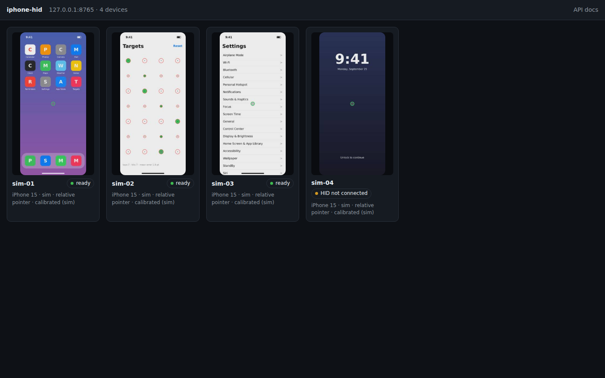
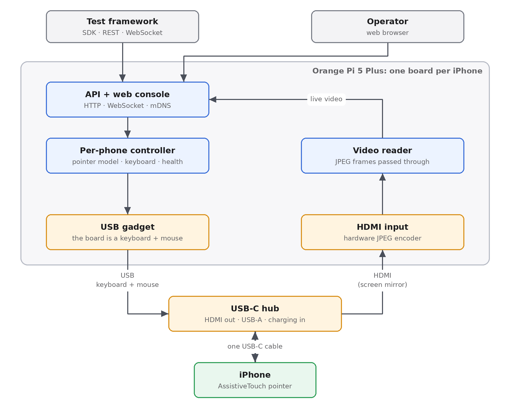
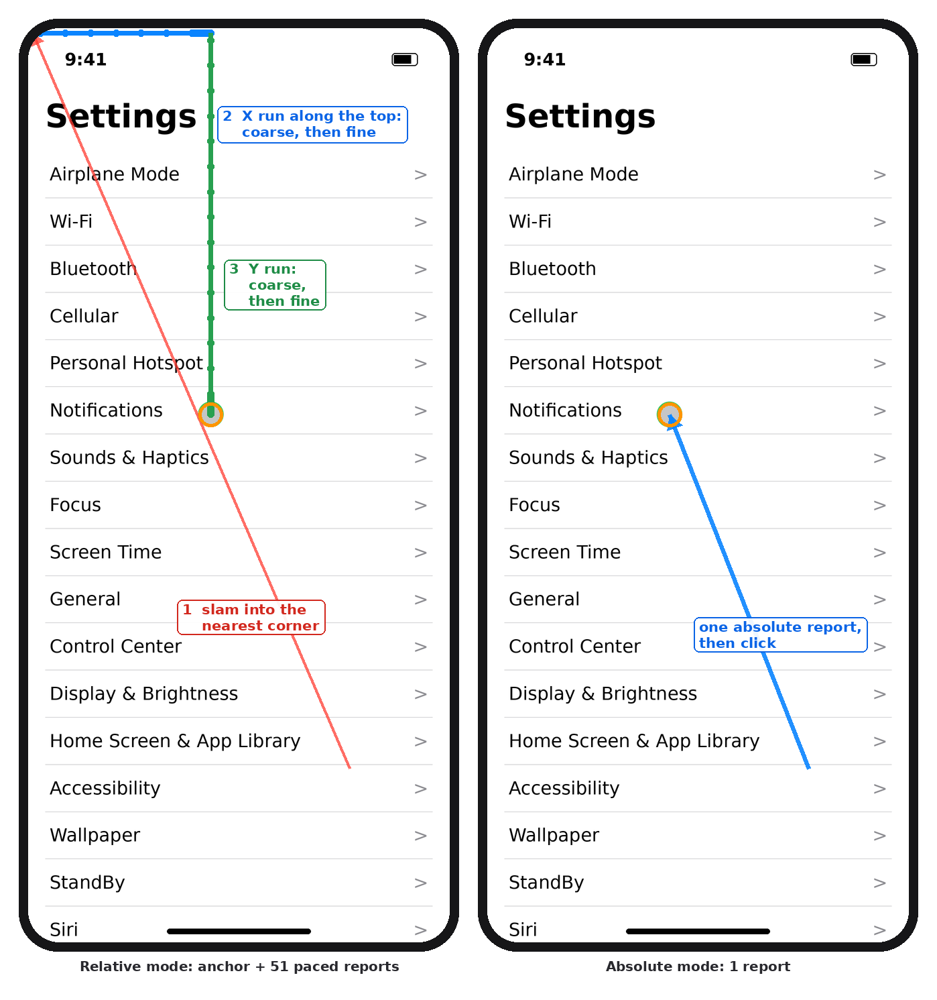
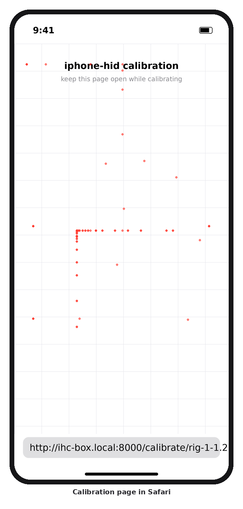
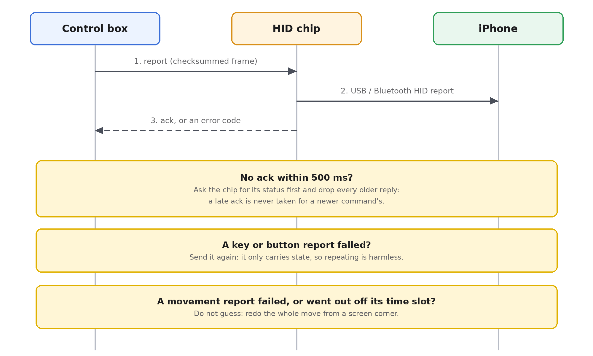
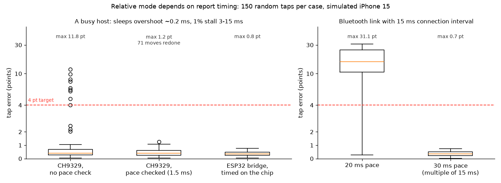
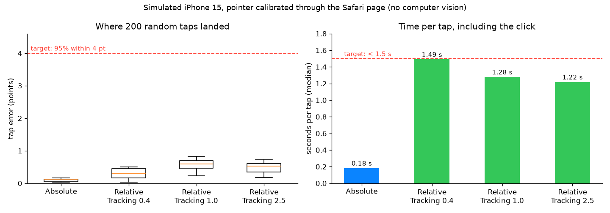
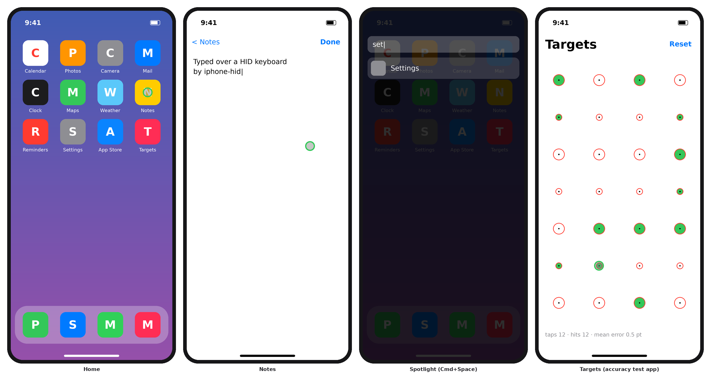
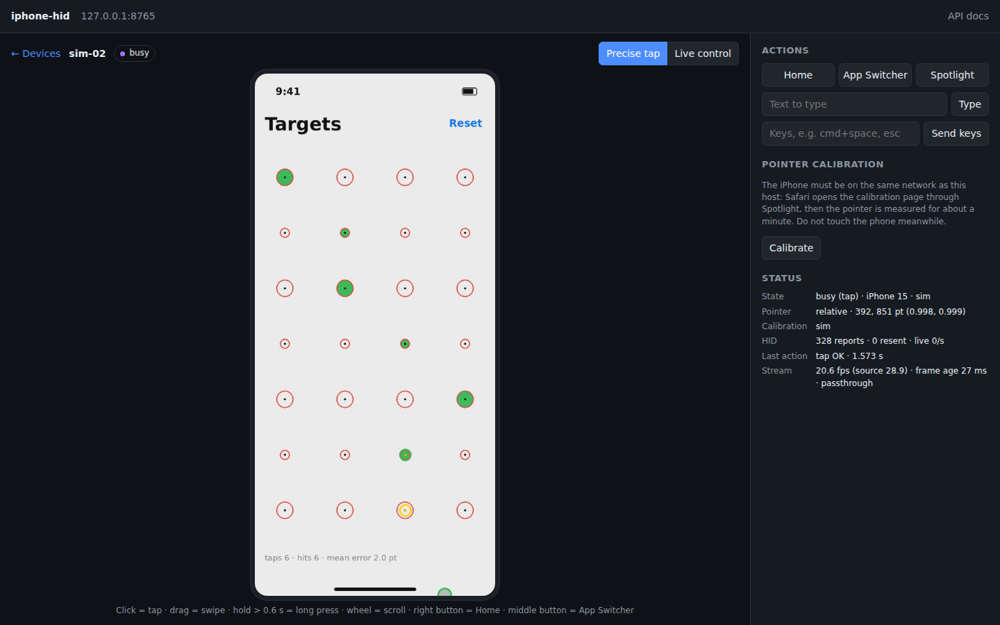

# iphone-hid

**Drive real iPhones from a test framework using only external hardware.** One small board per iPhone,
an **Orange Pi 5 Plus**, watches the phone's screen through its own HDMI input and operates the phone
as a plug-in keyboard and mouse. To the iPhone this is just an external display and an ordinary
keyboard and mouse:

- no jailbreak and no Developer Mode;
- no app installed on the phone;
- no Apple or third-party iPhone tooling on the board.

This project is the **iPhone control layer** of a larger automation framework. The framework asks for
things like "tap here", "swipe from here to there", "type this" and "take a screenshot". The board
handles the hardware, the pointer and the accuracy, and exposes plain HTTP/WebSocket APIs plus a
Python SDK. Boards announce themselves on the network, so a test runner finds them without
configuration.

> **Status:** the software is complete and runs end to end on **simulated iPhones**: a detailed
> simulator of the keyboard/mouse hardware, the pointer, the screen and the video input. The Orange Pi
> 5 Plus box is being tested on real hardware now. Two things only that board can answer: whether its
> USB-C port works as a keyboard and mouse, and how fast its HDMI input is. Every simulated behaviour
> follows a protocol document, documented iOS behaviour or comparable open-source projects. Each
> assumption that still needs a real phone has a matching hardware test (see [Roadmap](#roadmap)).

*The web console with four simulated iPhones: home screen, a tap-accuracy test app, Settings, and a
locked phone that the health check reports as "HID not connected".*

---

## How it works, end to end

1. **Seeing.** The iPhone mirrors its screen over HDMI into the board's **HDMI input**. The board's
   hardware encoder turns each frame into a JPEG image, and the box forwards those images to the
   browser or SDK as they are, with no second encoding.
2. **Acting.** The board's USB-C port runs as a **USB device**: to the iPhone, the board *is* a wired
   keyboard and mouse. There is no extra chip in between. Every report counts as done only once the
   iPhone has actually picked it up.
3. **Pointing.** iOS shows a mouse pointer through the AssistiveTouch accessibility feature. The box
   never looks at the screen to find the pointer. It knows where the pointer is from a per-phone
   calibration (see [Tapping the right spot](#tapping-the-right-spot-without-looking)).

## How each iPhone is wired

- **One cable to the phone.** A USB-C hub gives the iPhone an HDMI output and a USB-A port, and
  charges it at the same time.
- **Two cables to the board.** HDMI goes into the port marked HDMI IN. The hub's USB-A port goes
  into the board's Type-C USB 3 port (not its power port) with a USB-A to USB-C cable. The USB-A end
  tells the board which side is the host.
- **Power and network.** The board has its own supply, and Ethernet carries the API and the console.

### Why USB-C iPhones only

- **A USB-C iPhone does both things through one port at once:** it sends video out and accepts a
  wired keyboard and mouse. A standard hub splits them.
- **A Lightning iPhone cannot.** Its HDMI adapter takes the only port, and the adapter's second port
  only charges. Lightning phones are therefore not supported.
- **iPhone 16e and 17e** have USB-C but no video output, so they cannot be used either.

### If the board's USB-C port cannot act as a keyboard

A board image may lock the port into host mode. The box still works: a **CH9329 cable** (a ready-made
"serial in, USB keyboard and mouse out" adapter, a few dollars) goes between a USB-A port of the board
and the hub, and the software drives it the same way. The same cable, with a USB capture card, also
turns any Linux computer into a box.

## Tapping the right spot without looking

The box does no image recognition. It must know where the pointer is at every moment, and it has two
ways to do that. Calibration picks the right one for each phone automatically.

- **Absolute pointer (preferred).** One report puts the pointer straight on the target, like a finger.
  About a quarter of a second per tap, with sub-point error. Several independent projects in 2026 drive iPhones this way
  over USB on iOS 26, with AssistiveTouch on. The board presents the same kind of absolute pointer they
  use. iOS glides the cursor to the new spot, so calibration measures how long to wait before clicking.
- **Relative pointer (fallback).** iOS accelerates mouse movement, so the same report does not always
  move the same distance. The box makes movement repeatable anyway:
  1. **anchor:** slam the pointer into the nearest screen corner, where it stops at the edge, so its
     position is known exactly;
  2. **run:** move one axis at a time with same-size reports at a fixed pace, starting from rest, so a
     run of *n* reports always covers the same distance. Calibration measures that distance for every
     direction;
  3. **tap**, then start the next action from a corner again, so errors never add up.

### One-time calibration per phone, through Safari

The box opens a small web page in Safari on the phone (through Spotlight). The page reports exactly
where each click lands, numbers its events and sends a heartbeat, so the box can tell a click that
missed from one whose report is merely late.

- From click to click, the box measures how far the pointer really travels, and checks whether the
  phone follows absolute positioning.
- It takes seconds in absolute mode and under a minute in relative mode.
- It never clicks blindly. Every move is sized so that even the fastest possible pointer stays on the
  page. A lost or late event stops the calibration instead of letting it click on.
- The result is checked with taps from the centre outwards, and refused if any lands more than 3 pt
  off.

Redo it only if the phone's Tracking Speed setting changes.

**Without Safari.** When `ihc-hidtest --gadget abstest` puts the pointer in the four corners, the phone
follows the absolute pointer: pick **Absolute** under Pointer in the console (or start the server with
`--pointer absolute`, or `IHC_POINTER=absolute` in `/etc/default/ihc`). Taps land at once, with the
whole report range spread over the whole screen, and no calibration page is needed.

## No lost commands

- **Every report is confirmed.** On the board, a report counts as delivered only once the iPhone has
  polled it off the USB port. The box never "sends and hopes". (A CH9329 confirms that it received
  each command.)
- **A phone that stops taking input shows up at once:** locked, unplugged, or waiting for "Allow
  accessory". The action fails with a clear reason instead of hanging.
- **State reports** (keys, buttons, absolute position) are simply resent after an ambiguous failure.
- **Movement reports** may or may not have been applied, so the box does not guess: it redoes the
  whole move from a fresh corner.
- **Pacing is checked.** In relative mode, the box sends reports on a fixed schedule, then verifies
  that none went out more than 1.5 ms off its slot. A stray report means the move is redone.
- **Nothing stays pressed.** Any action that fails half-way releases every key and button, on both
  the relative and the absolute pointer, before anything else happens. If the release itself cannot
  be confirmed, the next move releases first.
- **Health is watched continuously:** keyboard/mouse reachable, phone taking input, video frames
  arriving, fresh and not black. The video pipeline restarts by itself when the HDMI signal comes
  back.

### Why timing matters so much in relative mode

iOS accelerates the pointer by speed, so a report that goes out a few milliseconds late moves the
pointer a different distance. Here a busy host sometimes stalls. Without the pace check, some taps
miss by more than 10 pt. With it, the stray moves are redone and every tap lands within about 1 pt.
The absolute pointer is immune to this, which is one more reason to prefer it.

## Accuracy on the simulator

Measured by the simulator (random targets across the whole screen, four configurations):

| Mode | Worst tap error | Time per tap (median) | Calibration time |
|---|---|---|---|
| Absolute pointer | 0.17 pt | 0.24 s | about 9 s |
| Relative, slow Tracking Speed (0.4) | 0.5 pt | 1.49 s | about 52 s |
| Relative, default Tracking Speed (1.0) | 0.83 pt | 1.28 s | about 48 s |
| Relative, fast Tracking Speed (2.5) | 0.72 pt | 1.32 s | about 48 s |

The target is 95% of taps within 4 pt (about 5 pixels on a 1080p picture). On a real phone, relative
mode is the one to watch: its accuracy depends on how repeatable iOS pointer acceleration is, which
only the hardware tests can tell.

### The simulator

Everything above runs today without hardware. The simulator plays each part:

- **the keyboard and mouse hardware:** acknowledged reports, a 9600-baud serial line, and fault
  injection (lost, late or corrupted replies, unplugged cable, locked phone);
- **the iPhone:** home screen, Settings, Spotlight, the app switcher, a tap-accuracy test app, and
  Safari with the calibration page; an accelerated pointer, an optional absolute pointer, lock and
  signal loss;
- **the video input:** letterboxed HDMI frames, limited colour range, latency and JPEG artifacts.

The board's own USB device side and its HDMI pipeline are tested against stand-ins for the kernel
interface and the video encoder.

### How this compares with what is on the market

Every iPhone automation product that needs no jailbreak and no app does the same thing at its core:
a wired or wireless keyboard and mouse driving AssistiveTouch.

- The cheap Chinese "phone farm" boxes use one HID board per phone, like this project. They calibrate
  the pointer with a web page on the phone, and take video over AirPlay instead of HDMI.
- Touch-screen (digitizer) emulation stopped working in iOS 13.4, so nobody relies on it.
- Single-phone KVM sticks, such as Sipeed's NanoKVM-Go, follow the same idea as this box: one small
  board, one cable to the phone.

Details, with sources: [absolute pointer research](docs/research/absolute-pointer.md) and
[market survey](docs/research/china-market.md).

## Using it

**Plug and play.** The box is meant to be a closed appliance:

1. Install the software on the board once: copy the single file from the
   [latest release](https://github.com/pravrilgreen/iphone-hid/releases/latest) to the board and run
   it. It carries its own Python and libraries and reads the HDMI input by itself, so the board needs
   no internet. From then on, at every boot, the board makes itself the phone's keyboard and mouse and
   starts the service.
2. Cable the phone as above. The service finds the USB port and the HDMI input by itself. The phone
   gets a farm-wide unique name from the board's serial number, such as `iphone-b40d9e`, or a name
   you choose.
3. The board announces itself on the local network (mDNS / DNS-SD). Test runners discover every box
   without configuration.
4. Calibrate the phone once, from the console or through the API.

**Access.** Installing the box creates a random API token, and every call needs it. The SDK and CLI
read it from `IHC_TOKEN`; the console asks for it once. The server also refuses requests from other
web sites and unknown host names. The calibration page on the phone uses a one-time key of its own.
So a device on the same network cannot drive the phone or feed fake clicks into a calibration.

**From a test framework** (HTTP/WebSocket API or the Python SDK). Coordinates are fractions of the
phone screen (0 to 1), so they do not depend on the video resolution or the phone model:

| Group | Actions |
|---|---|
| Touch | tap, long press, swipe or drag, scroll |
| Keys | type text, key combos (Cmd+Space...), Home, App Switcher, media keys, open a URL |
| Screen | screenshot (cropped to the phone), live MJPEG stream, frames over WebSocket |
| State | per-phone status: ready, busy, locked or not taking input, no video, offline |
| Farm | list boxes and phones; the SDK treats many boxes as one farm |
| Live control | a WebSocket that forwards a remote mouse and keyboard with no planning (KVM style) |

The API describes itself (OpenAPI), and a command-line tool covers the same actions for scripts.

**For an operator**, the web console shows every phone live. Opening one gives two modes:

- *Precise tap*: clicking on the picture taps that exact spot, and dragging swipes.
- *Live control*: the operator's mouse and keyboard go straight to the phone.

Home, App Switcher, Spotlight, typing and calibration are one click away.

## What each box needs

| Part | Notes |
|---|---|
| Orange Pi 5 Plus (v2.x is fine) + its 5 V / 4 A supply | The whole box: server, keyboard/mouse, video input |
| USB-C hub with HDMI + USB-A + USB-C PD charging input | HDMI through DisplayPort Alt Mode (not DisplayLink). Example: UGREEN Revodok 105 (15495) |
| USB-C charger, 30 W or more | Into the hub's PD input; charges the phone |
| HDMI cable | Hub → board HDMI IN |
| USB-A to USB-C cable (data, not charge-only) | Hub USB-A → board Type-C USB 3 port |
| Ethernet | API and console |
| *Only if the board's port cannot act as a keyboard:* CH9329 cable | Board USB-A → hub USB-A |

- Supported phones: **iPhone 15 and later with USB-C**, except iPhone 16e and 17e (no video output).
- Each iPhone needs a one-time manual setup: AssistiveTouch on, mouse buttons mapped to Home and App
  Switcher, auto-lock off, and so on. See the [iPhone setup guide](docs/iphone-setup.md).
- One board serves one phone. A farm is many boxes, and the SDK drives them as one.

## Performance targets

| Metric | Target | On the simulator |
|---|---|---|
| Tap accuracy | 95% within 4 pt | absolute ≤ 0.2 pt; relative ≤ 1 pt |
| Time per tap | < 1.5 s | absolute ≈ 0.25 s; relative 1.3–1.5 s |
| Video latency to the browser (LAN) | < 0.25 s | to be measured on the board |
| Commands lost without notice | 0 | every report confirmed; failures are redone or reported |

## Roadmap

| Phase | Scope | Status |
|---|---|---|
| 0. Hardware checks | tools to probe the board's USB port, HDMI input and the pointer; a step-by-step test plan | 🟡 in progress on the Orange Pi 5 Plus |
| 1. Keyboard and mouse | the board as a USB keyboard + mouse, confirmed reports; CH9329 cable as fallback | 🟢 done on the simulator |
| 2. Precise pointer | absolute and relative modes, Safari calibration | 🟢 done on the simulator |
| 3. API, SDK, console | live view, precise tap, live control, Python SDK, CLI | 🟢 done on the simulator |
| 4. Appliance | set-up at boot, auto-discovery, hot-plug, mDNS, health, service files | 🟢 done on the simulator |
| 5. All-in-one board | HDMI input with hardware JPEG encoding, one board per iPhone | 🟡 software done, hardware test running |

🟢 done · 🟡 in progress · ⚪ not started.

## Limits

- It cannot get past a passcode or Face ID, install apps, or read system data. Phones must be
  unlocked.
- Copy-protected content (Netflix and similar) shows as black on HDMI.
- Automating third-party services may break their terms of use.

## Documentation

The detailed documents are in Vietnamese, except the box guide and the two research reports.

- [Quick test: mouse and video on the board](docs/quick-test.md): the first checks, nothing
  installed: the iPhone takes the board's mouse, then the board captures the iPhone's screen
- [The all-in-one box: Orange Pi 5 Plus](docs/gadget.md) (English): parts, wiring, checks,
  troubleshooting
- [Getting started](docs/getting-started.md): the simulator first, then real hardware
- [Architecture](docs/architecture.md)
- [Feasibility study](docs/feasibility.md): independent research with sources and risks
- [Research: absolute pointer on iPhone](docs/research/absolute-pointer.md) and
  [market survey of cheap iPhone-control hardware](docs/research/china-market.md) (English)
- [Hardware test checklist](docs/phase0-checklist.md)
- [iPhone setup](docs/iphone-setup.md)
- [CH9329 protocol notes](docs/ch9329-protocol.md) (the fallback cable)
- [Simulator](docs/simulator.md)
