# Install a box: Orange Pi 5 Plus

One Orange Pi 5 Plus per iPhone. It is the iPhone's touch pointer and keyboard through its USB-C
port, it reads the iPhone's screen from its HDMI input, and it serves the API and the console.

The steps, in order: [prepare the board](#prepare-the-board), [wire it](#wiring),
[install the box software](#install-the-box-software), turn on the
[HDMI input](#the-hdmi-input) if doctor asks for it, then [check it](#check-it).

## Parts

| Part | Notes |
|---|---|
| Orange Pi 5 Plus (v2.x is fine) | Any memory size. With its own 5 V / 4 A USB-C supply |
| microSD card, 16 GB or more | For the board's system (or its eMMC module) |
| iPhone 15 or later with USB-C | Not 16e or 17e: they have no video output |
| USB-C hub: HDMI, USB-A, USB-C PD input | HDMI through DisplayPort Alt Mode. Example: UGREEN Revodok 105 (15495) |
| USB-C charger, 30 W or more | Into the hub's PD input: powers the hub, charges the phone |
| HDMI cable | Hub to the board's **HDMI IN** |
| USB-A to USB-C cable, with data | Hub's USB-A to the board's **Type-C USB 3.0/DP** port |
| Ethernet cable | API and console |

## Prepare the board

1. **Download an image** for the Orange Pi 5 Plus, with the vendor kernel (Linux 6.1):
   - Orange Pi's own Ubuntu or Debian server image (orangepi.org, Orange Pi 5 Plus, Official
     Images), or
   - Armbian for the Orange Pi 5 Plus, a "vendor" kernel build.

   A desktop image works too; the box needs no display on the board.
2. **Write it to the microSD card** from a computer, with balenaEtcher or Raspberry Pi Imager
   ("Use custom"). Unpack it first if it came as a `.7z` or `.zip`.
3. **First boot:** the card into the board, Ethernet to the network, then the board's power supply.
   Give it a minute.
4. **Find its address** in the router's list of clients (or, with a monitor and a keyboard on the
   board, `hostname -I`).
5. **Log in** over SSH: `ssh orangepi@<address>` (password `orangepi`) on Orange Pi's image;
   `ssh root@<address>` (password `1234`) on Armbian, which then asks for a user of your own.
   Change the default password (`passwd`).

## Wiring

1. Charger into the hub's USB-C PD input.
2. Hub HDMI into the board's port labelled **HDMI IN** (the two other HDMI ports are outputs).
3. Hub USB-A, through the USB-A to USB-C cable, into the board's **Type-C port next to the USB 3
   ports**. The power port is on the other edge.
4. Hub to the iPhone. Unlock the phone and answer **Allow** if iOS asks about the accessory.
5. Board power last.



The USB-A end of the cable in step 3 tells the board that the other side is the host, so its port
becomes a device. With a USB-C to USB-C cable the board may take the host role itself.

## Install the box software

Download `ihc-box-<version>-linux-arm64.run` from the
[releases page](https://github.com/pravrilgreen/iphone-hid/releases) (versions 0.x are
pre-releases, listed there but not as "latest"), copy it to the board (`scp`), then:

```sh
sudo sh ihc-box-*-linux-arm64.run
```

It installs `/opt/ihc/bin/ihcd` (also on the path as `ihcd`), the udev rules, an API token in
`/var/lib/ihc/token`, and two services:

- `ihcd-gadget` makes the board's USB-C port the iPhone's touch pointer and keyboard at boot;
- `ihcd` serves the console and the API on port 8000.

Updating is the same command with the newer file; the token stays. Going back to an older version
is the same command with the older file. An earlier box version (the services `ihc` and
`ihc-gadget`) is replaced.

For a farm, give every box the same token at install, so one token opens every console and the SDK
needs one setting: `sudo IHC_TOKEN=<token> sh ihc-box-*-linux-arm64.run` (at least 20 random
characters, e.g. from `head -c 18 /dev/urandom | base64`).

The console is at `http://<board address>:8000` and asks for the token once
(`sudo cat /var/lib/ihc/token`). The phone is named `iphone-` followed by six characters derived from
the board's serial number, so every box of a farm has its own name.

Settings go in `/etc/default/ihc` as one `IHCD_ARGS` line, then `sudo systemctl restart ihcd`:

```sh
IHCD_ARGS="--id iphone-a01 --landscape"
```

| Flag | Effect |
|---|---|
| `--id iphone-a01` | The phone's name on the network; name boxes after the phone they hold |
| `--landscape` | The phone mirrors in landscape |
| `--settle 120ms` | Wait longer before a press that follows a jump |
| `--home button` | Home through the secondary pointer button instead of Cmd+H |
| `--addr 10.0.0.5:8000` | Listen on one interface only |
| `--allow-host box-a.lab.example.com` | Answer to this DNS name (repeatable) |
| `--tls-cert FILE --tls-key FILE` | Serve HTTPS |
| `--max-viewers 8` | Screen streams served at once (default 4) |

`ihcd serve -h` lists every flag. The gadget's own flags go in an `IHCD_GADGET_ARGS` line of the
same file, then `sudo systemctl restart ihcd-gadget` (the phone sees the accessory unplugged and
plugged in again): for example `IHCD_GADGET_ARGS="--no-remote-wakeup"`; `ihcd gadget up -h` lists
them.

## The HDMI input

Orange Pi's image turns the HDMI input on. Armbian (vendor kernel 6.1) has the driver built in but
leaves the HDMI input off in the device tree, and ships the `rk3588-hdmirx` overlay that turns it on.

`sudo ihcd doctor` reads the device tree, the kernel and the boot scripts and says what this board
needs. `sudo ihcd doctor --fix-safe --fix-boot` makes the change itself: it first checks that the
overlays still apply together (with `fdtoverlay`, when the board has it: `sudo apt install
device-tree-compiler`), keeps a copy of the file it edits, and prints the command that puts the
copy back. Reboot after.

By hand, on Armbian, keep a copy of the boot settings first:

```sh
sudo cp /boot/armbianEnv.txt /boot/armbianEnv.txt.bak
```

- **Armbian 24.11 or later:** add `rk3588-hdmirx` to the `overlays=` line of `/boot/armbianEnv.txt`
  (one line, names separated by spaces; add the line if there is none), then reboot.
- **Earlier boot scripts** load `overlays=` entries only as `<overlay_prefix>-<entry>.dtbo`, so
  `rk3588-hdmirx` is skipped. Load it as a user overlay instead:

  ```sh
  sudo mkdir -p /boot/overlay-user
  sudo cp /boot/dtb/rockchip/overlay/rk3588-hdmirx.dtbo /boot/overlay-user/
  if grep -q '^user_overlays=' /boot/armbianEnv.txt; then
      sudo sed -i 's/^user_overlays=.*/& rk3588-hdmirx/' /boot/armbianEnv.txt
  else
      sudo sed -i -e '$a\' /boot/armbianEnv.txt    # end the last line first
      echo 'user_overlays=rk3588-hdmirx' | sudo tee -a /boot/armbianEnv.txt
  fi
  sudo reboot
  ```

If the board does not come back with the HDMI input (or at all, from a bad boot file), put the copy
back: from the board, `sudo cp /boot/armbianEnv.txt.bak /boot/armbianEnv.txt`; or with the microSD
card in a computer, in its first partition.

## Network and security

- The box serves plain HTTP on port 8000 of every interface. Put the boxes on a network of their
  own (a VLAN for the lab), or serve HTTPS and bind the lab interface:

  ```sh
  sudo install -d -m 750 -o root -g ihc /etc/ihc
  sudo install -m 640 -o root -g ihc cert.pem key.pem /etc/ihc/
  # /etc/default/ihc
  IHCD_ARGS="--addr 10.0.0.5:8000 --tls-cert /etc/ihc/cert.pem --tls-key /etc/ihc/key.pem"
  ```

  The console and the SDK then use `https://`; `Farm.discover()` picks the scheme up from the box's
  announcement.
- The box answers to its IP addresses, `localhost`, `*.local` names and its host name. A DNS name
  of your own needs `--allow-host`, or the box answers 403.
- The token: `/var/lib/ihc/token`, readable by the service only. To change it, write a new one there
  (`sudo sh -c 'head -c 18 /dev/urandom | base64 > /var/lib/ihc/token'`) and restart `ihcd`;
  consoles then ask for it again.
- Whoever has the token drives the phone like a person holding it. On a phone with the passcode off,
  keep the token and the network as safe as the phone itself.

## Check it

```sh
sudo ihcd doctor             # every part: gadget support, USB device port, gadget, iPhone, HDMI input,
                             # picture, services, API, token; each problem with its fix
sudo ihcd doctor --fix-safe  # fix what can be fixed now without cutting anything else off: modules,
                             # the gadget, node permissions, the services
sudo ihcd doctor --fix       # also the fixes that may cut something else off the USB port: switch its
                             # role to device, unbind another gadget (ADB, a USB network or console)
sudo ihcd doctor --fix-boot  # --fix, and turn the HDMI input on in the boot configuration (keeps a
                             # backup; reboot after). With --fix-safe: the safe fixes and the boot one
```

Without `sudo`, doctor still runs, but says which checks need it. The installer runs
`ihcd doctor --fix-safe` at the end. `ihcd doctor --json` gives the same results for scripts. It
exits with status 1 while a problem remains.

A healthy box looks like this (addresses and versions differ):

```
  ok    Board             Orange Pi 5 Plus (arm64, kernel 6.1.115-vendor-rk35xx)
  ok    Gadget support    USB gadget framework loaded, HID function available
  ok    USB device port   device controller fc000000.usb
  ok    Other gadgets     none
  ok    Gadget            profile RA on fc000000.usb: keyboard, consumer, mouse, absolute
  ok    HID nodes         4 nodes, readable and writable by the service
  ok    iPhone            connected: the iPhone has taken the touch pointer and keyboard
  ok    HDMI input        /dev/video0
  ok    Picture           receiving 1920x1080p60
  ok    Service           ihcd and ihcd-gadget enabled and running
  ok    Console and API   answers on port 8000: http://192.168.1.20:8000
  ok    API token         readable by the service only (sudo cat /var/lib/ihc/token)

All good: the box is ready.
```

Then run the [hardware check](hardware-check.md) on the iPhone: the pointer, the buttons, the
video. Stop the service while driving the phone by hand (`sudo systemctl stop ihcd`), so two
programs do not drive it at once.

## Troubleshooting

| Symptom | Cause and fix |
|---|---|
| `ihcd doctor`: no USB device controller | The port is in host mode. `sudo ihcd doctor --fix` switches a USB role switch to device mode; a device tree that fixes the port in host mode needs the Orange Pi image or Armbian's vendor image, which allow device mode on the Type-C port next to the USB 3 ports |
| `ihcd doctor`: the controller is used by another gadget | The image runs its own gadget, usually ADB. `sudo ihcd doctor --fix` unbinds it and sets the box's gadget up; doctor names the service that makes it at boot, to disable |
| The gadget stays at `not attached` | Wrong cable or port: USB-A to USB-C, into the Type-C port next to the USB 3 ports |
| The console says **Not connected** | The iPhone is locked or waits for **Allow** for the accessory. Unlock it and allow it |
| The console says **Asleep** | Auto-Lock put the phone to sleep. Press **Wake** (or the side button of the drawn phone), and set Auto-Lock to Never ([iPhone setup](iphone-setup.md)) |
| `ihcd doctor`: no HDMI input | The HDMI input is off in the device tree: doctor says which overlay step this board needs, and `--fix-boot` makes it ([The HDMI input](#the-hdmi-input)) |
| **No picture** while the HDMI input exists | The phone is locked, or the hub gets no picture from it: unlock it, replug the hub |
| The pointer does not move | AssistiveTouch is off, or the phone kept an older descriptor: `sudo ihcd gadget up --replace --profile A`, then `sudo ihcd gadget up --replace` for the usual profile again |
