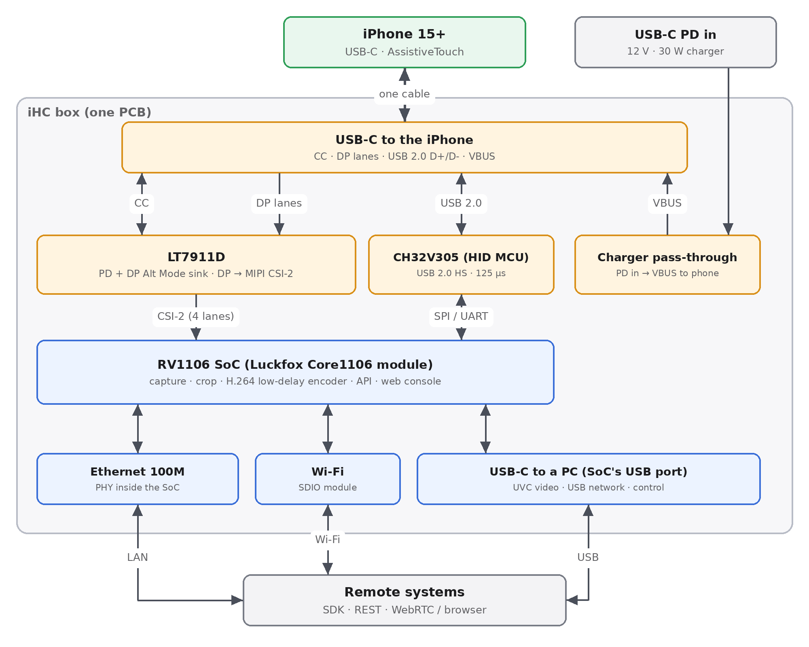
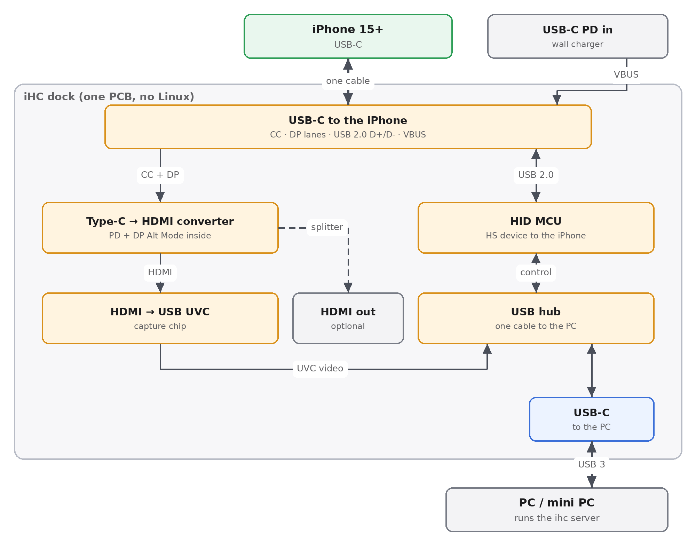

# Custom box: feasibility, cost, overall design

- **Date:** 2026-09-25 (translated to English 2026-09-26). **Scope:** replace the Orange Pi 5 Plus + hub with a
  self-built box that is small and plug-and-play. The box is the iPhone's keyboard and mouse, takes video from the
  iPhone's USB-C port, and charges the iPhone. It is controlled remotely over Ethernet, Wi-Fi and USB. This document
  also answers whether the CH9329 is fast enough.
- **Current software:** the box software is `ihcd`, one static Go binary (`box/`, ADR 0002). It drives the
  absolute pointer only; the relative mouse mode, the per-phone calibration, the CH9329 backend and the Python server
  are gone, and Python remains only as the SDK and the `ihc` command. Passages below that compare the CH9329 or
  discuss relative mode are kept as the reasoning behind the MCU choice, not as a description of the current box.
- **Method:** four research passes in parallel.
  - Datasheets read directly from copies on GitHub: WCH CH32V20x/30x, Rockchip RV1106, Sophgo SG200x.
  - Code and docs of open-source KVM products: JetKVM, NanoKVM, PiKVM, Luckfox PicoKVM, GL.iNet Comet, Aiden.
  - Linux drivers for the bridge chips (Rockchip BSP, InES), TinyUSB, Chromium EC.
  - Search results for LCSC prices and for pages the proxy blocked: cnx-software, orangepi.org, lcsc.com, wch.cn.
- **Labels:** **[Confirmed]** means the primary source was read (code, datasheet, vendor documentation).
  **[Likely]** means a vendor claim, a search snippet, or several indirect sources that agree. **[Unknown]** means
  there is no data yet, so it must be measured. Prices taken from LCSC snippets are **[Likely]**; estimated numbers
  are marked "estimate".
- **Schematic:** the pin-level design of Option B is in [hardware/box-v1](../../hardware/box-v1/README.md).
- **Licensing:** JetKVM (GPL-2.0), Luckfox PicoKVM (GPL) and Aiden (AGPL-3.0) are used for architecture reference
  only. No code from these projects is copied; the box firmware and software are written from scratch.

---

## 0. Conclusions

1. **Feasible, and the architecture is already proven on the market.**
   - JetKVM, Luckfox PicoKVM and GL.iNet Comet are all small Rockchip SoCs with a video bridge chip and a USB port
     that acts as keyboard and mouse. [Confirmed]
   - Aiden uses the same RV1106 SoC to control an **iPhone** through a USB-C hub. [Confirmed]
   - This box follows the same pattern, specialised for the iPhone. The difference: one chip takes video straight
     from the iPhone's USB-C port, so there is no hub.
2. **The CH9329 is enough for ordinary taps, but not for maximum performance.** The box no longer uses it (ADR 0002
   removed the CH9329 backend); the comparison stays because it explains the MCU choice. Three main limits:
   - its descriptor is fixed, so it cannot use the absolute-mouse layout already proven on the test iPhone;
   - its ack only means the chip received the command, not that the iPhone fetched the report;
   - the 115200-baud UART adds latency and jitter.

   Replace it with the **CH32V305RBT6**: a WCH RISC-V MCU with USB 2.0 High-Speed and a built-in PHY, plus a
   second Full-Speed port, in an LQFP64 package that can be soldered with an iron, at about $1.33. The **CH9329F**
   (the new High-Speed version) is a quick drop-in alternative, but its descriptor is still fixed. (§3)
3. **The real speed is decided by the video path and by iOS, not by the HID chip.**
   - The best HID chip saves only a few milliseconds.
   - iOS takes 80–250 ms to glide the pointer to the target before each tap.
   - The video path decides the visible latency. Hardware H.264 in low-delay mode over WebRTC gives 35–60 ms
     glass-to-glass; MJPEG is much slower. (§2)
4. **Proposed box (Option B):**
   - iPhone ↔ **LT7911D**: one chip handles PD, DP Alt Mode, and DP-to-MIPI CSI conversion;
   - **CH32V305**: High-Speed keyboard and mouse, runs timed command sequences on the chip;
   - **RV1106** on the solderable **Luckfox Core1106** module: captures video, encodes low-delay H.264, runs the API;
   - external ports: Ethernet, Wi-Fi, and USB-C to a PC (video over UVC, network over USB).

   Parts cost about **$35–58 per box** (estimate, batches of 10–50). The **PC dock** version (Option A, no Linux on
   the box) costs about **$17–25**. (§6, §9)
5. **Go step by step, low risk first.**
   - Start with the HID MCU: firmware on the CH32V307V-EVT-R1 evaluation board (same USB block as the CH32V305),
     1–2 weeks, under $10 per board. With an `mcu` HID sink added to `ihcd`, it works with the current Orange Pi.
   - Then assemble a trial box from off-the-shelf modules.
   - Only then make a custom PCB. (§12)

---

## 1. Requirements

| Requirement | How the design meets it |
|---|---|
| Maximum performance: low latency, no lost commands | High-Speed HID at 125 µs, command sequences run by a timer on the MCU, confirmation once the iPhone has fetched the report; low-delay H.264 + WebRTC, black borders cropped before encoding |
| One USB-C connection to the iPhone: video, keyboard and mouse, charging | LT7911D (PD + Alt Mode sink + pass-through charging) and CH32V305 on the D+/D- pins |
| Video out over HDMI or USB | USB: the SoC acts as a UVC webcam for the PC. HDMI: only on the dock version (the MS2131 has an HDMI loop-out port), because the RV1106 has no HDMI output |
| Remote control over Wi-Fi, Ethernet, USB | 100M Ethernet (PHY inside the RV1106), SDIO Wi-Fi module, USB-C to the PC (network over USB + UVC + control) |
| Plug and play, compact | DHCP + mDNS, EDID and pointer mode set automatically, OTA updates, aluminium case the size of a USB-C hub (§8) |
| Hand-solderable | LQFP for the MCU, a module with castellated edge pads for the SoC. The QFN video chip needs a hot-air station, or JLCPCB assembly (§10) |

---

## 2. Where the time goes

### 2.1 One tap (absolute pointer)

| Stage | CH9329 @115200 (no longer used) | Linux gadget (Orange Pi, current) | CH32V305 HS (proposed) |
|---|---|---|---|
| Server → chip | ~1.7 ms: 13-byte frame + 7-byte ack on the wire [Confirmed, calculated] | tens of µs (`write()` to `/dev/hidgN`) | < 0.1 ms over USB/SPI (estimate) |
| Wait for the iPhone to fetch (poll) | unclear: Full-Speed chip, bInterval not published [Unknown] | ≤ 1 ms (HS, bInterval 4); measured on the Orange Pi board: 2.6 ms from write to iPhone fetch [Confirmed] | ≤ 0.125 ms if iOS honours bInterval=1 [Unknown, must measure] |
| Confirmation | "chip received" | "iPhone fetched" (POLLOUT) | "iPhone fetched" + µs timestamp (IN-complete interrupt) |
| iOS glides the pointer to the target | 80–250 ms (Aiden waits 80 ms, glassbox proved 250 ms is safe) [Confirmed, see absolute-pointer.md] | same as left | same as left |
| Press, hold, release (release sent 3 times) | 60–100 ms + ~30 ms | same as left | same as left, but timed to the µs on the MCU |

A tap takes about 150–350 ms, and nearly all of it is iOS time. The best HID chip saves only 1–10 ms. To be
really faster, the wait for the pointer glide must be shortened:

- **Measure the glide delay.** The `ihcd` touch engine waits a fixed settle time after a jump before it presses
  (`Config.Settle` in `box/internal/input`, 80 ms by default), and does not wait when the pointer is already in place
  (a hover in the live view). There is no per-phone calibration. Measuring the real glide on the iPhone models in use
  (T6) shows whether the fixed value is right.
- **Try turning off animations** (Reduce Motion, and Pointer Animations if iOS has that option for the
  AssistiveTouch pointer). If the pointer jumps straight to the target, the wait could drop to a few tens of ms.
  [Unknown, must test]

The HID chip matters in four other places:

1. **Relative mode, as a fallback only.** The box drives the absolute pointer only and has no relative mode today.
   If some iOS release (for example iOS 27, see absolute-pointer.md) ignored the absolute mouse, a relative mode
   would be needed again. iOS accelerates the relative pointer by velocity, so reports sent a few ms off rhythm move
   it the wrong distance. User-space timing on Linux (the earlier Python server) jittered by 0.5–5 ms. A hardware
   timer on the MCU jitters by under 1 µs, which would make relative mode deterministic.
2. **Smoother live control:** 1000–8000 reports/s, against at most about 580/s when the CH9329 had to wait for an
   ack.
3. **Real confirmation:** only the gadget and the MCU know for sure that the iPhone fetched the report. The CH9329
   does not.
4. **Free descriptor:** the layout already proven on the iPhone can be used (one interface per report type, absolute
   mouse 0..32767). The CH9329's layout, with report IDs 1/2 sharing one interface, has not been tried on iOS by
   anyone (absolute-pointer.md, V7).

### 2.2 Video path (glass-to-glass)

| System | Latency | Source |
|---|---|---|
| PiKVM V4 (TC358743 → CM4, H.264 over WebRTC) | 35–50 ms (capture 17 ms + encode 13 ms) | PiKVM docs [Confirmed] |
| JetKVM (RV1106 + TC358743, H.264 over WebRTC) | vendor says 30–60 ms; Jeff Geerling measured ~40 ms; a competitor measured ~98 ms from click to image | [Likely] |
| NanoKVM (SG2002 + LT6911) | 100–150 ms | NanoKVM README [Confirmed] |
| MS2130 dongle into a PC, 1080p60 | ~66 ms, including the PC monitor | HyperHDR discussion [Likely] |
| Orange Pi 5 Plus + CPU JPEG encoder (current) | not measured; predicted 80–150 ms | [Unknown] |

Improvements that work on any hardware, including the current Orange Pi:

- **Crop the black borders before encoding.** The iPhone's portrait screen fills only about 500×1080 of the
  1920×1080 frame, about 26% of the pixels. Cropping first (Rockchip RGA) makes the load on the encoder and the
  network about 4 times lighter.
- **Use hardware H.264 in low-delay mode:** no B-frames, sliced frames, IDR on request. Send it over
  WebRTC/WebCodecs; keep MJPEG as the fallback.
- **Bandwidth:** MJPEG 1080p60 needs 50–150 Mbit/s, so it only works on a LAN. H.264 needs only 2–8 Mbit/s, which
  fits over Wi-Fi and over 100M Ethernet.
- **Try a portrait EDID.** If the box advertises a portrait resolution, the iPhone may output video without
  borders. [Unknown, must test]

---

## 3. Is the CH9329 enough, and what to use instead

The CH9329 cable was the earlier fallback HID path; `ihcd` no longer supports it. The comparison is kept as the
reason for the CH32V305.

| | CH9329 (earlier fallback, no longer used) | CH9329F (new) | Linux gadget on the SoC | **CH32V305RBT6 (proposed)** |
|---|---|---|---|---|
| USB to the iPhone | Full-Speed [Likely] | High-Speed, adjustable bInterval [Likely] | High-Speed | High-Speed, PHY on the chip [Confirmed] |
| Link from the host | UART ≤ 115200 (does not reach 115200 at 3.3 V) [Likely] | UART up to 15 Mbit/s [Likely] | direct writes to the device file | a second Full-Speed USB port, or SPI/UART at Mbit rates [Confirmed] |
| Descriptor | fixed; only VID/PID, strings and mode can be changed [Confirmed] | keyboard and mouse still fixed; has a touchscreen mode and custom 510-byte HID reports [Likely] | free | free |
| Ack once the iPhone has fetched | no | yes (optional) [Likely] | yes (POLLOUT) | yes, with a µs timestamp |
| Timed command sequences on the chip | no | no | no (Linux does the scheduling) | yes |
| Package, price | SOP16, cheap | QFN32, price unknown | built into the SoC | LQFP64M 10×10, 0.5 mm, ~$1.33 [Likely] |

**Notes on the CH32V305** [Confirmed, datasheet V3.9]:

- The TSSOP20 (V305FBP6) and QFN28 (V305GBU6) packages only bring out the pins of the High-Speed port. For both
  USB ports, pick one of three:
  - V305RBT6 (LQFP64M);
  - V305CCT6 (LQFP48);
  - V307RCT6/VCT6 (LQFP64M/100, about $2.2).
- TinyUSB has HS/FS drivers for the CH32V30x, but runs only one port at a time. The second port uses WCH's driver;
  the `openwch/ch32v307` repo has HID examples on both ports.
- The RP2040/RP2350 have Full-Speed only. The NXP LPC55S16 and STM32F723 also work, but cost more or need extra
  parts.

**Does the iPhone poll at 125 µs?** There is no public measurement yet [Unknown].

- By the spec: Full-Speed is at least 1 ms. High-Speed with bInterval=1 is 125 µs.
- The closest hint from Apple: TinyUSB issue #1705. A Full-Speed HID device with bInterval=1 was polled at only
  500 Hz on Apple Silicon Macs, while Intel Macs and Windows gave 1000 Hz.
- So it must be measured on a real iPhone with the CH32V307V-EVT-R1 evaluation board (§13; same USB block as the
  CH32V305) **before** the PCB is drawn. This is experiment T1 in §11.

---

## 4. Video path: from the iPhone's USB-C port to a frame

**What is known about the iPhone** [Confirmed, unless noted otherwise]:

- DP Alt Mode outputs up to 4K60. A plain USB-C to HDMI adapter works; no MFi is needed.
- Screen mirroring only: the portrait home screen gets borders on both sides (pillarbox).
- DP on: 15, 16 and 17, including the Plus, Pro and Pro Max models. **No DP: 16e, 17e, Air.**
- Standard models run USB 2.0; Pro models run USB 3 at 10 Gbit/s. In 4-lane DP mode, the D+/D- pair (USB 2.0)
  stays free for HID.
- Copy-protected apps (movies) show a black screen on a video path without HDCP. [Likely]
- Apple's USB-C Digital AV Multiport Adapter runs video, USB and charging at the same time. So the combination of
  roles the box needs is proven to work.

| Chip | In → out | PD/Alt Mode built in | Package | Price | Notes |
|---|---|---|---|---|---|
| **LT7911D** | USB-C/DP1.2 (4 lanes) → MIPI CSI | yes (PD 2.0, dual CC for pass-through charging) | QFN-64 | ~$4.9 | `lt7911d.c` driver in the Rockchip BSP; 1080p60/4K30 [Likely/Confirmed] |
| LT7911UXC | USB-C/DP1.4a → 4-lane MIPI | yes (PD 3.0) | BGA-169 | ~$13, often out of stock | only needed for 4K60 |
| **LT8711HE** | USB-C/DP → HDMI 2.0 | yes (dual CC, pass-through, with MCU and flash) | QFN-64 | ~$3.2 | for the dock version |
| LT6911C / LT6911UXC | HDMI → CSI | no | QFN-64 | ~$3.6 / ~$5.9 | used by NanoKVM; needs Lontium firmware |
| TC358743 | HDMI 1.4 → CSI-2 | no | BGA-64 | unknown | official driver in Linux; used by JetKVM and PiKVM |
| RK628D | HDMI → CSI | no | unknown | unknown | used by Aiden |
| **MS2131** / MS2130 | HDMI → USB 3 UVC 1080p60 (the MS2131 adds HDMI loop-out) | no | QFN-64 | MS2130 ~$3.1 | standard UVC, no driver needed; firmware in external flash |
| VL102/VL103, CYPD3125 | PD + Alt Mode only (UFP_D role, power source) | yes | QFN-48/40 | ~$1.4–2.4 | closed firmware; for open PD, Chromium EC servo_v4 is the open-source reference for exactly this role |

Proposed chains:

- **Standalone box (B):** iPhone → LT7911D → 4-lane CSI → RV1106. One chip handles PD, Alt Mode and video
  conversion. No hub, and no HDMI in between.
- **Low-risk fallback:** USB-C to HDMI adapter with PD pass-through → HDMI-to-CSI module (TC358743 or LT6911C) →
  RV1106. This is exactly how Aiden and JetKVM do it.
- **PC dock (A):** iPhone → LT8711HE → HDMI → MS2131 → USB 3 → PC.

---

## 5. SoC

| SoC | CPU / RAM | H.264 | CSI | USB device ports | Ethernet | Package, module |
|---|---|---|---|---|---|---|
| **RV1106G3** | 1× A7, 256 MB RAM inside the chip | 5 MP@30, has an "ultra-low delay" mode | 1×4 or 2×2 lanes | 1 | 100M, PHY in the chip | QFN128 0.35 mm; Luckfox Core1106 module with castellated pads, $16–27 |
| SG2002 | C906/A53 1 GHz, 256 MB in the chip | 1080p60 (in practice) | datasheet and boards disagree | 1 | 100M, PHY in the chip | LicheeRV Nano $9–14; higher latency (NanoKVM 100–150 ms) |
| RV1126B | 4× A53, external RAM | 4K30, low-delay | 2×4 | 1 (USB3) | GbE | BGA; Luckfox Aura from $49 |
| RK3576 | 4×A72 + 4×A53 | 4K60 | 2×4 + C/D-PHY | **2** | 2× GbE | BGA; Core3576 from $105 |
| RK3566/3568 | 4× A55 | 1080p60 | 1×4 | 1 | GbE | BGA, needs a module |

[Confirmed for datasheet figures; module prices are Likely]

**Choice: the RV1106G3 on the Luckfox Core1106.**

- JetKVM (1080p60), Luckfox PicoKVM and Aiden (iPhone control) all run on this chip.
- The RAM and the Ethernet PHY are built into the chip, so the board is simple.
- The encoder has a low-delay mode. The `luckfox-pico` SDK is open on GitHub.
- The only limit: there is just one USB port. The design gives that port to the PC and hands HID to the MCU.

**When to move to the RK3576:** for 4K60, GbE, or **2 iPhones per box** (two CSI inputs, two USB device ports). The
module costs about 4–6.5 times as much (from $105, against $16–27 for the Core1106). Split across two iPhones it is
still about $53 per phone, 2–3 times the Core1106, so the module cost per phone is higher; the RK3576 is chosen for
those features, not to save money.

---

## 6. Two box options

### Option B: standalone box (proposed)

- **iPhone side.** One USB-C cable:
  - CC and the DP pairs go to the LT7911D;
  - D+/D- go to the High-Speed port of the CH32V305;
  - VBUS comes from the charger through the pass-through circuit.
- **Inside the box.**
  - The LT7911D sends 4-lane CSI-2 into the RV1106. The RV1106 crops the screen area, encodes low-delay H.264, and
    runs the API and the web console.
  - The CH32V305 connects to the RV1106 over SPI or UART at a few Mbit/s. It takes high-level commands (tap, swipe,
    type) and runs them on its own timer.
- **Outside.**
  - 100M Ethernet and an SDIO Wi-Fi module.
  - The RV1106's USB port goes out to a USB-C port for the PC. The PC sees the box as a USB network card (calling
    the same REST API as over the LAN), a UVC webcam (the iPhone screen), and a control channel. All three run on one
    cable, with no driver.
- **No HDMI out**, because the RV1106 has no HDMI transmitter. If HDMI out is needed, use Option A, or add an
  LT8711HE with a splitter (more cost and complexity).

### Option A: PC dock, no Linux

- Made of an LT8711HE (USB-C to HDMI, with PD), an MS2131 (HDMI to USB 3 UVC, with HDMI loop-out), a CH32V305
  (HID) and a USB 3 hub chip.
- The PC sees the dock as a webcam (the iPhone screen) plus a control device, with no driver needed on Linux,
  Windows or macOS.
- `ihcd` runs on the PC (there is a Linux amd64 build; `ihcd` runs on Linux only). Two additions are needed: UVC
  capture from the dock (today `ihcd` reads only uncompressed V4L2 input from an HDMI receiver and rejects MJPEG),
  and an `mcu` HID sink for the MCU.
- **Fits when:** the phone farm already has PCs or mini PCs, HDMI out is needed, or the box should have no operating
  system that needs updating.
- **Does not fit when:** control over Wi-Fi/Ethernet without a PC is needed, or one PC must carry many iPhones. Each
  MS2130 dongle sending YUY2 1080p60 uses about 250 MB/s of USB 3, so MJPEG must be used.

| | B: standalone box | A: PC dock | Orange Pi 5 Plus + hub (current) |
|---|---|---|---|
| Needs a host machine | no | yes (PC) | no |
| Video latency (target) | 35–60 ms (H.264 WebRTC) | ~50–70 ms (MS213x + PC) | not measured; JPEG runs on the CPU |
| HID | CH32V305 HS, timed command sequences | CH32V305 HS | Linux gadget HS |
| Wi-Fi / Ethernet / USB | yes / yes / yes | via PC / via PC / yes | yes / yes / no |
| HDMI out | no | yes | the hub has it |
| Parts (estimate) | $35–58 | $17–25 | the board costs many times more, plus a hub |
| Size | a box of about 90×60×20 mm | USB-C hub size | board + hub + cables |

---

## 7. Firmware and software

### 7.1 MCU firmware (CH32V305), bare-metal C

| Block | Job |
|---|---|
| `usb_phone` (HS port) | Composite HID with the same interface layouts (profiles) as the `ihcd` USB gadget (`box/internal/hid`): keyboard, media keys (consumer control) and absolute pointer, one interface per type, no report IDs, bInterval=1. One serial number per profile. Profiles are switched at runtime by a soft re-enumeration. |
| `link` | Channel to the host: Full-Speed USB (vendor bulk, or CDC with a WinUSB/MS OS 2.0 descriptor so Windows needs no driver) or SPI slave with DMA. COBS framing + CRC16 + sequence number. Every command gets an ack; a failed command gets a nack. An event stream goes back to the host. |
| `sched` | 1 µs hardware timer and a queue of timed reports. High-level commands run on the chip, independent of Linux or the network: `tap(x, y, settle, hold, release×3)`, `swipe(points, duration, rate)`, `type(text, key_interval)`, `key`, `media`. The first plan also had `rel_run(n, interval)` for relative mode; it is dropped with relative mode. |
| `telemetry` | µs timestamp when the iPhone fetches each report (IN-complete interrupt). SOF counting to measure the real poll rate. USB state (configured / suspend / reset). Caps Lock LED from OUT reports. |
| `safety` | Watchdog. Releases every key and button when the host link is lost for more than 200 ms, on a USB reset, or when the iPhone suspends. A button is never left held. |
| `update` | WCH USB ISP bootloader (open-source tool `wchisp`), callable from `ihcd`. |

`ihcd` gains an `mcu` HID sink next to the USB gadget sink (`box/internal/hid`). It speaks the protocol above and is
used on the Orange Pi, a Linux PC and box B alike. The touch engine (`box/internal/input`) then hands timed gestures
to the MCU instead of timing each report itself. Neither the sink nor the firmware exists yet.

### 7.2 Software on the RV1106

- Minimal Buildroot image (luckfox-pico SDK), read-only rootfs, A/B updates, boot in under 5 seconds.
- **Box software:** the same `ihcd` binary as on the Orange Pi (ADR 0002), with the same REST/WebSocket API, so the
  Python SDK and existing clients run unchanged. Today `ihcd` is built as a static Linux binary for arm64 (and
  amd64). The RV1106 is a 32-bit ARM Cortex-A7, so it needs a `GOOS=linux GOARCH=arm GOARM=7` build; that build
  does not exist yet. The arm64 bundle is 3.4 MB, small next to the 256 MB of RAM.
- **Video path:** `ihcd` today captures uncompressed V4L2 frames and encodes JPEG on the CPU (libjpeg-turbo). On the
  RV1106 the planned path is: frames from the LT7911D (V4L2) → RGA crops the screen area → hardware H.264 encoder in
  low-delay mode → WebRTC (a permissively licensed library, not JetKVM's GPL code), MJPEG fallback, and a UVC gadget
  on the USB-C port to the PC. None of the RV1106-specific parts are built yet.
- **Network:** DHCP, mDNS `_ihc._tcp` (`ihcd` already advertises it), a Wi-Fi access point with a setup page when
  there is no network, CDC-NCM over the USB-C port.

---

## 8. Plug and play, like the Chinese products

1. **Plug in three cables:** iPhone, PD charger, LAN (or use Wi-Fi). Status LED: red means no iPhone, yellow means
   HID works but there is no video yet, green means ready.
2. **Joins the network on its own:** DHCP, then mDNS advertising. The controlling machine sees the box right away
   (`ihcd` already advertises `_ihc._tcp`, and the `ihc` SDK finds boxes over mDNS).
3. **Nothing to configure:**
   - EDID 1080p60 and the absolute pointer are preset;
   - the default HID profile is the layout already proven on the iPhone;
   - on the iPhone, only AssistiveTouch has to be turned on and a button assigned, once (if the media-style Home key
     works, the button-assignment step goes away too).
4. **Plug into a PC and it works**, with no driver: network over USB + UVC + control channel.
5. **One-click updates:** OTA for the SoC, USB ISP for the MCU, both from the web console.
6. **Case:** aluminium, the size of a USB-C hub. A short USB-C cable or a right-angle male plug goes straight into the
   iPhone; a clamp mount for phone racks.

---

## 9. Cost (estimate, batches of 10–50, USD)

**Option B:**

| Item | Price |
|---|---|
| Luckfox Core1106 (RV1106G3, 256 MB) | 16–27 [Likely] |
| LT7911D | ~4.9 [Likely] (Lontium firmware: unknown) |
| CH32V305RBT6 + crystal + ESD | ~1.7 |
| 3× USB-C, ESD for the iPhone port and the PC port | ~1.5 |
| Power: PD input trigger (CH224K), 5 V/3 A buck, 3.3/1.8/1.2 V rails, VBUS load switch | 2–3 (estimate) |
| RJ45 with magnetics | ~0.8 |
| SDIO Wi-Fi module | 2–4 (estimate) |
| 4-layer impedance-controlled PCB | 2–5 (estimate) |
| Passives, LEDs, buttons | 1–2 |
| Aluminium case | 3–8 |
| **Total** (sum of the rows above) | **~$35–58** |

**Option A:** LT8711HE ~3.2 + MS2131 (MS2130 ~3.1) + flash 0.2 + CH32V305RBT6 1.3 + USB 3 hub chip (unknown,
estimate 1–3) + ports and ESD ~2 + power ~1.5 + PCB 2–5 + case 3–6 ≈ **$17–25**.

**Separate HID board** (a CH32V305 board of its own; stage 1 uses the evaluation board from §13): CH32V305RBT6 +
crystal + LDO + 2 USB-C + ESD + 2-layer PCB ≈ **$4–6**.

**Market reference prices** [Likely]:

- JetKVM: $69–103;
- GL.iNet Comet: $69–89;
- Luckfox PicoKVM: $28/$56;
- NanoKVM: Lite ~$20, Full ~$40.

Box B sits around the price of the NanoKVM Full and PicoKVM, but is built for the iPhone: video straight from the
USB-C port, an HID MCU with precise timing, and iPhone charging.

---

## 10. Hand soldering and manufacturing

| Part | Package | How to solder |
|---|---|---|
| CH32V305RBT6 | LQFP64 0.5 mm | iron + flux, drag soldering: OK |
| Luckfox Core1106 | module with castellated pads | iron: OK |
| LT7911D, LT8711HE, MS2131 | QFN-48/64, with thermal pad | needs a stencil + hot-air station or hot plate; or JLCPCB assembly |
| Bare RV1106, TC358743 | QFN128 0.35 mm, BGA | not by hand: use a module |

- **PCB:** 4 layers, 90 Ω impedance for USB and 100 Ω for DP and MIPI. Keep the DP pairs from the USB-C port to the
  LT7911D as short as possible, with no vias where they can be avoided. 4-layer impedance-controlled boards from
  JLCPCB are cheap.
- **The first prototype** should use off-the-shelf dev boards and modules (§12, stage 2), to keep the risk of the
  high-frequency circuit apart from the risk of the firmware.

---

## 11. Risks and experiments to run first

| ID | Question | How to test | If it fails |
|---|---|---|---|
| T1 | Does the iPhone poll High-Speed HID at 125 µs? | CH32V307V-EVT-R1 board (§13), count the gaps between IN-completes | keep the CH32V305 (the timing and descriptor benefits remain), just expect 1 ms |
| T2 | Can the LT7911D enter DP Alt Mode with the iPhone while still supplying power (source, DR_Swap)? Where to get the Lontium firmware? Can the EDID force 1080p60? | get an LT7911D evaluation board with CSI firmware from Lontium or an official distributor (§13, item 4; retail USB-C to MIPI boards for displays carry DSI firmware and do not fit), connect the iPhone, read the chip over I2C from the Orange Pi's 40-pin header | USB-C to HDMI adapter + TC358743/LT6911C (the path Aiden and JetKVM already run) |
| T3 | Can the RV1106 receive 1080p60 from the LT7911D? (port the `lt7911d.c` driver from BSP 5.10 to the SDK kernel) | Luckfox Pico (§13, row 9) + LT7911D board | use an HDMI bridge as in T2 |
| T4 | Is the low-delay H.264 latency on the RV1106 ≤ 60 ms? | measure with a clock on the iPhone screen, photographing both screens | tune GOP, slicing, the WebRTC jitter buffer |
| T5 | Power: charging the iPhone while mirroring, and the LT7911D pass-through current | measure current while the iPhone charges + mirrors | a separate power circuit supplying 5 V/3 A to the iPhone |
| T6 | Does turning off animations (Reduce Motion) make the pointer reach the target faster? | jump the pointer and time its arrival in the captured video, with and without Reduce Motion | keep a fixed settle time in the `ihcd` touch engine, set from the measurement |
| T7 | Can a portrait EDID remove the black borders? | set a portrait EDID on the Orange Pi's HDMI IN port | crop with RGA |

Known, acceptable risks: apps with DRM show a black screen on the video path; the 16e, 17e and Air do not output
video.

---

## 12. Roadmap

1. **Stage 1, HID board (1–2 weeks, under $10):**
   - CH32V307V-EVT-R1 evaluation board (§13), firmware v0 with `usb_phone`, `link` over USB FS, `sched` and
     `telemetry`;
   - `mcu` HID sink in `ihcd`;
   - run T1, T6;
   - compare with the Orange Pi's Linux gadget (and with the CH9329 figures in §2–§3).

   The result is an HID MCU that `ihcd` drives on the Orange Pi or a Linux PC, in the role the CH9329 cable once
   had as the fallback.
2. **Stage 2, box assembled from modules (2–4 weeks):**
   - Luckfox Pico (RV1106) + HDMI-to-CSI module + USB-C to HDMI adapter + HID board;
   - `ihcd` built for linux/arm (GOARM=7) with the H.264 WebRTC video path;
   - run T4;
   - in parallel, test the LT7911D board (T2, T3).
3. **Stage 3, PCB v1 of Option B (4–8 weeks):**
   - Core1106 + LT7911D + CH32V305 + power + RJ45 + Wi-Fi;
   - case, status LED, OTA, plug-and-play features;
   - run T5.
4. **Stage 4, as needed:**
   - dock version (A) for phone farms that use PCs;
   - RK3576 box for 2 iPhones.

---

## 13. Shopping list (final)

One choice per item only. Hardware already on hand is reused: Orange Pi 5 Plus, UGREEN Revodok 105 hub, iPhone 15.

**Batch 1: buy now (stages 1–2, experiments T1–T7)**

| # | Item | Qty | Price (USD) | Where to buy | Purpose, why chosen |
|---|---|---|---|---|---|
| 1 | WCH **CH32V307V-EVT-R1** | 2 | ~8.7 each | LCSC C2943980 | HID MCU board. Has both a High-Speed USB port (480 Mbit/s, built-in PHY) and a Full-Speed port, both Type-C, plus an on-board WCH-LinkE programmer. Same USB block as the CH32V305, so the firmware carries over 1:1. One for development, one for a second device or as a spare. |
| 2 | Great Scott Gadgets **Cynthion** (with aluminium case) | 1 | ~200–210 | Crowd Supply, Adafruit, Hak5 | USB 2.0 High-Speed analyser. Shows exactly when the iPhone polls (T1), the descriptors, and the timing of each report. The best HS analyser in its price range; the Packetry software is open source. |
| 3 | **JetKVM** (original, RV1106G3, 2026 version with full-size HDMI) | 1 | 103 | jetkvm.com | A ready-built RV1106 + TC358743 platform that already runs 1080p60. Has a developer mode (SSH) and the open `rv1106-system` build. Used to build and measure the low-delay H.264 path together with `ihcd` (T4) without wiring CSI. Not the JetKVM Mini, which uses an ESP32. |
| 4 | **LT7911D** evaluation board with CSI firmware loaded + 5 LT7911D chips | 1 + 5 | chip ~4.9; board unknown | official Lontium distributor (龙迅代理) | Experiment T2: DP Alt Mode + PD with the iPhone. Requirements: Type-C DP Alt Mode sink, pass-through charging (dual CC), 4-lane MIPI CSI-2, 1080p60 and 4K30, with firmware, register documentation and a reference schematic. Not available at retail: the `lt7911d` driver does not load firmware, and the modules sold for VR headsets and displays carry DSI firmware. The Orange Pi's Armbian kernel already has the `lt7911d` driver, so reading registers over I2C on the 40-pin header is enough for a first test. |
| 5 | ChargerLAB **POWER-Z KM003C** | 1 | ~110 | power-z.com, Amazon | Records PD messages in both directions (including DP Alt Mode entry) and the charging current. For T2 and T5. |
| 6 | DreamSourceLab **DSLogic Plus** | 1 | ~149 | dreamsourcelab.com, Amazon | 16-channel, 400 MHz logic analyser. Probes the LT7911D's I2C, the SPI/UART link between MCU and SoC, and the accuracy of the MCU timer (toggle a GPIO pin on each IN-complete). |
| 7 | **Apple Thunderbolt 4 (USB-C) Pro** cable, 1 m | 1 | 69 | Apple | Connects the iPhone to the LT7911D board. The cable that ships with the iPhone is USB 2.0 only, with no DP lanes. This cable is known to run DP Alt Mode with the iPhone. |
| 8 | USB-A → USB-C data cable, 0.3 m | 2 | ~5 | any | Connects the hub's USB-A port to the MCU board (the iPhone is the host). |
| 9 | **Luckfox Pico** board (RV1106) | 1 | [Unknown] | Waveshare, Luckfox | RV1106 board with a free CSI input for T3 (LT7911D board → RV1106) and the stage 2 box. The JetKVM (row 3) is not used for T3: its RV1106 already takes video from its own TC358743. |

Batch 1 total, summed from the rows above: about **$683–693**, of which $24.50 is the five LT7911D chips (counting
the cables in row 8 at ~$5 each). This does not count the LT7911D evaluation board and the Luckfox Pico (prices
unknown), shipping or tax.

**Soldering tools (if not already on hand), for stage 3**

| Item | Price (USD) | Why |
|---|---|---|
| **Hakko FX-951** soldering station | ~250–300 | Professional standard, wide choice of tips; drag-soldering LQFP64 0.5 mm is easy |
| **Quick 861DW** hot-air station | ~300 | Even heat for soldering QFN-64 with a thermal pad (LT7911D) |
| **Amtech NC-559-V2-TF** flux (genuine) | ~25 | Standard flux for QFN/LQFP |
| **Chip Quik SMD291AX10** solder paste | ~20 | Used with a stencil for QFN pads |
| **AmScope SE400-Z** stereo microscope | ~250 | Inspect solder bridges on 0.5 mm pins and QFN pads |

**Batch 2: buy only if T1–T3 pass (PCB v1, Option B)**

| Item | Qty | Price (USD) | Where to buy |
|---|---|---|---|
| Luckfox **Core1106** (RV1106G3, 256 MB) | 3 | 16–27 each | Waveshare, Luckfox |
| **CH32V305RBT6** | 10 | ~1.33 each | LCSC |
| LT7911D (CSI firmware loaded) | 5 | already paid in batch 1 | the same five chips as batch 1, row 4; listed here because they go on the v1 boards, not a second purchase |
| 4-layer impedance-controlled PCB + stencil, 5–10 boards | 1 lot | estimate 50–150 | JLCPCB |
| Remaining parts (USB-C, CH224K, power, RJ45, SDIO Wi-Fi) | per BOM | ~10–15 per board | LCSC, finalised when the schematic is drawn |

---

## Sources

**HID and MCU**
- CH32V20x/30x datasheet V3.9: https://raw.githubusercontent.com/ch32-riscv-ug/CH32V307/main/datasheet_en/CH32V20x_30xDS0.PDF
- TinyUSB: https://github.com/hathach/tinyusb (issue #1705)
- openwch/ch32v307: https://github.com/openwch/ch32v307
- CH9329F protocol V1.3 (translation): https://github.com/Socolin/KVM-Switch (`src/legacy/ch9329.md`)

**Video path and PD**
- Apple, video over USB-C: https://support.apple.com/en-us/105099
- Apple, iPhones without DP (16e, 17e, Air): https://support.apple.com/en-us/122208
- Apple, HDCP: https://support.apple.com/en-us/108399
- Apple USB-C Digital AV Multiport Adapter: https://www.apple.com/shop/product/mw5m3am/a/usb-c-digital-av-multiport-adapter
- USB speeds on the iPhone 15: https://appleinsider.com/articles/23/09/21/usb-c-on-iphone-15-everything-you-need-to-know
- Lontium LT7911D: https://www.lontiumsemi.com/UploadFiles/2022-10/LT7911D_Brief_R1.3.pdf
- Lontium LT8711HE: https://www.lontiumsemi.com/UploadFiles/pdf/LT8711HE_Product_Brief.pdf
- Lontium LT8711UXD: https://www.lontiumsemi.com/UploadFiles/2021-07/LT8711UXD_U1_Brief_Draft1.pdf
- Bridge chip drivers in the Rockchip BSP: https://github.com/rockchip-linux/kernel/tree/develop-5.10/drivers/media/i2c
- InES LT6911UXC driver: https://github.com/InES-HPMM/Lontium_lt6911uxc
- Tools for the MS2130/MS2131: https://github.com/BertoldVdb/ms-tools
- MS2130 latency: https://github.com/awawa-dev/HyperHDR/discussions/499
- Infineon pdaltmode: https://github.com/Infineon/pdaltmode
- Chromium EC servo_v4: https://github.com/coreboot/chrome-ec/blob/master/board/servo_v4/usb_pd_policy.c

**SoCs and reference products**
- JetKVM: https://github.com/jetkvm/kvm
- NanoKVM: https://github.com/sipeed/NanoKVM
- NanoKVM-Pro: https://github.com/sipeed/NanoKVM-Pro
- GL.iNet Comet: https://github.com/gl-inet/glkvm
- Luckfox PicoKVM: https://github.com/luckfox-eng29/kvm
- Aiden (read for reference only): https://github.com/AidenAI-IO/aiden-firmware
- PiKVM latency: https://github.com/pikvm/pikvm/blob/master/docs/latency.md
- Rockchip documents: https://github.com/DeciHD/rockchip_docs
- Sophgo SG200X hardware: https://github.com/sophgo/sophgo-hardware/tree/master/SG200X
- Luckfox Core1106: https://www.waveshare.com/core1106.htm
- Luckfox Pico Zero: https://www.waveshare.com/luckfox-pico-zero.htm
- Jeff Geerling's test of IP-KVMs: https://www.jeffgeerling.com/blog/2026/i-tested-every-ip-kvm/

**Shopping list**
- CH32V307V-EVT-R1 on LCSC: https://www.lcsc.com/product-detail/C2943980.html
- CH32V307V-EVT-R1 (Zephyr docs, USB ports and WCH-LinkE): https://docs.zephyrproject.org/latest/boards/wch/ch32v307v_evt_r1/doc/index.html
- Cynthion: https://greatscottgadgets.com/cynthion/
- JetKVM, developer mode: https://jetkvm.com/docs/advanced-usage/developing
- JetKVM, 2026 hardware and prices: https://jetkvm.com/blog/new-internals-new-ports-price-update
- POWER-Z KM003C: https://www.power-z.com/products/chargerlab-power-z-km003c
- DSLogic Plus: https://www.dreamsourcelab.com/shop/logic-analyzer/dslogic-plus/
- `lt7911d` driver in the Rockchip BSP: https://github.com/rockchip-linux/kernel/tree/develop-5.10/drivers/media/i2c
