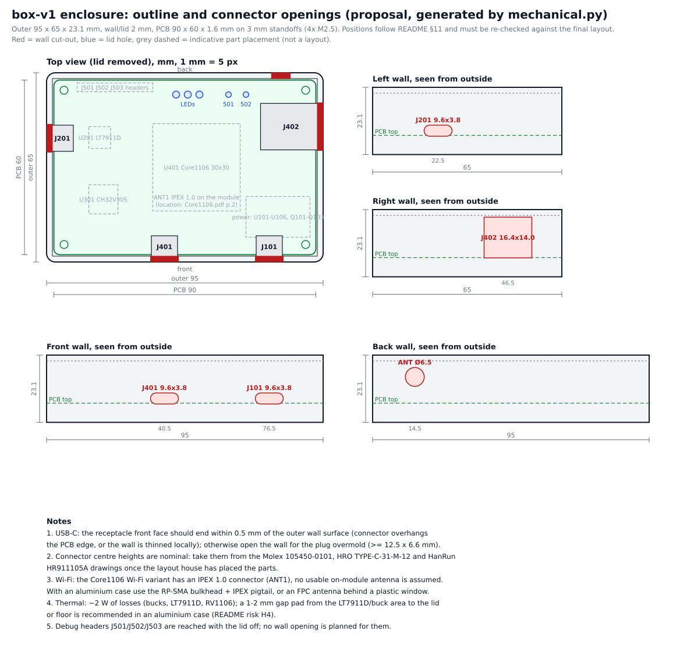

# Box v1: order package for layout, fabrication and assembly

- **Product:** a box that drives an iPhone (USB-C, iPhone 15 and later) as a USB HID absolute pointer, keyboard and
  media keys, and captures the iPhone's screen over DisplayPort Alt Mode. One 4-layer PCB of 96×66 mm: LT7911D
  (USB-C DP Alt Mode → MIPI CSI-2), CH32V305RBT6 (USB HS HID device to the iPhone), Luckfox Core1106 module
  (RV1106G3, Linux), USB-C PD power input, 100M Ethernet, USB-C to a PC, debug headers, LEDs, buttons.
- **Revision:** box-v1 schematic and draft layout of 2026-09-26. **Engineering reference:** [README.md](README.md).
- **Labels:** **[Confirmed]** = read from the primary source; **[Likely]** = indirect source or estimate to be
  re-checked; **[Unknown]** = no data yet. They are used the same way in every file of this package.

## 1. Status at a glance

| Item | Status |
|---|---|
| Schematic, pin level | Complete for every part with a public datasheet; `check.py --selftest` passes (759 pins, 135 nets) |
| LT7911D pinout, footprint, reference circuit, firmware | **Blocking:** the datasheet R1.4 is public (LCSC) but its pin table is not copied in yet: 25 pins carry placeholder numbers `?..` [Unknown]; reference circuit and firmware come from Lontium (§4) |
| Bill of materials | Every orderable line has a manufacturer and MPN; LCSC codes [Likely] (§9) |
| PCB layout | **Draft** in `kicad/box-v1.kicad_pcb`: every part placed, everything routed except the LT7911D pins, DP and CSI lanes; to be finished and reviewed by the layout house (§3). No Gerbers yet |
| Custom footprints (LT7911D QFN-64, Core1106 castellated module, CH224K ESSOP-10, HRO TYPE-C-31-M-04) | Drafts in the board; the LT7911D one is provisional until the package drawing is read (§3) |
| Enclosure | Proposal drawing only ([svg/mechanical.svg](svg/mechanical.svg), §8) |
| Firmware and software | Not in the package (§11) |

The package is ready for a **quotation request** for finishing the layout and a prototype run. It is **not** ready
for a turnkey production order: the LT7911D pins must be filled in (§4) and the layout finished and approved first.

## 2. Package contents and which file is authoritative

| File | Role |
|---|---|
| `netlist.py` | **Authoritative source** for every part, pin, net and orderable part (`BUY` catalogue). If any other file disagrees, `netlist.py` wins and the other files are regenerated with `python3 generate.py` |
| `kicad/box-v1.kicad_pro`, `kicad/*.kicad_sch` | KiCad 8 schematic (root + 5 sheets), generated. Symbols are embedded; footprints use KiCad standard library names except the custom ones in §3 |
| `kicad/box-v1.kicad_pcb`, `kicad/drc.rpt` | Draft 4-layer layout (KiCad 7 format, opens in KiCad 7 and 8) and its DRC report, generated by `pcb.py` from `netlist.py` + `placement.py` (README §15) |
| `placement.py`, `pcb.py`, `footprints/box-v1.pretty/` | Board generator: part positions, footprints, rules, zones, Freerouting run, DRC |
| `svg/pcb-*.svg` | Views of the layout: placement (assembly) and each copper layer |
| `kicad/box-v1.net` | KiCad netlist (version E) with MPN, Manufacturer, LCSC and DNP fields, for import into the PCB editor |
| `bom.csv` | Bill of materials, grouped by orderable part (§9) |
| `netlist.json` | Same data as JSON (parts with ordering data, pins, nets) |
| `svg/power.svg`, `iphone.svg`, `mcu.svg`, `soc.svg`, `debug.svg` | Schematic sheets for review in a browser |
| `svg/mechanical.svg` | Enclosure outline and connector openings (proposal), generated by `mechanical.py` |
| `README.md` | Engineering reference: power tree, pin tables, routing rules, bring-up, risks, sources |
| `check.py` | Design-rule and consistency checks; `python3 check.py --selftest` must print `RESULT: PASS` |
| `ORDERING.md` | This cover sheet |

Only Python 3 (standard library) is needed to regenerate and check the schematic files; `pcb.py` also needs
KiCad 7's `pcbnew` module and, to route, Freerouting 1.9 (README §15).

## 3. Work split

**Complete in this package:** circuit (except the LT7911D pin numbers), part selection with MPNs, net classes and
impedance targets (in `kicad/box-v1.kicad_pro`), routing and placement rules (README §5, §11), a draft layout with
every part placed and every net routed except the LT7911D's (README §15), bring-up plan (README §9), enclosure
proposal.

**To be done by the layout house:**

1. Footprints: check the drafts in the board. `LT7911D_QFN-64-1EP_7.5x7.5mm_P0.4mm` is provisional: redo it from the
   package drawing in the datasheet (§4). `Luckfox_Core1106_Castellated_30x30mm_P1.0mm` follows README §4.4
   (30×30 mm, 112 pads, 1.0 mm pitch): compare it with Luckfox's `Core1106-SMT` footprint. Check the L101/L102 land
   pattern (KiCad `L_Bourns_SRP1038C`) against the ordered Bourns SRP1038A-100M.
2. Replace the LT7911D placeholder pins in `netlist.py` (or ask the buyer to) and re-run `generate.py`, `check.py`
   and `pcb.py`; the check refuses a placeholder that is not labelled [Unknown].
3. Finish the layout to §7: route U201 (its supplies, crystal, I2C, CC, the 4 DP lanes from J201 through U202/U203,
   AUX, and the 5 CSI pairs to the module), then review the autorouted rest: re-route the USB and Ethernet pairs as
   coupled, length-matched pairs, check the buck loops and the 3 A paths. Stack-up and impedance confirmation with
   the fab (§5), DRC.
4. Outputs: Gerber X2 + Excellon drill, IPC-D-356 netlist, pick-and-place (CPL) file, assembly drawings (top/bottom,
   polarity marks), fabrication drawing with the stack-up and impedance table, a 3D STEP model of the assembly for
   the enclosure, and the KiCad PCB project for review.
5. A layout review with the buyer before fabrication.

**Buyer's side:** the LT7911D documents and firmware (§4), the Core1106 modules if they are consigned (§9), layout
approval, firmware (§11), the choice between Option A (default) and Option B (README §3.4).

## 4. Blocking item: the LT7911D documents

The LT7911D (Lontium, QFN-64 7.5×7.5 mm, 0.4 mm pitch) converts the iPhone's USB-C DisplayPort Alt Mode output to
4-lane MIPI CSI-2. Its datasheet R1.4 is public: LCSC publishes it for part C5310990 (README source `LT7911D_DS`).
It could not be opened from the environment this package was made in, so its pin table (item 1) still has to be
copied into `netlist.py`. The reference designs and firmware (items 2–9) come from Lontium or its distributors,
possibly under NDA. What is known and what is missing is in README §4.2.

**Request from Lontium or an authorised distributor (item 1 is in the public datasheet):**

1. Full LT7911D datasheet: 64-pin table + EPAD, thermal pad size, package drawing, recommended footprint, reflow
   profile.
2. Reference schematic "Type-C DP Alt Mode sink → 4-lane MIPI CSI-2 with pass-through charging": wiring of
   UCC1/UCC2, the second charger-side CC port (whether it exists, which pins), the VBUS switch control pin, the VBUS
   sense pin, VCONN.
3. Firmware: can the LT7911D act as **power Source + UFP_D + DR_Swap** towards the iPhone while being a PD sink
   towards the charger? Which PDOs does it advertise to the iPhone (5 V/3 A only, or 9 V too)? Is a CSI (not DSI)
   firmware build available?
4. Mapping of the Type-C receptacle SS pairs onto lanes D0–D3, handling of plug orientation (internal mux or not),
   AUX polarity, AC capacitors and sink-side AUX bias resistors.
5. Crystal frequency and load capacitors, or an external clock.
6. Voltage and current of each supply pin (is `VDD` 1.2 V or something else), power sequencing, reset timing.
7. Function of `SLEEP_33` and `RX_HPD` in Type-C operation; which GPIO is the interrupt; is the I2C address fixed at
   0x2B; I2C I/O level.
8. Which MIPI port outputs CSI, the MIPI pinout, lane/polarity swap, CSI format (YUV422 8-bit), maximum rate per
   lane, 1080p60 and 4K30.
9. Tools and procedure to edit the EDID and to flash the firmware over I2C (protocol, licence terms), and whether
   parts can be bought pre-programmed.

**Recommended route:**

1. Copy the 64-pin table, the EPAD and the package drawing from datasheet R1.4 into `netlist.py` and the
   footprint in `pcb.py`; re-run `generate.py`, `check.py` and `pcb.py`.
2. Ask the layout house (question 1 of the RFQ, §13) whether it already works with the LT7911D reference design and
   firmware; many Shenzhen design houses do. Otherwise contact a Lontium distributor directly (sign an NDA if they
   ask for one) and pass the documents to the layout house under the same terms.
3. **Before the PCB, buy an LT7911D evaluation board with CSI firmware** (shopping list, custom-box.md §13, item 4)
   and run experiments T2/T3 (iPhone enters DP Alt Mode; the RV1106 captures 1080p60 over 4 lanes). This retires
   risks H2/H3 before money goes into the layout.
4. The rest of the board (power, CH32V305, Core1106, Ethernet, USB) is already laid out around the LT7911D area
   (README §11, §15); finishing that area may move nearby parts.

## 5. Fabrication specification

| Parameter | Value |
|---|---|
| Layers | 4 |
| Stack-up | JLC04161H-7628 (L1 35 µm / 7628 prepreg 0.2104 mm, εr 4.4 / L2 15 µm / core 1.065 mm, εr 4.43 / L3 15 µm / 7628 prepreg 0.2104 mm / L4 35 µm) **[Likely]**; JLC04161H-3313 (3313 prepreg 0.0994 mm, εr 4.1) if the layout needs finer traces for the 0.4 mm QFN escape. Equivalent stack-ups from another fab are fine; the fab adjusts trace widths to the impedance targets |
| Layer use | L1 parts + all differential pairs + GND pour; L2 solid GND; L3 signals, 5V_SYS pour, GND pour; L4 signals + GND pour; no parts on L4 |
| Thickness | 1.6 mm ±10 % |
| Copper | 1 oz outer, 0.5 oz inner |
| Material | FR-4, Tg ≥ 150 °C |
| Impedance control | Yes, with test coupons and report: **90 Ω ±10 % differential** (USB: PHONE_USB_DP/DN, PC_USB_DP/DN, MCU_FS_DP/DN), **100 Ω ±10 % differential** (DP lanes SS_*, DP AUX, MIPI CSI-2 CSI_*, Ethernet ETH_*), **50 Ω ±10 % single-ended** (coupon; no RF trace is planned on this board, the Wi-Fi antenna connector is on the module) |
| Starting widths (L1 over L2, 7628) | 100 Ω: 0.20 mm / 0.15 mm gap; 90 Ω: 0.25 / 0.15 mm (IPC-2141 estimates, README §5) **[Likely]** |
| Minimum track / space | design rule 0.10 / 0.10 mm (4/4 mil); confirm the fab's capability |
| Vias | Through vias only: 0.30 mm drill / 0.55 mm pad for signals and GND stitching, 0.40 / 0.80 mm on the 1–3 A supplies (as in the KiCad net classes); 0.30 mm drill thermal vias in the exposed pads of U102/U103 (HSOP) and U201 (EPAD); via-in-pad filled and capped preferred for U201's EPAD, otherwise tented from L4 with a window-pane stencil; design rules allow 0.25 mm drill / 0.45 mm pad |
| Surface finish | ENIG (flat pads for the 0.4 mm QFN and the castellated module) |
| Solder mask / silkscreen | LPI mask, any colour; mask web between QFN pads where the fab allows; white silkscreen with references, pin-1 and polarity marks |
| Board size | 96 × 66 mm, 2 mm corner radius; 4× Ø2.7 mm mounting holes (M2.5) 3.5 mm from each corner |
| Edge features | USB-C receptacles (J201 on the front edge, J401 and J101 on the rear edge) and the RJ45 J402 sit at the board edge so that their faces reach the case wall (§8): no V-score along those edges |
| Panelisation | Vendor's choice, e.g. 2×2 with 5 mm rails and tab routing (mouse bites) away from the connector edges; 3 fiducials on the board (1 mm copper, 2 mm mask opening), add rail fiducials |
| Electrical test | 100 % flying-probe test against the IPC-D-356 netlist |
| Quality | IPC-A-600 / IPC-6012 Class 2 |
| Quantities | **5** (prototype), **10** (engineering batch), **50** (pilot); quote each |

## 6. Assembly specification

| Topic | Instruction |
|---|---|
| Sides | All parts on the top side (L1); the bottom carries only test pads |
| SMT by the vendor | Every `bom.csv` line with `assembly = SMT`, including U201 (LT7911D) once its footprint exists |
| THT | J402 (RJ45 HR911105A) and the 2.54 mm headers J501, J502, J503: selective or hand soldering by the vendor, or left loose for the buyer (quote both) |
| Module | U401 Luckfox Core1106 (30×30 mm castellated, 112 pads), consigned by the buyer or bought by the vendor from Luckfox/Waveshare; reflowed with the board on the carrier's pads (stencil apertures per Luckfox's `Core1106-SMT` footprint) or hand-soldered. Follow any moisture/bake instructions supplied with the module |
| DNP (keep pads, do not place) | R106, R107, R128, R204, R206, R207, R211, R212 (`dnp = yes` in `bom.csv`) |
| Solder jumpers | JP101 is bridged 1-2 by copper in its footprint (Option A); leave 2-3 open. JP102 stays open |
| Polarity / orientation | Diodes: pin 1 = cathode (D101 SMBJ20A, D201, D401 TVS cathode to the rail; D102 zener cathode to PSW_S; D104 cathode to 5V_SYS). LEDs D501–D503: cathode to GND. C101 electrolytic: + to VIN. Pin 1 of U101–U107, U201–U205, U301, U401, Q101–Q103 and the 4-pad crystals X201/X301 per the silkscreen |
| Stencil | 0.10–0.12 mm laser-cut stainless steel; area ratio ≥ 0.66 for the 0.4 mm-pitch QFN; window-pane apertures at 50–60 % coverage on exposed pads (U201, U102, U103, U101) |
| Reflow | Lead-free (SAC305) profile per J-STD-020, peak 245–250 °C; the LT7911D profile comes with its datasheet [Unknown] |
| Inspection | AOI on all SMT; X-ray on U201 (QFN-64 + EPAD) and the HSOP exposed pads of U102/U103 |
| Cleaning / coating | No-clean flux; no conformal coating |
| Programming | None at the factory for the first batches (§11) |
| Staged prototypes | For the 5-piece run: assemble 2 boards fully and 3 boards without U201, X201 and U401, so that power, MCU and HID can be brought up in stages (README §9) |
| Packaging | ESD bags, one board per bag |

## 7. Layout constraints (summary of README §5 and §11)

- **Placement** (as in the draft, README §11): J201 (iPhone USB-C) on the front (left) edge, U202–U205 right behind
  it, then the LT7911D (~22 mm from the front) and the CH32V305 (top-left, USB HS pins towards J201). Core1106 in
  the centre-top, CSI edge facing the LT7911D across a free corridor. On the rear (right) edge: J402 RJ45 next to
  module pads 85–88, J401 (PC USB-C) with U107, J101 (PD USB-C) with the CH224K. The bucks, the inductors and the
  iPhone VBUS switch along the bottom edge, away from the DP/CSI pairs. Headers along the top edge; LEDs at the front
  edge; buttons near the rear.
- **High-speed:** DP lanes on L1 only, no vias, ≤ 15 mm, pair skew ≤ 0.1 mm, lane-to-lane ≤ 2 mm; CSI ≤ 30 mm, pair
  skew ≤ 0.1 mm, data vs clock ≤ 1 mm, all five pairs on one layer with equal vias; USB HS ≤ 30 mm, pair skew ≤ 0.15
  mm, A6-B6/A7-B7 joined at the receptacle with ≤ 2 mm stubs; solid GND on L2 under every pair, stitching vias every
  ~3 mm along DP and CSI; ≥ 3× trace width between pairs; flow-through routing through the ESD arrays.
- **Power:** 3 A nets (VIN, 5V2_PHONE, PSW_*, PHONE_VBUS, 5V_SYS, SW nodes) ≥ 1.0 mm or pours; minimal VIN–SW–GND
  loops; SW nodes never under a differential pair or crystal; Kelvin sense traces from R126 to U106; JP101 pads
  ≥ 2 mm wide.
- **Antenna:** the Core1106 Wi-Fi variant has an IPEX 1.0 antenna connector (ANT1) [Likely]; leave clearance above
  it for the plug and a route for the pigtail to the case. Only if a module variant with an on-board antenna is used:
  that corner at the board edge and no copper on any layer within ~10 mm of the antenna.
- **Thermal:** thermal vias under the HSOP pads and the LT7911D EPAD into L2/L4 copper; copper pours around the
  bucks; about 2 W of total losses (README risk H4); plan a gap pad from the LT7911D/buck area to the case.
- **Test and assembly:** keep the test points TP201–TP510 on the top side, reachable with the Core1106 fitted; keep
  3 mm around the mounting holes free of parts.

## 8. Mechanical



Generated by `python3 mechanical.py` (also run by `generate.py`). All positions follow README §11 and are
**proposals**: the enclosure openings must be re-dimensioned from the layout house's 3D model of the finished
board. Outer case about 101 × 71 × 24 mm (2 mm walls, PCB on 3 mm standoffs, RJ45 ~13.5 mm tall).

<!-- BEGIN GENERATED: openings -->
| Opening | Wall / face | Centre (PCB coordinates) | Centre from outside-left corner, height above outside bottom | Size | Purpose | Note |
|---|---|---|---|---|---|---|
| J201 | left (front) | y = 35.0, z = +1.6 over PCB top | 33.5 mm, 8.2 mm | 9.6 x 3.8 slot, R1.9 ends | USB-C to the iPhone (HRO TYPE-C-31-M-04) | front of the box; receptacle face within 0.5 mm of the outer wall; height from the HRO drawing |
| J402 | right (rear) | y = 17.0, z = +6.9 over PCB top | 19.5 mm, 13.5 mm | 16.4 x 14.0 | RJ45 Ethernet (HanRun HR911105A) | body ~16 x 13.5 mm [Likely], jack LEDs visible through the opening |
| J401 | right (rear) | y = 34.2, z = +1.6 over PCB top | 36.7 mm, 8.2 mm | 9.6 x 3.8 slot, R1.9 ends | USB-C to the PC (HRO TYPE-C-31-M-12) |  |
| J101 | right (rear) | y = 49.0, z = +1.6 over PCB top | 51.5 mm, 8.2 mm | 9.6 x 3.8 slot, R1.9 ends | USB-C PD power input (HRO TYPE-C-31-M-12) |  |
| ANT | top | x = 84.0, z = +9.0 over PCB top | 14.5 mm, 15.6 mm | Ø6.5 D-hole (per bulkhead) | Wi-Fi antenna, RP-SMA bulkhead (option) | IPEX 1.0 pigtail from the Core1106 ANT1 connector; clear of the RJ45 and the H4 post; omit when an internal FPC antenna sits behind a non-metal window |
| D501-D503 | lid | x = 2.2, y = 14.0 | lid, same x/y + wall offset 2.5 mm | Ø2.0 | 3 light pipes for the status LEDs | at y = 11.5, 14.0, 16.5 mm, next to the front wall; 0603 top-view LEDs |
| SW501 | lid | x = 72.0, y = 61.2 | lid, same x/y + wall offset 2.5 mm | Ø1.5 | RECOVERY button pin-hole | top-actuated tactile switch; press with a pin |
| SW502 | lid | x = 72.0, y = 55.2 | lid, same x/y + wall offset 2.5 mm | Ø1.5 | RESET button pin-hole |  |
<!-- END GENERATED: openings -->

Box-level items that are not on the PCB BOM (choose at order; no part numbers were verified for them):

- Enclosure: CNC or extruded aluminium clamshell for the pilot run; 3D-printed (MJF PA12) for the 5-piece prototypes.
- Wi-Fi antenna: IPEX 1.0 (U.FL-compatible) to RP-SMA bulkhead pigtail (~100 mm) and a 2.4 GHz antenna, or an
  adhesive FPC antenna with an IPEX 1.0 lead behind a non-metal window. The module's Wi-Fi band as described in
  search excerpts is 2.4 GHz [Likely].
- 3 light pipes (Ø2 mm) for D501–D503, 4× M2.5 screws and 3 mm standoffs, 4 rubber feet, a 1–2 mm thermal gap pad.

## 9. Bill of materials and sourcing

[`bom.csv`](bom.csv) columns are described in README §12. Coverage (generated from `netlist.py`):

<!-- BEGIN GENERATED: bom-coverage -->
| BOM figure | Count |
|---|---|
| Lines in `bom.csv` | 78 |
| Lines that are PCB copper only (test pads, solder jumpers: nothing to buy) | 3 |
| Orderable lines | 75 (of which DNP: 4) |
| Orderable lines with a manufacturer part number | 75 |
| LCSC code [Confirmed] (read on the LCSC/JLCPCB page itself) | 0 |
| LCSC code [Likely] (JLCPCB parts-list snapshot or search excerpt) | 69 |
| No LCSC code (choose at order) | 6: J501, J502 J503, R114, R119, R503, U401 |
| Lines in JLCPCB's Basic/Preferred list (no feeder fee) | 44 |
| Lines assumed Extended (feeder fee per line) | 30 |
| Placements per board (fitted parts): SMT / THT / module | 167 / 4 / 1 |
<!-- END GENERATED: bom-coverage -->

- **LCSC codes are [Likely], not [Confirmed]:** lcsc.com and jlcpcb.com could not be opened from the build
  environment. Codes come either from JLCPCB's Basic/Preferred parts list (snapshot of 2026-04-02 mirrored by
  CDFER/JLCPCB-Kicad-Library) or from web-search excerpts of the product pages (2026-09-26). The assembly house
  must re-validate every line (code, package, stock) at quotation.
- **No code found (choose at order):** the lines listed above. The MPN is concrete; any equivalent with the same
  value, tolerance, rating and package is acceptable for the resistors and headers.
- **Consigned / special:** U401 Luckfox Core1106 (not an LCSC item: buy from Luckfox or Waveshare; the exact variant
  code must be taken from the store page: RV1106G3, 8 GB eMMC, Wi-Fi 6/BT 5.2). U201 LT7911D is listed at LCSC as
  C5310990 [Likely]; if the vendor cannot buy it, it is consigned together with its firmware.
- **Substitutions:** passives may be replaced by equivalents of the same value, tolerance, voltage, dielectric and
  package; ICs, connectors, inductors, crystals and the fuse only with the buyer's approval.
- **Prices** in `bom.csv` are estimates: JLCPCB list prices from the snapshot, LCSC "from" prices (largest
  quantity break) from search excerpts, or explicit allowances where no price was found. Small quantities cost
  more; minimum order quantities and attrition are not included.

## 10. Bring-up and acceptance tests

**By the vendor (no firmware needed):**

1. Bare board: 100 % electrical test; impedance coupon report within ±10 %.
2. Assembled board, before power: AOI and X-ray pass; resistance from each rail test point to GND (TP507/TP508)
   > 100 Ω: TP501 VIN, TP502 5V2_PHONE, TP503 5V_SYS, TP504 3V3, TP505 1V2, TP506 PHONE_VBUS, TP509 3V3_LT,
   TP510 1V2_LT_A.
3. Power-on with a USB-C PD source offering 9 V (or a PD trigger + bench supply limited to 1 A) on J101:

| Test point | Expected | Limit |
|---|---|---|
| TP501 VIN | 9.0 V | 8.5–9.5 V |
| TP503 5V_SYS | 5.02 V | ±2 % |
| TP504 3V3 | 3.31 V | ±3 % |
| TP505 1V2 | 1.20 V, rising ~4 ms after 3V3 | ±3 % |
| TP502 5V2_PHONE | 5.22 V | ±2 % |
| TP506 PHONE_VBUS | 0 V (switch off without firmware) | < 0.8 V |
| TP401 VCC_3V3_MOD | 3.3 V (Core1106 PMIC up, when U401 is fitted) | ±5 % |
| PD_PG (U101 pin 10 / R108) | low (9 V contract) | < 0.4 V |

4. Idle input current at 9 V recorded per board (for comparison between boards; no limit is set yet).

**By the buyer (with firmware, README §9 steps 3–6):** CH32V305 flashed through J501 and enumerates at USB High
Speed with the iPhone (HID-only test with R211/R212 fitted temporarily); Core1106 console on J503, 100M Ethernet
link, USB gadget on J401, loader mode with SW501; LT7911D answers at I2C 0x2B with chip ID 0x0516; the iPhone enters
DP Alt Mode and frames are captured over V4L2; iPhone charging with PHONE_ISENSE = 0.5 V/A, VBUS < 0.8 V within
650 ms after unplugging.

## 11. Firmware and software (not in this package)

| Item | Status | Responsible |
|---|---|---|
| CH32V305 firmware: USB HS HID device (absolute pointer + keyboard + media keys), SPI/UART link to the RV1106, iPhone VBUS switch logic (README §3.4), LED states | Not written yet | Buyer / firmware developer |
| RV1106 Linux image (Luckfox SDK), device tree with the LT7911D node (README §4.4 fragment), CSI capture, USB gadget | Not in this package | Buyer / software developer |
| `ihcd`, the box software | Source in `box/` of this repository; it runs on an Orange Pi 5 Plus today, an RV1106 build is not in this package yet | Buyer |
| LT7911D firmware (CSI output, PD roles, EDID) | From Lontium or its distributors, possibly under NDA (§4) | Buyer with Lontium/distributor |
| Factory programming | Not required for the first batches: the CH32V305 is flashed through J501 (WCH-LinkE) or by the RV1106 over USART1 ISP; the RV1106 over USB-C in loader mode (SW501); the LT7911D with Lontium's I2C tool or pre-programmed parts | - |

## 12. Cost estimate (per board, USD)

Generated from the unit prices in `bom.csv`. **Estimate, not a quotation.**

<!-- BEGIN GENERATED: cost -->
| Item (USD per board, estimate) | 10 boards | 50 boards | Basis |
|---|---|---|---|
| Components on `bom.csv`, fitted parts (172 pieces) | 40.45 | 40.45 | unit prices in `bom.csv`: $39.58 from listings, $0.87 allowances |
| of which Luckfox Core1106 | 27.00 | 27.00 | top of the $16.34-26.99 range in search excerpts |
| of which LT7911D | 4.90 | 4.90 | Global Sources excerpt, chip only |
| JLCPCB extended-part feeder fee, $3 x 30 lines, spread over the batch | 9.00 | 1.80 | upper bound: every line outside the Basic/Preferred snapshot counted |
| 4-layer impedance-controlled PCB | 2-5 | 2-5 | allowance from docs/research/custom-box.md §9, not a quote |
| Enclosure | 3-8 | 3-8 | allowance from custom-box.md §9 |
| **Total without assembly labour** | **54-62** | **47-55** | estimate |
<!-- END GENERATED: cost -->

Not included: finishing the layout (non-recurring), assembly labour and setup, stencil, THT soldering, X-ray, shipping, duties,
the LT7911D evaluation board and any Lontium licence, the antenna kit and other box-level items of §8. The listed
IC prices are LCSC "from" prices (largest quantity break), so the component line is a lower bound at 10 and 50
pieces. The research note docs/research/custom-box.md §9 puts the whole box at about $35–55 in batches of 10–50.

## 13. RFQ email template

```text
Subject: RFQ - 4-layer PCB layout + fabrication + assembly, "box-v1" (LT7911D / RV1106 module), 5 / 10 / 50 pcs

Hello,

We would like a quotation for finishing the layout, fabrication and assembly of a 4-layer board (96 x 66 mm) that
converts a phone's USB-C DisplayPort Alt Mode output to MIPI CSI-2 (Lontium LT7911D), carries a WCH CH32V305RBT6
USB High-Speed device, a Luckfox Core1106 (Rockchip RV1106G3) castellated module, USB-C PD power input (CH224K),
two TI buck converters and a 10/100 Ethernet jack.

Attached: the schematic package (KiCad 8 project, netlist, BOM with MPNs, schematic PDFs/SVGs), a draft KiCad
layout (every part placed, everything routed except the LT7911D area), ORDERING.md with the fabrication and
assembly specification, layout constraints, enclosure proposal and acceptance tests.

Please quote separately:
1. Finishing the PCB layout from our draft: the LT7911D footprint (QFN-64 7.5 x 7.5 mm 0.4 mm pitch) and its
   area (DP and CSI lanes), a review and clean-up of the autorouted rest, impedance-controlled routing (90 ohm USB,
   100 ohm DP/CSI/Ethernet differential), outputs: Gerber, drill, IPC-D-356, pick-and-place, assembly drawings,
   STEP model, KiCad files.
2. Fabrication: 4 layers, 1.6 mm, JLC04161H-7628 or equivalent stack-up, ENIG, impedance control with coupons,
   quantities 5, 10 and 50.
3. Assembly: top-side SMT (about 170 placements, one QFN-64 0.4 mm pitch with exposed pad, one LQFP-64), THT for
   one RJ45 and three pin headers, one castellated module (consigned or sourced by you), AOI and X-ray,
   quantities 5, 10 and 50. Please mark which BOM lines you can source and which must be consigned.

Questions:
1. Do you have (or can you obtain through Lontium or its distributor) the LT7911D reference schematic for
   "Type-C DP Alt Mode sink to 4-lane MIPI CSI-2 with pass-through charging" and its CSI firmware? Can you complete
   the LT7911D pinout and footprint from its public datasheet R1.4 (LCSC C5310990) and finish the layout of that
   area as part of the job?
2. Can you source the LT7911D (LCSC C5310990) and the Luckfox Core1106 (RV1106G3, 8 GB eMMC, Wi-Fi 6/BT 5.2), or
   must we consign them?
3. Which LCSC codes in the BOM do you need to change (stock, package), and what are your extended-part and setup
   fees?
4. Lead times for layout, prototypes (5 pcs) and the 50-piece batch.
5. Can you also quote a CNC aluminium or 3D-printed enclosure from the proposal drawing once the layout is fixed?

Thank you,
[name, company, address, phone]
```

## 14. Evidence and open decisions

- No pinout, price or part code in this package was invented. Where data is missing the files say so: `?..`
  placeholder pins and [Unknown] labels for the LT7911D, empty LCSC cells with "choose at order", allowances marked
  as such in the BOM.
- The stack-up parameters (from JLCPCB's impedance-template data as extracted by the gsuberland/jlcpcb_autogenerated_stackups
  project) and the trace widths are [Likely]: the fab confirms them.
- Open decisions before fabrication: Option A (default) or B for iPhone charging (README §3.4), a CC over-voltage
  protector on the iPhone port (README §14.2), antenna path (RP-SMA or FPC), THT soldering by the vendor or the
  buyer.
