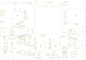

# Box v1 (Option B): schematic design

> **Ordering the box?** Start with [ORDERING.md](ORDERING.md): the cover sheet for a PCB layout, fabrication and
> assembly house (package contents, what is complete, the blocking LT7911D item, fabrication and assembly
> specification, mechanical drawing, acceptance tests, cost estimate, RFQ email). This README is the engineering
> reference behind it.

- **Date:** 2026-09-26. **Status:** pin-level schematic and a **draft PCB layout** (every part placed, everything
  routed except the LT7911D area, §15). Architecture and parts come from
  [custom-box.md](../../docs/research/custom-box.md) §4–§9 and §13.
- **Scope:** one 4-layer PCB of 96×66 mm with the LT7911D (USB-C DP Alt Mode → MIPI CSI-2), the CH32V305RBT6
  (USB High-Speed HID to the iPhone), a Luckfox Core1106 module (RV1106G3), USB-C PD power input, 100M RJ45, USB-C to
  the PC, debug headers, status LEDs and buttons.
- **Labels** (as in custom-box.md): **[Confirmed]** = read from the primary source (datasheet, vendor schematic,
  source code). **[Likely]** = vendor claim, indirect source (search excerpt, KiCad library) or a calculated value
  to be checked against the full datasheet. **[Unknown]** = no public data, must be measured or asked of the
  vendor. Net names, reference designators and pin names are in English.
- **Single source of truth:** [`netlist.py`](netlist.py). Every other file (KiCad, SVG, BOM, netlists, the pin
  tables in this README, the generated tables in ORDERING.md) is generated from it. To change the circuit or a
  part, edit `netlist.py`, then run `generate.py` and `check.py` again. The board is generated from the same
  netlist and from [`placement.py`](placement.py) by [`pcb.py`](pcb.py) (§15).
- **References and licences:** only vendor datasheets and reference designs (WCH, Luckfox, Rockchip), the official
  KiCad symbol library (to cross-check pinouts) and the Rockchip BSP Linux driver (device-tree property names
  only, no code copied). No schematic or file was copied from open hardware projects under GPL/AGPL (JetKVM,
  Luckfox PicoKVM, Aiden, the LT7911D projects on OSHWHub); these projects are not used as a pin source.

---

## 0. Summary

1. **The circuit is closed at pin level** for every part with a public datasheet: CH32V305RBT6, CH224K, Core1106,
   the regulators, ESD, connectors. `check.py` reports PASS: every pin is on a net or marked no-connect, every net
   has at least two pins, every IC power pin has a decoupling capacitor, no net names collide, and every part has
   ordering data. The connectivity read back from the KiCad files matches `netlist.py` on all 759 pins (see §13).
2. **The LT7911D is the biggest blind spot.** Its datasheet R1.4 turns out to be public (LCSC publishes it for part
   C5310990), but the build environment's network could not open it, so pins 1–23 still have numbers from public
   excerpts of the product brief **[Likely]** and the other 25 pins are drawn by function only, with placeholder
   numbers such as `?XTALI` **[Unknown]**. The layout places it with a provisional footprint and leaves its pins,
   the DP lanes and the CSI-2 lanes unrouted until the pin table is filled in (§15). Whether it can act as the power
   source for the iPhone is a firmware question for Lontium (§10.1). No other part does its job with public
   documentation: the other USB-C DP Alt Mode receivers (ITE, Realtek, Parade) are documented under NDA only, and
   so are Lontium's reference designs and firmware.
3. **Power:** the CH224K requests **9 V** from the PD charger (the block diagram says 12 V, reason in §3.1). Two
   LMR33630 bucks make 5.2 V/3 A for the iPhone and 5.0 V/3 A for the system; two TLV62569 bucks make 3.3 V and
   1.2 V. The iPhone gets VBUS through two back-to-back P-MOSFETs with a current shunt.
4. **Two ways to charge the iPhone**, chosen by fitting parts, not by redrawing the circuit:
   - **A (default):** the box supplies 5.2 V to the iPhone itself; the CH32V305 switches VBUS on.
   - **B (if the LT7911D supports dual-CC pass-through):** the charger's CC goes to the LT7911D, the charger's VBUS
     goes straight to the iPhone, and the LT7911D switches it on.
5. **A PD charger of ≥ 30 W** (9 V/3 A) is needed to charge the iPhone at 15 W and run the box (estimate in §3.5).
6. **Bill of materials:** every orderable line has a manufacturer and MPN; LCSC codes are given where they could be
   found, all marked **[Likely]** because lcsc.com and jlcpcb.com could not be opened from the build environment
   (§12). Design-review findings of 2026-09-26 are in §14.
7. **Layout (draft):** 96×66 mm, 4 layers, all SMD parts on the top. The iPhone port is on the front edge; Ethernet,
   the PC port and the power input on the rear. `pcb.py` places every part, routes with Freerouting and fills the
   copper zones; KiCad's DRC is clean apart from the LT7911D connections left open on purpose (§15).

---

## 1. Files in this directory

| File | Content |
|---|---|
| `ORDERING.md` | Cover sheet of the order package for a layout + fabrication + assembly house |
| `netlist.py` | Source of truth: parts (ref, value, footprint), every pin, nets, confidence, cited sources, and the `BUY` catalogue (manufacturer, MPN, LCSC code, evidence, JLCPCB class, price estimate, assembly class) |
| `layout.py` | Placement of the symbols on each sheet, shared by KiCad and SVG |
| `placement.py` | Where every big part sits on the board (connectors, ICs, inductors), the board size, holes, fiducials and the routing corridors kept free; shared by `pcb.py` and `mechanical.py` |
| `pcb.py` | Generates the board `kicad/box-v1.kicad_pcb` from `netlist.py` + `placement.py`: footprints, placement, rules, zones, routing through Freerouting, DRC (§15). Needs KiCad 7's `pcbnew` Python module |
| `footprints/box-v1.pretty/` | Footprints the KiCad library does not have (the HRO TYPE-C-31-M-04 receptacle); the LT7911D, Core1106 and CH224K footprints are built in `pcb.py` |
| `kicad/box-v1.kicad_pcb`, `kicad/drc.rpt` | The draft layout and its KiCad DRC report |
| `svg/pcb-*.svg` | Views of the layout: assembly (placement), each copper layer |
| `generate.py` | Writes `kicad/`, `svg/`, `bom.csv`, `netlist.json`, `kicad/box-v1.net`, the pin tables in this README and the generated tables in ORDERING.md; calls `mechanical.py` |
| `mechanical.py` | Enclosure outline and connector openings → `svg/mechanical.svg` and the openings table in ORDERING.md |
| `check.py` | Checks design rules and generated files; `--selftest` injects faults to prove that each rule catches them |
| `kicad/box-v1.kicad_pro`, `kicad/*.kicad_sch` | KiCad 8 project (format 20231120): root sheet + 5 sub-sheets |
| `kicad/box-v1.net` | KiCad netlist (s-expression, version E) with MPN, Manufacturer, LCSC and DNP fields |
| `svg/*.svg` | 5 schematic sheets viewable on GitHub, plus `svg/mechanical.svg` |
| `bom.csv` | Grouped BOM: reference, qty, value, manufacturer, mpn, lcsc, lcsc_confidence, lcsc_evidence, jlc_type, assembly, dnp, unit_price_usd_est, price_basis, footprint, confidence, notes (§12) |
| `netlist.json` | Parts (with ordering data), pins and nets as JSON |

Re-run after every change (standard Python 3 only):

```sh
cd hardware/box-v1
python3 generate.py            # regenerate every file
python3 check.py --selftest    # PASS/FAIL, non-zero exit code on errors
```

---

## 2. Block diagram


```
PD charger ─J101─ CH224K (9 V) ─ F101 ─ VIN ─┬─ U102 LMR33630 ─ 5V2_PHONE ─ JP101 ─ Q101/Q102 ─ R126 ─ PHONE_VBUS ─┐
                                             └─ U103 LMR33630 ─ 5V_SYS ─┬─ Core1106 (VCC5V0_SYS)                    │
                                                                       ├─ U104 TLV62569 ─ 3V3 ─ CH32V305, LT7911D IO  │
                                                                       └─ U105 TLV62569 ─ 1V2 ─ LT7911D (core, PHY)   │
iPhone ═J201 (USB-C 24P)═╦═ 4 SS pairs + SBU1/2 (DP Alt Mode) ─ U201 LT7911D ═ CSI-2 4 lanes ═ U401 Core1106     │
                         ╠═ CC1/CC2 ─ LT7911D (PD, Alt Mode) + CH32 ADC                                         │
                         ╠═ D+/D- ─ U301 CH32V305 (USB HS, HID)                                                  │
                         ╚═ VBUS ─────────────────────────────────────────────────────────────────────────────────┘
U301 CH32V305 ─ SPI0 + UART4 + IRQ/NRST/BOOT0 ─ U401 Core1106 ─┬─ FEPHY ─ J402 RJ45 (magjack)
                                                               ├─ USB OTG ─ J401 USB-C to the PC
                                                               └─ Wi-Fi 6 on the module (Wi-Fi variant, IPEX antenna connector)
```

Schematic sheets (generated, same content as the KiCad files):

| Sheet | SVG | KiCad |
|---|---|---|
| 1. Power | [svg/power.svg](svg/power.svg) | `kicad/power.kicad_sch` |
| 2. iPhone USB-C + LT7911D | [svg/iphone.svg](svg/iphone.svg) | `kicad/iphone.kicad_sch` |
| 3. CH32V305 | [svg/mcu.svg](svg/mcu.svg) | `kicad/mcu.kicad_sch` |
| 4. Core1106 + Ethernet + PC USB-C | [svg/soc.svg](svg/soc.svg) | `kicad/soc.kicad_sch` |
| 5. Debug, LEDs, buttons | [svg/debug.svg](svg/debug.svg) | `kicad/debug.kicad_sch` |
| Enclosure and openings (proposal) | [svg/mechanical.svg](svg/mechanical.svg) | - |

Drawing convention: no wires; every pin end carries a net label (global label) or a power symbol (rail), or a ×
(no connect). Two pins with the same label name are on the same net, also across sheets. In the SVGs, orange pin
names/numbers are **[Unknown]** and teal ones **[Likely]**; DNP parts are drawn dashed.

---

## 3. Power tree

### 3.1 USB-C PD input (J101, U101 CH224K)

- The CH224K is a PD sink configured by one resistor from CFG1 to GND: 6.8 kΩ = 9 V, 24 kΩ = 12 V, 56 kΩ = 15 V,
  open = 20 V. In resistor mode CFG2/CFG3 must stay open. **[Confirmed]**, CH224 datasheet §5.2.1.
- The circuit follows WCH's reference schematic §6.2: VDD from VIN through 1 kΩ with a 1 µF capacitor.
  **[Confirmed]** The CH224K's VBUS sense pin is left open: the datasheet allows it in PD-only mode (§5.5), and the
  pin is rated 13.5 V (§7.2), below VIN with a 15 V or 20 V profile. The first draft fed it from VIN through 10 kΩ.
- PD only: the CH224K DP and DM pins are shorted together, D+/D- of J101 are left open (datasheet §5.5). No QC/AFC
  protocol can therefore raise the voltage unexpectedly. **[Confirmed]**
- **9 V instead of the 12 V of the block diagram.** Every PD charger of 18 W or more has a fixed 9 V level; 12 V is
  not among the mandatory PD 3.0 levels, so many chargers lack it. **[Likely]** For 12 V, change R103 to 24 kΩ; the
  downstream circuit tolerates up to 20 V (LMR33630 36 V bucks, 50 V input capacitors).
- R101 (1 kΩ) is a 1206: it dissipates ~0.14 W at 15 V. A 20 V request (R103 open) would need 0.28 W, above its
  0.25 W rating, so the CH224K asks for 9–15 V only; Option B, which uses 20 V, removes U101 and R101 carries no
  current.
- **PG** (open drain, low = the requested voltage is present) is pulled up to 3V3 by R108 and goes to the
  CH32V305 (PB12). The MCU firmware only switches the iPhone VBUS on when PG is low.
- Input protection: F101 very fast 5 A/32 V fuse (1206), D101 SMBJ20A TVS (20 V standoff, 32.4 V clamp at 18.5 A,
  below the 36 V input rating of the LMR33630; the first draft's SMAJ24A clamped at 38.9 V), C101 47 µF 35 V to damp
  ringing when a long cable is hot-plugged. U107 (TPD4E05U06) protects the CC lines of J101 and J401 against ESD;
  the CH224K's CC pins are rated 8 V, so a cable that shorts CC to VBUS still needs a CC over-voltage switch
  (§8).

### 3.2 Rails

| Rail | Voltage | Source | Main loads | Design current | Notes |
|---|---|---|---|---|---|
| VBUS_IN / VIN | 9 V (5–20 V) | PD charger via J101, F101 | U102, U103, CH224K | ~2.8 A at 9 V | VIN is after the fuse |
| 5V2_PHONE | 5.22 V | U102 LMR33630ADDA, 400 kHz | iPhone through the switch | 3 A | R109/R110 = 100k/23.7k; on when VIN > ~7.2 V |
| 5V_SYS | 5.02 V | U103 LMR33630ADDA | Core1106, U104, U105 | 1.5 A (3 A rated) | R113/R114 = 100k/24.9k; on when VIN > ~4.3 V |
| 3V3 | 3.315 V | U104 TLV62569DBV, 1.5 MHz | CH32V305, LT7911D 3.3 V, pull-ups, LEDs, INA180 | ≤ 0.4 A (2 A rated) | R118/R119 = 100k/22.1k |
| 1V2 | 1.200 V | U105 TLV62569DBV | LT7911D 1.2 V | **[Unknown]**, 2 A budget | R121/R122 = 100k/100k; on after 3V3 |
| 3V3_LT | 3.3 V | FB201 from 3V3 | LT7911D 3.3 V pins | | ferrite 600 Ω@100 MHz |
| 1V2_LT_A | 1.2 V | FB202 from 1V2 | VCC12A_RX, VCC12_PI, VCC12_RXPLL | | isolates the PLL/analog supply |
| VDDA_MCU | 3.3 V | FB301 from 3V3 | CH32V305 VDDA | | datasheet: VDDA must equal VIO |
| CH224_VDD | 3.3 V | CH224K internal shunt | CH224K | a few mA | |
| PHONE_VBUS | 0 or 5.2 V | switch Q101/Q102 | iPhone | 3 A | discharged to 0 V through R210 |
| VCC_1V8_MOD, VCC_3V3_MOD | 1.8 / 3.3 V | PMIC on the Core1106 | RECOVERY key pull-up; TP | ≤ 300 mA per rail | per the Luckfox power table |

The VREF values (LMR33630: 1.0 V; TLV62569: 0.6 V) and the EN threshold (~1.2 V) are **[Likely]**: taken from the
library/memory, the TI datasheets could not be read in this environment. `check.py` (rule R10) recomputes the
output voltages, UVLO thresholds and ADC ranges from the resistor values in `netlist.py`; change VREF in
`check.py` if the datasheet differs.

Buck parts (each LMR33630): 2 × 10 µF 50 V X7R 1206 + 100 nF 50 V next to VIN/GND; 100 nF bootstrap capacitor;
1 µF VCC capacitor; 10 µH inductor (Isat ≥ 5 A for U102, ≥ 4 A for U103, 10×10 mm; the ordered Bourns SRP1038A-100M
is rated 7.5 A with ~30 mΩ DCR per the LCSC excerpt, against the original ≤ 25 mΩ target: ~0.27 W copper loss at
3 A); 3 × 22 µF 25 V X5R 1206 at the output. With 9 V → 5.2 V, 400 kHz and 10 µH the ripple current is ~0.55 A
(18 % of 3 A). Each TLV62569: 10 µF + 100 nF at the input, 2.2 µH inductor (Isat ≥ 3 A, 4×4 mm; the ordered
SRN4018-2R2M is rated 2.9 A per the LCSC excerpt, enough for the 2 A converter, confirm Isat on the datasheet),
2 × 22 µF 25 V X5R 0805 at the output.

### 3.3 Power-up sequence

1. VIN rises → U103 (5V_SYS) runs when VIN > ~4.3 V; U102 (5V2_PHONE) only runs when VIN > ~7.2 V, so with a non-PD
   (5 V) charger the box runs but does not charge the iPhone.
2. 5V_SYS → the Core1106 sequences its own rails with the EA3036C PMIC on the module **[Confirmed]** (Core1106
   schematic); U104 (3V3) starts immediately (EN pulled up to 5V_SYS).
3. U105 (1V2) starts about 4 ms after 3V3: its EN comes from 3V3 through a 100 kΩ/100 nF RC. 3.3 V before 1.2 V is a
   safe assumption; the real LT7911D requirement is **[Unknown]**.
4. LT7911D: RST_N is pulled up to 3V3 by 10 kΩ with a 1 µF capacitor (τ = 10 ms), so the chip runs as soon as it is
   powered and can handle PD/CC. The RV1106 controls the reset through GPIO0_A3 (pad 61); this pin defaults to a
   pull-up, so it does not hold the LT7911D in reset while the SoC boots. **[Confirmed]** for the default level
   (`_u` suffix in the Luckfox pin table).
5. The CH32V305 has an internal POR; NRST has a 4.7 kΩ/100 nF RC.
6. CSI path: the LT7911D may drive LP-11 before the RV1106 has booted. Both come up from the same 5V_SYS within a few
   ms; the driver opens the stream only after probing. The risk of back-feeding through the CSI pins while the
   module is unpowered is low but **[Unknown]**.

### 3.4 Charging path to the iPhone (pass-through)

Switch: Q101 and Q102 (SO-8 P-MOSFETs, AO4407A: −30 V, ~11 mΩ at Vgs −10 V and about 18 mΩ at −4.5 V **[Likely]**)
share their sources (PSW_S), with the drains facing outwards. When off, the two body diodes block both directions,
so the iPhone cannot feed back into the box and the box cannot push voltage out before it is allowed to. Q103
(2N7002) pulls the gate down through R124 10 kΩ; R123 100 kΩ holds the gate off; C128 47 nF gives a ~0.5 ms soft
start; D102 (10 V zener) clamps Vgs in Option B with VIN up to 20 V. At 5.2 V, Vgs ≈ −4.7 V.

| | Option A (default) | Option B |
|---|---|---|
| Charger CC (J101) | to the CH224K (R104/R105 = 0 Ω) | to the second PD port of the LT7911D (R106/R107 = 0 Ω, remove R104/R105, remove U101) |
| Switch supply | 5V2_PHONE (JP101 bridged 1-2) | VIN (JP101 bridged 2-3), voltage negotiated by the LT7911D |
| Who switches | CH32V305 PB1 (R127 = 0 Ω) | LT7911D GPIO (R128 = 0 Ω, remove R127) |
| TVS on the iPhone VBUS | D201 SMF6.0A | change to SMF22A |
| Condition | LT7911D can act as Source (Rp) + UFP_D + DR_Swap with the iPhone | LT7911D has dual-CC pass-through firmware |

VBUS enable logic in the MCU firmware (Option A): PD_PG low **and** iPhone-side VBUS < 0.8 V (nobody else is
supplying it) **and** the CC1/CC2 voltages show an Rd device. Switch off when the current (PHONE_ISENSE) exceeds
the limit or when the cable is unplugged. The MCU reads CC1_SENSE/CC2_SENSE (through 100 kΩ, no load on the CC
lines), PHONE_VBUS_SENSE (100k/15k divider, 20 V → 2.6 V) and PHONE_ISENSE (INA180A2, gain 50, 10 mΩ shunt →
0.5 V/A, up to 6.6 A before saturating at 3.3 V).

Per the Type-C specification, a source must bring VBUS back to vSafe0V (< 0.8 V) after unplugging; R210 10 kΩ with
~20 µF in total takes 5.2 V down to 0.8 V in ~0.4 s (limit 650 ms). **[Likely]**, per the USB Type-C spec.

### 3.5 Power estimate

| Load | Power | Confidence |
|---|---|---|
| iPhone, 5.2 V × 3 A | 15.6 W | [Likely]: the iPhone draws up to 3 A when the source advertises 3 A |
| Core1106 | 2.4 W measured (467 mA), 5 W (1 A) design | [Confirmed], Luckfox power table |
| 3V3 (CH32V305, LT7911D 3.3 V, LEDs) | ≤ 1.3 W | [Unknown] for the LT7911D |
| 1V2 (LT7911D) | ≤ 1 W | [Unknown] |
| Total from VIN (buck efficiency ~92 %) | ~25 W → ~2.8 A at 9 V | estimate |

Conclusion: a PD charger with a 9 V/3 A level (30 W class) is needed. With a 20 W charger the firmware should limit
the iPhone current (switch off when PHONE_ISENSE is high or VIN_SENSE sags).

### 3.6 Powering the box from the PC (JP102, development only)

JP102 is open by default. With JP102 bridged, PC_VBUS → D104 (SS34) → 5V_SYS gives ~4.6–4.7 V, right at the 4.6 V
minimum of the Core1106. **Do not plug a charger into J101 while JP102 is bridged:** 5V_SYS could then flow
backwards through the body diode of U103 to VIN and out of the J101 VBUS pin. The iPhone is not charged in this
mode (U102 off).

---

## 4. Blocks and pin tables

Every table below is generated from `netlist.py`. The "Connects to" column lists the other pins on the same net
(`REF.pin`). NC = no connect (no-connect flag in KiCad). The last column is the confidence of the **pin number and
function**. The header line of each part names the ordered part (manufacturer and MPN, see §12).

### 4.1 Power

Sources: CH224K per the WCH datasheet (V1F copy on GitHub); LMR33630, TLV62569, INA180A2, AO4407A/2N7002 per the
KiCad 8.0.9 symbol library (which copies the vendors' pinouts) **[Likely]**; the USB-C connectors per the standard
Type-C pinout **[Confirmed]**. CH224K CC1/CC2: the datasheet pin table says "6, 7 = CC1, CC2" but figure §6.2 and
the KiCad symbol say CC1 = 7, CC2 = 6; both pins are symmetric so either way works, the schematic follows figure
§6.2.

<!-- BEGIN GENERATED: pins-power -->
**J101 USB-C PD IN** (Korean Hroparts Elec TYPE-C-31-M-12; footprint `Connector_USB:USB_C_Receptacle_HRO_TYPE-C-31-M-12`; source: [KICAD_SYM](https://gitlab.com/kicad/libraries/kicad-symbols/-/tree/8.0.9))

| Pin | Name | Net | Connects to | Note | Confidence |
|---|---|---|---|---|---|
| A1 | GND | GND | rail (161 pins) |  | [Confirmed] |
| A4 | VBUS | VBUS_IN | F101.1 |  | [Confirmed] |
| A5 | CC1 | PD_CC1 | R104.1, R106.1, U107.1 |  | [Confirmed] |
| A6 | D+ | NC | - |  | [Confirmed] |
| A7 | D- | NC | - |  | [Confirmed] |
| A8 | SBU1 | NC | - |  | [Confirmed] |
| A9 | VBUS | VBUS_IN | F101.1 |  | [Confirmed] |
| A12 | GND | GND | rail (161 pins) |  | [Confirmed] |
| B1 | GND | GND | rail (161 pins) |  | [Confirmed] |
| B4 | VBUS | VBUS_IN | F101.1 |  | [Confirmed] |
| B5 | CC2 | PD_CC2 | R105.1, R107.1, U107.2 |  | [Confirmed] |
| B6 | D+ | NC | - |  | [Confirmed] |
| B7 | D- | NC | - |  | [Confirmed] |
| B8 | SBU2 | NC | - |  | [Confirmed] |
| B9 | VBUS | VBUS_IN | F101.1 |  | [Confirmed] |
| B12 | GND | GND | rail (161 pins) |  | [Confirmed] |
| S1 | SHIELD | GND | rail (161 pins) |  | [Confirmed] |

**JP101 PSW_SRC** (-; footprint `Jumper:SolderJumper-3_P1.3mm_Bridged12_RoundedPad1.0x1.5mm`; source: -)

| Pin | Name | Net | Connects to | Note | Confidence |
|---|---|---|---|---|---|
| 1 | A | 5V2_PHONE | L101.2, C108.1, C109.1, C110.1, R109.1, TP502.1 |  | [Confirmed] |
| 2 | C | PSW_IN | Q101.5, Q101.6, Q101.7, Q101.8 |  | [Confirmed] |
| 3 | B | VIN | rail (16 pins) |  | [Confirmed] |

**JP102 PC_PWR** (-; footprint `Jumper:SolderJumper-2_P1.3mm_Open_RoundedPad1.0x1.5mm`; source: -)

| Pin | Name | Net | Connects to | Note | Confidence |
|---|---|---|---|---|---|
| 1 | A | PC_VBUS | rail (7 pins) |  | [Confirmed] |
| 2 | B | PCPWR_A | D104.2 |  | [Confirmed] |

**Q101 AO4407A** (Alpha & Omega Semiconductor AO4407A; footprint `Package_SO:SOIC-8_3.9x4.9mm_P1.27mm`; source: [KICAD_SYM](https://gitlab.com/kicad/libraries/kicad-symbols/-/tree/8.0.9))

| Pin | Name | Net | Connects to | Note | Confidence |
|---|---|---|---|---|---|
| 1 | S | PSW_S | Q102.1, Q102.2, Q102.3, R123.1, C128.1, D102.1 |  | [Confirmed] |
| 2 | S | PSW_S | Q102.1, Q102.2, Q102.3, R123.1, C128.1, D102.1 |  | [Confirmed] |
| 3 | S | PSW_S | Q102.1, Q102.2, Q102.3, R123.1, C128.1, D102.1 |  | [Confirmed] |
| 4 | G | PSW_G | Q102.4, R123.2, C128.2, D102.2, R124.1 |  | [Confirmed] |
| 5 | D | PSW_IN | JP101.2 |  | [Confirmed] |
| 6 | D | PSW_IN | JP101.2 |  | [Confirmed] |
| 7 | D | PSW_IN | JP101.2 |  | [Confirmed] |
| 8 | D | PSW_IN | JP101.2 |  | [Confirmed] |

**Q102 AO4407A** (Alpha & Omega Semiconductor AO4407A; footprint `Package_SO:SOIC-8_3.9x4.9mm_P1.27mm`; source: [KICAD_SYM](https://gitlab.com/kicad/libraries/kicad-symbols/-/tree/8.0.9))

| Pin | Name | Net | Connects to | Note | Confidence |
|---|---|---|---|---|---|
| 1 | S | PSW_S | Q101.1, Q101.2, Q101.3, R123.1, C128.1, D102.1 |  | [Confirmed] |
| 2 | S | PSW_S | Q101.1, Q101.2, Q101.3, R123.1, C128.1, D102.1 |  | [Confirmed] |
| 3 | S | PSW_S | Q101.1, Q101.2, Q101.3, R123.1, C128.1, D102.1 |  | [Confirmed] |
| 4 | G | PSW_G | Q101.4, R123.2, C128.2, D102.2, R124.1 |  | [Confirmed] |
| 5 | D | PSW_OUT | R126.1, U106.3 |  | [Confirmed] |
| 6 | D | PSW_OUT | R126.1, U106.3 |  | [Confirmed] |
| 7 | D | PSW_OUT | R126.1, U106.3 |  | [Confirmed] |
| 8 | D | PSW_OUT | R126.1, U106.3 |  | [Confirmed] |

**Q103 2N7002** (Changjiang Electronics Tech (CJ) 2N7002; footprint `Package_TO_SOT_SMD:SOT-23`; source: [KICAD_SYM](https://gitlab.com/kicad/libraries/kicad-symbols/-/tree/8.0.9))

| Pin | Name | Net | Connects to | Note | Confidence |
|---|---|---|---|---|---|
| 1 | G | PHONE_VBUS_EN | R125.1, R127.2, R128.2 |  | [Confirmed] |
| 2 | S | GND | rail (165 pins) |  | [Confirmed] |
| 3 | D | PSW_GD | R124.2 |  | [Confirmed] |

**U101 CH224K** (WCH (Jiangsu Qin Heng) CH224K; footprint `Package_SO:SSOP-10-1EP_3.9x4.9mm_P1mm_EP2.1x3.3mm`; source: [CH224](https://raw.githubusercontent.com/makespacemadrid/cheap-wled-controller/main/datasheet/ch224k.pdf))

| Pin | Name | Net | Connects to | Note | Confidence |
|---|---|---|---|---|---|
| 1 | VDD | CH224_VDD | R101.2, C102.1 | internal 3.3 V shunt, fed from VIN through 1 kΩ | [Confirmed] |
| 2 | CFG2 | NC | - | resistor mode: CFG2/CFG3 must stay open (§5.2.1) | [Confirmed] |
| 3 | CFG3 | NC | - | same as CFG2 | [Confirmed] |
| 4 | DP | CH224_DPDM |  | DP-DM shorted: PD only (§5.5) | [Confirmed] |
| 5 | DM | CH224_DPDM |  | DP-DM shorted | [Confirmed] |
| 6 | CC2 | CH224_CC2 | R105.2 | through R105 0R to J101.B5 | [Confirmed] |
| 7 | CC1 | CH224_CC1 | R104.2 | through R104 0R to J101.A5 | [Confirmed] |
| 8 | VBUS | NC | - | left open: PD-only mode allows it (§5.5), and the pin is rated 13.5 V, below VIN at 15-20 V | [Confirmed] |
| 9 | CFG1 | CH224_CFG1 | R103.1 | 6.8 kΩ to GND = request 9 V | [Confirmed] |
| 10 | PG | PD_PG | R108.1, U301.33 | open drain, low = requested voltage present | [Confirmed] |
| 11 | GND | GND | rail (165 pins) | EPAD (the datasheet calls it pin 0) | [Confirmed] |

**U102 LMR33630ADDA** (Texas Instruments LMR33630ADDAR; footprint `Package_SO:Texas_HSOP-8-1EP_3.9x4.9mm_P1.27mm_ThermalVias`; source: [KICAD_SYM](https://gitlab.com/kicad/libraries/kicad-symbols/-/tree/8.0.9))

| Pin | Name | Net | Connects to | Note | Confidence |
|---|---|---|---|---|---|
| 1 | GND | GND | rail (164 pins) |  | [Confirmed] |
| 2 | VIN | VIN | rail (16 pins) |  | [Confirmed] |
| 3 | EN | U102_EN | R111.2, R112.1 | UVLO divider 100k/20k | [Confirmed] |
| 4 | PG | NC | - | not used | [Confirmed] |
| 5 | FB | U102_FB | R109.2, R110.1 |  | [Confirmed] |
| 6 | VCC | U102_VCC | C106.1 | internal LDO, 1 µF capacitor | [Confirmed] |
| 7 | BOOT | U102_BOOT | C107.1 |  | [Confirmed] |
| 8 | SW | U102_SW | C107.2, L101.1 |  | [Confirmed] |
| 9 | EP | GND | rail (164 pins) | thermal pad = GND | [Confirmed] |

**U103 LMR33630ADDA** (Texas Instruments LMR33630ADDAR; footprint `Package_SO:Texas_HSOP-8-1EP_3.9x4.9mm_P1.27mm_ThermalVias`; source: [KICAD_SYM](https://gitlab.com/kicad/libraries/kicad-symbols/-/tree/8.0.9))

| Pin | Name | Net | Connects to | Note | Confidence |
|---|---|---|---|---|---|
| 1 | GND | GND | rail (164 pins) |  | [Confirmed] |
| 2 | VIN | VIN | rail (16 pins) |  | [Confirmed] |
| 3 | EN | U103_EN | R115.2, R116.1 | UVLO divider 100k/39k | [Confirmed] |
| 4 | PG | NC | - | not used | [Confirmed] |
| 5 | FB | U103_FB | R113.2, R114.1 |  | [Confirmed] |
| 6 | VCC | U103_VCC | C114.1 | internal LDO, 1 µF capacitor | [Confirmed] |
| 7 | BOOT | U103_BOOT | C115.1 |  | [Confirmed] |
| 8 | SW | U103_SW | C115.2, L102.1 |  | [Confirmed] |
| 9 | EP | GND | rail (164 pins) | thermal pad = GND | [Confirmed] |

**U104 TLV62569DBV** (Texas Instruments TLV62569DBVR; footprint `Package_TO_SOT_SMD:SOT-23-5`; source: [KICAD_SYM](https://gitlab.com/kicad/libraries/kicad-symbols/-/tree/8.0.9))

| Pin | Name | Net | Connects to | Note | Confidence |
|---|---|---|---|---|---|
| 1 | EN | U104_EN | R117.2 |  | [Confirmed] |
| 2 | GND | GND | rail (165 pins) |  | [Confirmed] |
| 3 | SW | U104_SW | L103.1 |  | [Confirmed] |
| 4 | VIN | 5V_SYS | rail (18 pins) |  | [Confirmed] |
| 5 | FB | U104_FB | R118.2, R119.1 |  | [Confirmed] |

**U105 TLV62569DBV** (Texas Instruments TLV62569DBVR; footprint `Package_TO_SOT_SMD:SOT-23-5`; source: [KICAD_SYM](https://gitlab.com/kicad/libraries/kicad-symbols/-/tree/8.0.9))

| Pin | Name | Net | Connects to | Note | Confidence |
|---|---|---|---|---|---|
| 1 | EN | U105_EN | R120.2, C125.1 |  | [Confirmed] |
| 2 | GND | GND | rail (165 pins) |  | [Confirmed] |
| 3 | SW | U105_SW | L104.1 |  | [Confirmed] |
| 4 | VIN | 5V_SYS | rail (18 pins) |  | [Confirmed] |
| 5 | FB | U105_FB | R121.2, R122.1 |  | [Confirmed] |

**U106 INA180A2** (Texas Instruments INA180A2IDBVR; footprint `Package_TO_SOT_SMD:SOT-23-5`; source: [KICAD_SYM](https://gitlab.com/kicad/libraries/kicad-symbols/-/tree/8.0.9))

| Pin | Name | Net | Connects to | Note | Confidence |
|---|---|---|---|---|---|
| 1 | OUT | PHONE_ISENSE | C130.1, U301.17 |  | [Confirmed] |
| 2 | GND | GND | rail (165 pins) |  | [Confirmed] |
| 3 | IN+ | PSW_OUT | Q102.5, Q102.6, Q102.7, Q102.8, R126.1 | Kelvin at R126, MOSFET side | [Confirmed] |
| 4 | IN- | PHONE_VBUS | rail (11 pins) | Kelvin at R126, iPhone side | [Confirmed] |
| 5 | V+ | 3V3 | rail (28 pins) |  | [Confirmed] |

**U107 TPD4E05U06DQA** (Texas Instruments TPD4E05U06DQAR; footprint `Package_SON:USON-10_2.5x1.0mm_P0.5mm`; source: [KICAD_SYM](https://gitlab.com/kicad/libraries/kicad-symbols/-/tree/8.0.9))

| Pin | Name | Net | Connects to | Note | Confidence |
|---|---|---|---|---|---|
| 1 | D1+ | PD_CC1 | J101.A5, R104.1, R106.1 |  | [Confirmed] |
| 2 | D1- | PD_CC2 | J101.B5, R105.1, R107.1 |  | [Confirmed] |
| 3 | GND | GND | rail (164 pins) |  | [Confirmed] |
| 4 | D2+ | PC_CC1 | J401.A5, R401.1 |  | [Confirmed] |
| 5 | D2- | PC_CC2 | J401.B5, R402.1 |  | [Confirmed] |
| 6 | NC | NC | - | flow-through pad | [Confirmed] |
| 7 | NC | NC | - |  | [Confirmed] |
| 8 | GND | GND | rail (164 pins) |  | [Confirmed] |
| 9 | NC | NC | - |  | [Confirmed] |
| 10 | NC | NC | - |  | [Confirmed] |

Passives and test points of this block:

| Ref | Value | Pin 1 | Pin 2 | Footprint | Role |
|---|---|---|---|---|---|
| C101 | 47uF 35V | VIN | GND | `CP_Elec_6.3x7.7` | VIN bulk capacitor, damps ringing when a long cable is hot-plugged |
| C102 | 1uF 50V | CH224_VDD | GND | `C_0603_1608Metric` | CH224K VDD capacitor |
| C103 | 10uF 50V X7R | VIN | GND | `C_1206_3216Metric` | U102 input capacitor |
| C104 | 10uF 50V X7R | VIN | GND | `C_1206_3216Metric` | U102 input capacitor |
| C105 | 100nF 50V | VIN | GND | `C_0603_1608Metric` | High-frequency capacitor at the U102 VIN/GND pins |
| C106 | 1uF 25V | U102_VCC | GND | `C_0402_1005Metric` | U102 internal LDO capacitor |
| C107 | 100nF 16V | U102_BOOT | U102_SW | `C_0402_1005Metric` | U102 bootstrap capacitor |
| C108 | 22uF 25V X5R | 5V2_PHONE | GND | `C_1206_3216Metric` | U102 output capacitor |
| C109 | 22uF 25V X5R | 5V2_PHONE | GND | `C_1206_3216Metric` | U102 output capacitor |
| C110 | 22uF 25V X5R | 5V2_PHONE | GND | `C_1206_3216Metric` | U102 output capacitor |
| C111 | 10uF 50V X7R | VIN | GND | `C_1206_3216Metric` | U103 input capacitor |
| C112 | 10uF 50V X7R | VIN | GND | `C_1206_3216Metric` | U103 input capacitor |
| C113 | 100nF 50V | VIN | GND | `C_0603_1608Metric` | High-frequency capacitor at the U103 VIN/GND pins |
| C114 | 1uF 25V | U103_VCC | GND | `C_0402_1005Metric` | U103 internal LDO capacitor |
| C115 | 100nF 16V | U103_BOOT | U103_SW | `C_0402_1005Metric` | U103 bootstrap capacitor |
| C116 | 22uF 25V X5R | 5V_SYS | GND | `C_1206_3216Metric` | U103 output capacitor |
| C117 | 22uF 25V X5R | 5V_SYS | GND | `C_1206_3216Metric` | U103 output capacitor |
| C118 | 22uF 25V X5R | 5V_SYS | GND | `C_1206_3216Metric` | U103 output capacitor |
| C119 | 10uF 10V | 5V_SYS | GND | `C_0603_1608Metric` | U104 input capacitor |
| C120 | 100nF | 5V_SYS | GND | `C_0402_1005Metric` | U104 high-frequency input capacitor |
| C121 | 22uF 25V X5R | 3V3 | GND | `C_0805_2012Metric` | U104 output capacitor |
| C122 | 22uF 25V X5R | 3V3 | GND | `C_0805_2012Metric` | U104 output capacitor |
| C123 | 10uF 10V | 5V_SYS | GND | `C_0603_1608Metric` | U105 input capacitor |
| C124 | 100nF | 5V_SYS | GND | `C_0402_1005Metric` | U105 high-frequency input capacitor |
| C125 | 100nF | U105_EN | GND | `C_0402_1005Metric` | U105 EN delay capacitor (τ = 10 ms) |
| C126 | 22uF 25V X5R | 1V2 | GND | `C_0805_2012Metric` | U105 output capacitor |
| C127 | 22uF 25V X5R | 1V2 | GND | `C_0805_2012Metric` | U105 output capacitor |
| C128 | 47nF 50V | PSW_S | PSW_G | `C_0603_1608Metric` | Soft start (~0.5 ms), limits the charging current into the iPhone |
| C129 | 100nF | 3V3 | GND | `C_0402_1005Metric` | U106 supply capacitor |
| C130 | 1nF | PHONE_ISENSE | GND | `C_0402_1005Metric` | U106 output filter before the ADC |
| D101 | SMBJ20A | VIN | GND | `D_SMB` | TVS on VIN: 20 V standoff, 32.4 V clamp, below the 36 V input rating of the LMR33630 |
| D102 | BZT52C10 | PSW_S | PSW_G | `D_SOD-123` | 10 V zener clamping Vgs in Option B (VIN up to 20 V) |
| D104 | SS34 | 5V_SYS | PCPWR_A | `D_SMA` | 3 A 40 V Schottky: PC_VBUS -> 5V_SYS (development mode) |
| F101 | 5A 32V | VBUS_IN | VIN | `Fuse_1206_3216Metric` | Very fast 5 A / 32 V input fuse [Likely] |
| L101 | 10uH | U102_SW | 5V2_PHONE | `L_Bourns_SRP1038C_10.0x10.0mm` | U102 buck inductor, Isat ≥ 5 A [Likely] |
| L102 | 10uH | U103_SW | 5V_SYS | `L_Bourns_SRP1038C_10.0x10.0mm` | U103 buck inductor, Isat ≥ 4 A [Likely] |
| L103 | 2.2uH | U104_SW | 3V3 | `L_Bourns-SRN4018` | U104 inductor, Isat ≥ 3 A, 4x4 mm [Likely] |
| L104 | 2.2uH | U105_SW | 1V2 | `L_Bourns-SRN4018` | U105 inductor, Isat ≥ 3 A, 4x4 mm [Likely] |
| R101 | 1k | VIN | CH224_VDD | `R_1206_3216Metric` | CH224K VDD feed resistor (datasheet §6.2) |
| R103 | 6.8k 1% | CH224_CFG1 | GND | `R_0402_1005Metric` | Requested voltage: 6.8k=9V (default), 24k=12V, 56k=15V, open=20V |
| R104 | 0R | PD_CC1 | CH224_CC1 | `R_0402_1005Metric` | Option A: charger CC to the CH224K |
| R105 | 0R | PD_CC2 | CH224_CC2 | `R_0402_1005Metric` | Option A: charger CC to the CH224K |
| R106 **DNP** | 0R | PD_CC1 | LT_PDCC1 | `R_0402_1005Metric` | Option B: charger CC to the second PD port of the LT7911D [Unknown] |
| R107 **DNP** | 0R | PD_CC2 | LT_PDCC2 | `R_0402_1005Metric` | Option B (as R106) [Unknown] |
| R108 | 10k | PD_PG | 3V3 | `R_0402_1005Metric` | Pull-up for PG (open drain) to MCU PB12 |
| R109 | 100k 1% | 5V2_PHONE | U102_FB | `R_0402_1005Metric` | U102 upper feedback resistor |
| R110 | 23.7k 1% | U102_FB | GND | `R_0402_1005Metric` | U102 lower feedback resistor: Vout = 1.0 V x (1 + 100k/Rfbb) |
| R111 | 100k | VIN | U102_EN | `R_0402_1005Metric` | U102 EN divider (top) |
| R112 | 20k | U102_EN | GND | `R_0402_1005Metric` | U102 EN divider (bottom) |
| R113 | 100k 1% | 5V_SYS | U103_FB | `R_0402_1005Metric` | U103 upper feedback resistor |
| R114 | 24.9k 1% | U103_FB | GND | `R_0402_1005Metric` | U103 lower feedback resistor: Vout = 1.0 V x (1 + 100k/Rfbb) |
| R115 | 100k | VIN | U103_EN | `R_0402_1005Metric` | U103 EN divider (top) |
| R116 | 39k | U103_EN | GND | `R_0402_1005Metric` | U103 EN divider (bottom) |
| R117 | 100k | 5V_SYS | U104_EN | `R_0402_1005Metric` | U104 EN: on as soon as 5V_SYS is present |
| R118 | 100k 1% | 3V3 | U104_FB | `R_0402_1005Metric` | U104 upper feedback resistor |
| R119 | 22.1k 1% | U104_FB | GND | `R_0402_1005Metric` | U104 lower feedback resistor: Vout = 0.6 V x (1 + 100k/Rbot) |
| R120 | 100k | 3V3 | U105_EN | `R_0402_1005Metric` | U105 EN from 3V3 through an RC: 1V2 comes up ~4 ms after 3V3 |
| R121 | 100k 1% | 1V2 | U105_FB | `R_0402_1005Metric` | U105 upper feedback resistor |
| R122 | 100k 1% | U105_FB | GND | `R_0402_1005Metric` | U105 lower feedback resistor: Vout = 0.6 V x (1 + 100k/Rbot) |
| R123 | 100k | PSW_S | PSW_G | `R_0402_1005Metric` | Gate pulled up to the common source: MOSFETs off by default |
| R124 | 10k | PSW_G | PSW_GD | `R_0402_1005Metric` | Gate resistor: Vgs = -Vin x 100k/110k |
| R125 | 100k | PHONE_VBUS_EN | GND | `R_0402_1005Metric` | iPhone VBUS off by default |
| R126 | 10m 1% | PSW_OUT | PHONE_VBUS | `R_1206_3216Metric` | iPhone charging current shunt (Kelvin) |
| R127 | 0R | MCU_VBUS_EN | PHONE_VBUS_EN | `R_0402_1005Metric` | Option A: the CH32V305 switches the iPhone VBUS |
| R128 **DNP** | 0R | LT_VBUS_EN | PHONE_VBUS_EN | `R_0402_1005Metric` | Option B: an LT7911D GPIO switches the iPhone VBUS [Unknown] |
<!-- END GENERATED: pins-power -->

### 4.2 iPhone USB-C + LT7911D

**What is certain about the LT7911D** (driver `lt7911d.c`, `lt7911d.h` and DTS `rk3588s-evb1-lp4x-v10-camera.dtsi`
in the Rockchip BSP develop-5.10) **[Confirmed]**:

- I2C slave at 7-bit address **0x2B**; 16-bit registers accessed through pages (write 0xFF = high byte); chip ID
  **0x0516** at 0xA000/0xA001.
- `reset-gpios` active low; `power-gpios` and `plugin-det-gpios` optional; the chip's interrupt is rising edge.
- The driver requires an `xvclk` clock in the device tree (probe fails without it), although the LT7911D has its
  own crystal. On the RV1106, declare a CRU clock (for example MIPI_CLK0_OUT) without wiring the pin; Core1106 pad 19
  stays open.
- CSI-2 with 4 lanes (`data-lanes = <1 2 3 4>`), link frequency 400 MHz (800 Mbit/s per lane), UYVY 8-bit format.

**What is [Likely]:** names and numbers of pins 1–23 (VCC12D_RX, D0P/D0N, …, UCC1 = 14, UCC2 = 15, AUXP/AUXN = 17/18,
RST_N = 20, CSCL/CSDA = 21/22, RX_HPD = 23), taken from search excerpts of the product brief and of the datasheet on
LCSC (C5310990); the original files could not be downloaded (the proxy blocks lontiumsemi.com and
datasheet.lcsc.com). Supplies: 1.2 V + 3.3 V.

**What is [Unknown], and how it is drawn for now:**

- The MIPI TX pins, crystal, interrupt GPIO, core `VDD` pin, MIPI TX supplies, I2S/SPDIF and EPAD: drawn with
  placeholder numbers `?..`. The KiCad file therefore cannot match any QFN-64 footprint; this is deliberate, so
  that nobody lays out the board before the datasheet is in hand.
- Mapping of the receptacle SS pairs onto lanes D0–D3: drawn for now as D0 ← RX2 (A11/A10), D1 ← TX2 (B2/B3),
  D2 ← RX1 (B11/B10), D3 ← TX1 (A2/A3). The LT7911D has a lane-swap function, so the order may be set in firmware,
  but whether the chip handles plug orientation by itself or needs the wiring of the Lontium reference design is
  unknown. P is wired to P and N to N.
- AUX: SBU1 → C216 100 nF → AUXP, SBU2 → C217 100 nF → AUXN. The AUX direction when the plug is flipped and the
  sink-side bias resistors (R206/R207 1 MΩ, DNP) follow the Lontium reference design.
- `SLEEP_33`: function unclear; wired to TP201, with room for R204 (DNP) as a pull-down.
- Crystal X201 is drawn as 25 MHz with 18 pF capacitors; this is an assumption only (the BOM carries a 25 MHz 12 pF
  YXC part as a placeholder).

Connector protection: U202/U203 (TPD4E05U06, 0.5 pF, flow-through) for the 4 SS pairs; U204 for CC1/CC2/SBU1/SBU2;
U205 (USBLC6-2SC6) for D+/D-. D201 TVS on VBUS. R211/R212 (5.1 kΩ, DNP) are temporary Rd resistors to test HID
before the LT7911D is fitted (§9, step 3).

<!-- BEGIN GENERATED: pins-iphone -->
**J201 USB-C iPhone** (Korean Hroparts Elec TYPE-C-31-M-04; footprint `box-v1:USB_C_Receptacle_HRO_TYPE-C-31-M-04`; source: [USBC_SPEC](https://www.usb.org/document-library/usb-type-cr-cable-and-connector-specification-release-24))

| Pin | Name | Net | Connects to | Note | Confidence |
|---|---|---|---|---|---|
| 31 | SHIELD | GND | rail (158 pins) |  | [Confirmed] |
| 32 | SHIELD | GND | rail (158 pins) |  | [Confirmed] |
| 33 | SHIELD | GND | rail (158 pins) |  | [Confirmed] |
| 34 | SHIELD | GND | rail (158 pins) |  | [Confirmed] |
| A1 | GND | GND | rail (158 pins) |  | [Confirmed] |
| A2 | TX1+ | SS_TX1_P | U201.11, U202.1 |  | [Confirmed] |
| A3 | TX1- | SS_TX1_N | U201.12, U202.2 |  | [Confirmed] |
| A4 | VBUS | PHONE_VBUS | rail (8 pins) |  | [Confirmed] |
| A5 | CC1 | PHONE_CC1 | U201.14, U204.1, R211.1, R304.1 |  | [Confirmed] |
| A6 | D+ | PHONE_USB_DP | U205.1, U205.6, U301.59 |  | [Confirmed] |
| A7 | D- | PHONE_USB_DN | U205.3, U205.4, U301.58 |  | [Confirmed] |
| A8 | SBU1 | PHONE_SBU1 | C216.1, U204.4 |  | [Confirmed] |
| A9 | VBUS | PHONE_VBUS | rail (8 pins) |  | [Confirmed] |
| A10 | RX2- | SS_RX2_N | U201.3, U203.5 |  | [Confirmed] |
| A11 | RX2+ | SS_RX2_P | U201.2, U203.4 |  | [Confirmed] |
| A12 | GND | GND | rail (158 pins) |  | [Confirmed] |
| B1 | GND | GND | rail (158 pins) |  | [Confirmed] |
| B2 | TX2+ | SS_TX2_P | U201.5, U203.1 |  | [Confirmed] |
| B3 | TX2- | SS_TX2_N | U201.6, U203.2 |  | [Confirmed] |
| B4 | VBUS | PHONE_VBUS | rail (8 pins) |  | [Confirmed] |
| B5 | CC2 | PHONE_CC2 | U201.15, U204.2, R212.1, R305.1 |  | [Confirmed] |
| B6 | D+ | PHONE_USB_DP | U205.1, U205.6, U301.59 |  | [Confirmed] |
| B7 | D- | PHONE_USB_DN | U205.3, U205.4, U301.58 |  | [Confirmed] |
| B8 | SBU2 | PHONE_SBU2 | C217.1, U204.5 |  | [Confirmed] |
| B9 | VBUS | PHONE_VBUS | rail (8 pins) |  | [Confirmed] |
| B10 | RX1- | SS_RX1_N | U201.9, U202.5 |  | [Confirmed] |
| B11 | RX1+ | SS_RX1_P | U201.8, U202.4 |  | [Confirmed] |
| B12 | GND | GND | rail (158 pins) |  | [Confirmed] |

**U201 LT7911D** (Lontium Semiconductor LT7911D; footprint `box-v1:LT7911D_QFN-64-1EP_7.5x7.5mm_P0.4mm`; source: [LT7911D_BRIEF](https://www.lontiumsemi.com/UploadFiles/2022-10/LT7911D_Brief_R1.3.pdf))

| Pin | Name | Net | Connects to | Note | Confidence |
|---|---|---|---|---|---|
| 1 | VCC12D_RX | 1V2 | rail (10 pins) | 1.2 V digital DP RX | [Likely] |
| 2 | D0P | SS_RX2_P | J201.A11, U203.4 | DP lane 0+: provisional SS pair mapping, per the Lontium reference design | [Likely] |
| 3 | D0N | SS_RX2_N | J201.A10, U203.5 | DP lane 0- | [Likely] |
| 4 | VCC12A_RX | 1V2_LT_A | C204.1, C206.1, C207.1, C213.1, FB202.2, TP510.1 | 1.2 V analog DP RX | [Likely] |
| 5 | D1P | SS_TX2_P | J201.B2, U203.1 | DP lane 1+ | [Likely] |
| 6 | D1N | SS_TX2_N | J201.B3, U203.2 | DP lane 1- | [Likely] |
| 7 | VCC33_RX | 3V3_LT | rail (7 pins) | 3.3 V DP RX | [Likely] |
| 8 | D2P | SS_RX1_P | J201.B11, U202.4 | DP lane 2+ | [Likely] |
| 9 | D2N | SS_RX1_N | J201.B10, U202.5 | DP lane 2- | [Likely] |
| 10 | VCC12_PI | 1V2_LT_A | C204.1, C206.1, C207.1, C213.1, FB202.2, TP510.1 | 1.2 V phase interpolator | [Likely] |
| 11 | D3P | SS_TX1_P | J201.A2, U202.1 | DP lane 3+ | [Likely] |
| 12 | D3N | SS_TX1_N | J201.A3, U202.2 | DP lane 3- | [Likely] |
| 13 | VCC12_RXPLL | 1V2_LT_A | C204.1, C206.1, C207.1, C213.1, FB202.2, TP510.1 | 1.2 V RX PLL | [Likely] |
| 14 | UCC1 | PHONE_CC1 | J201.A5, U204.1, R211.1, R304.1 | Type-C CC1, iPhone side (PD + Alt Mode) | [Likely] |
| 15 | UCC2 | PHONE_CC2 | J201.B5, U204.2, R212.1, R305.1 | Type-C CC2, iPhone side | [Likely] |
| 16 | VCC33_IO | 3V3_LT | rail (7 pins) | 3.3 V IO (I2C, 3.3 V GPIO) | [Likely] |
| 17 | AUXP | LT_AUX_P | C216.2, R206.1 | DP AUX+ (through a 100 nF capacitor from SBU1) | [Likely] |
| 18 | AUXN | LT_AUX_N | C217.2, R207.1 | DP AUX- (through a 100 nF capacitor from SBU2) | [Likely] |
| 19 | SLEEP_33 | LT_SLEEP | R204.1, TP201.1 | function unclear: TP + R204 DNP | [Likely] |
| 20 | RST_N | LT_RST_N | R203.1, C215.1, R213.2 | reset, active low | [Likely] |
| 21 | CSCL | LT_SCL | R201.1, U401.65 | I2C slave 0x2B (7-bit) | [Likely] |
| 22 | CSDA | LT_SDA | R202.1, U401.66 | I2C slave | [Likely] |
| 23 | RX_HPD | LT_RX_HPD | TP202.1 | DP-side HPD; over Type-C HPD travels in PD messages: TP only | [Likely] |
| ?EPAD | EPAD | GND | rail (165 pins) | thermal pad = GND (assumed) | [Unknown] |
| ?IIS_D0 | IIS_D0 | NC | - | not used | [Unknown] |
| ?IIS_MCLK | IIS_MCLK | NC | - | not used | [Unknown] |
| ?IIS_SCLK | IIS_SCLK | NC | - | not used | [Unknown] |
| ?IIS_WS | IIS_WS | NC | - | audio: not used | [Unknown] |
| ?INT | GPIO_INT | LT_INT | R205.1, U401.67 | interrupt GPIO to the SoC (the firmware decides which pin) | [Unknown] |
| ?PDCC1 | PD_CC1 | LT_PDCC1 | R106.2 | Option B: charger-side CC (if the chip has a second PD port) | [Unknown] |
| ?PDCC2 | PD_CC2 | LT_PDCC2 | R107.2 | Option B | [Unknown] |
| ?SPDIF | VSYNC_OUT/SPDIF | NC | - | not used | [Unknown] |
| ?TX0N | TXA_D0N | CSI_D0_N | U401.11 |  | [Unknown] |
| ?TX0P | TXA_D0P | CSI_D0_P | U401.12 | CSI lane 0+ | [Unknown] |
| ?TX1N | TXA_D1N | CSI_D1_N | U401.7 |  | [Unknown] |
| ?TX1P | TXA_D1P | CSI_D1_P | U401.8 | CSI lane 1+ | [Unknown] |
| ?TX2N | TXA_D2N | CSI_D2_N | U401.5 |  | [Unknown] |
| ?TX2P | TXA_D2P | CSI_D2_P | U401.6 | CSI lane 2+ | [Unknown] |
| ?TX3N | TXA_D3N | CSI_D3_N | U401.3 |  | [Unknown] |
| ?TX3P | TXA_D3P | CSI_D3_P | U401.4 | CSI lane 3+ | [Unknown] |
| ?TXCN | TXA_CLKN | CSI_CLK_N | U401.9 | clock- | [Unknown] |
| ?TXCP | TXA_CLKP | CSI_CLK_P | U401.10 | MIPI port used for CSI: clock+ | [Unknown] |
| ?VBUSEN | GPIO_VBUS_EN | LT_VBUS_EN | R128.1 | Option B: drives the VBUS switch | [Unknown] |
| ?VCC12_TX | VCC12_TX | 1V2 | rail (10 pins) | 1.2 V MIPI TX (possibly several pins) | [Unknown] |
| ?VCC33_TX | VCC33_TX | 3V3_LT | rail (7 pins) | 3.3 V MIPI TX (possibly several pins) | [Unknown] |
| ?VDD | VDD | 1V2 | rail (10 pins) | core pin: voltage unclear (1.2 V assumed) | [Unknown] |
| ?XTALI | XTALI | LT_XI | X201.1, C201.1 | crystal (frequency unclear, 25 MHz assumed) | [Unknown] |
| ?XTALO | XTALO | LT_XO | X201.3, C202.1 | crystal | [Unknown] |

**U202 TPD4E05U06DQA** (Texas Instruments TPD4E05U06DQAR; footprint `Package_SON:USON-10_2.5x1.0mm_P0.5mm`; source: [KICAD_SYM](https://gitlab.com/kicad/libraries/kicad-symbols/-/tree/8.0.9))

| Pin | Name | Net | Connects to | Note | Confidence |
|---|---|---|---|---|---|
| 1 | D1+ | SS_TX1_P | J201.A2, U201.11 |  | [Confirmed] |
| 2 | D1- | SS_TX1_N | J201.A3, U201.12 |  | [Confirmed] |
| 3 | GND | GND | rail (164 pins) |  | [Confirmed] |
| 4 | D2+ | SS_RX1_P | J201.B11, U201.8 |  | [Confirmed] |
| 5 | D2- | SS_RX1_N | J201.B10, U201.9 |  | [Confirmed] |
| 6 | NC | NC | - | flow-through pad | [Confirmed] |
| 7 | NC | NC | - |  | [Confirmed] |
| 8 | GND | GND | rail (164 pins) |  | [Confirmed] |
| 9 | NC | NC | - |  | [Confirmed] |
| 10 | NC | NC | - |  | [Confirmed] |

**U203 TPD4E05U06DQA** (Texas Instruments TPD4E05U06DQAR; footprint `Package_SON:USON-10_2.5x1.0mm_P0.5mm`; source: [KICAD_SYM](https://gitlab.com/kicad/libraries/kicad-symbols/-/tree/8.0.9))

| Pin | Name | Net | Connects to | Note | Confidence |
|---|---|---|---|---|---|
| 1 | D1+ | SS_TX2_P | J201.B2, U201.5 |  | [Confirmed] |
| 2 | D1- | SS_TX2_N | J201.B3, U201.6 |  | [Confirmed] |
| 3 | GND | GND | rail (164 pins) |  | [Confirmed] |
| 4 | D2+ | SS_RX2_P | J201.A11, U201.2 |  | [Confirmed] |
| 5 | D2- | SS_RX2_N | J201.A10, U201.3 |  | [Confirmed] |
| 6 | NC | NC | - | flow-through pad | [Confirmed] |
| 7 | NC | NC | - |  | [Confirmed] |
| 8 | GND | GND | rail (164 pins) |  | [Confirmed] |
| 9 | NC | NC | - |  | [Confirmed] |
| 10 | NC | NC | - |  | [Confirmed] |

**U204 TPD4E05U06DQA** (Texas Instruments TPD4E05U06DQAR; footprint `Package_SON:USON-10_2.5x1.0mm_P0.5mm`; source: [KICAD_SYM](https://gitlab.com/kicad/libraries/kicad-symbols/-/tree/8.0.9))

| Pin | Name | Net | Connects to | Note | Confidence |
|---|---|---|---|---|---|
| 1 | D1+ | PHONE_CC1 | J201.A5, U201.14, R211.1, R304.1 |  | [Confirmed] |
| 2 | D1- | PHONE_CC2 | J201.B5, U201.15, R212.1, R305.1 |  | [Confirmed] |
| 3 | GND | GND | rail (164 pins) |  | [Confirmed] |
| 4 | D2+ | PHONE_SBU1 | J201.A8, C216.1 |  | [Confirmed] |
| 5 | D2- | PHONE_SBU2 | J201.B8, C217.1 |  | [Confirmed] |
| 6 | NC | NC | - | flow-through pad | [Confirmed] |
| 7 | NC | NC | - |  | [Confirmed] |
| 8 | GND | GND | rail (164 pins) |  | [Confirmed] |
| 9 | NC | NC | - |  | [Confirmed] |
| 10 | NC | NC | - |  | [Confirmed] |

**U205 USBLC6-2SC6** (STMicroelectronics USBLC6-2SC6; footprint `Package_TO_SOT_SMD:SOT-23-6`; source: [KICAD_SYM](https://gitlab.com/kicad/libraries/kicad-symbols/-/tree/8.0.9))

| Pin | Name | Net | Connects to | Note | Confidence |
|---|---|---|---|---|---|
| 1 | I/O1 | PHONE_USB_DP | J201.A6, J201.B6, U301.59 |  | [Confirmed] |
| 2 | GND | GND | rail (165 pins) |  | [Confirmed] |
| 3 | I/O2 | PHONE_USB_DN | J201.A7, J201.B7, U301.58 |  | [Confirmed] |
| 4 | I/O2 | PHONE_USB_DN | J201.A7, J201.B7, U301.58 |  | [Confirmed] |
| 5 | VBUS | 3V3 | rail (28 pins) | tied to 3V3 (clamp reference) | [Confirmed] |
| 6 | I/O1 | PHONE_USB_DP | J201.A6, J201.B6, U301.59 |  | [Confirmed] |

**X201 25MHz** (YXC (Yangxing Tech) X322525MOB4SI; footprint `Crystal:Crystal_SMD_3225-4Pin_3.2x2.5mm`; source: -)

| Pin | Name | Net | Connects to | Note | Confidence |
|---|---|---|---|---|---|
| 1 | ~ | LT_XI | U201.?XTALI, C201.1 |  | [Confirmed] |
| 2 | GND | GND | rail (164 pins) |  | [Confirmed] |
| 3 | ~ | LT_XO | U201.?XTALO, C202.1 |  | [Confirmed] |
| 4 | GND | GND | rail (164 pins) |  | [Confirmed] |

Passives and test points of this block:

| Ref | Value | Pin 1 | Pin 2 | Footprint | Role |
|---|---|---|---|---|---|
| C201 | 18pF C0G | LT_XI | GND | `C_0402_1005Metric` | Crystal load capacitor (unclear, per the Lontium reference design) [Unknown] |
| C202 | 18pF C0G | LT_XO | GND | `C_0402_1005Metric` | Crystal load capacitor [Unknown] |
| C203 | 100nF | 1V2 | GND | `C_0402_1005Metric` | Decoupling capacitor at LT7911D pin 1 |
| C204 | 100nF | 1V2_LT_A | GND | `C_0402_1005Metric` | Decoupling capacitor at LT7911D pin 4 |
| C205 | 100nF | 3V3_LT | GND | `C_0402_1005Metric` | Decoupling capacitor at LT7911D pin 7 |
| C206 | 100nF | 1V2_LT_A | GND | `C_0402_1005Metric` | Decoupling capacitor at LT7911D pin 10 |
| C207 | 100nF | 1V2_LT_A | GND | `C_0402_1005Metric` | Decoupling capacitor at LT7911D pin 13 |
| C208 | 100nF | 3V3_LT | GND | `C_0402_1005Metric` | Decoupling capacitor at LT7911D pin 16 |
| C209 | 100nF | 1V2 | GND | `C_0402_1005Metric` | Decoupling capacitor at LT7911D VDD |
| C210 | 100nF | 3V3_LT | GND | `C_0402_1005Metric` | Decoupling capacitor at LT7911D VCC33_TX |
| C211 | 100nF | 1V2 | GND | `C_0402_1005Metric` | Decoupling capacitor at LT7911D VCC12_TX |
| C212 | 10uF 10V | 1V2 | GND | `C_0603_1608Metric` | 1V2 bulk capacitor at the LT7911D |
| C213 | 10uF 10V | 1V2_LT_A | GND | `C_0603_1608Metric` | 1V2_LT_A bulk capacitor |
| C214 | 10uF 10V | 3V3_LT | GND | `C_0603_1608Metric` | 3V3_LT bulk capacitor |
| C215 | 100nF | LT_RST_N | GND | `C_0402_1005Metric` | Power-on reset RC (τ = 1 ms) |
| C216 | 100nF | PHONE_SBU1 | LT_AUX_P | `C_0402_1005Metric` | AUX AC capacitor (direction/bias unclear, per the Lontium reference design) [Unknown] |
| C217 | 100nF | PHONE_SBU2 | LT_AUX_N | `C_0402_1005Metric` | AUX AC capacitor [Unknown] |
| C218 | 100nF | 3V3 | GND | `C_0402_1005Metric` | Capacitor at the U205 VBUS pin |
| C219 | 10uF 25V | PHONE_VBUS | GND | `C_0805_2012Metric` | iPhone-side VBUS capacitor (Type-C source ≤ 120 µF) |
| C220 | 100nF 50V | PHONE_VBUS | GND | `C_0402_1005Metric` | iPhone VBUS high-frequency capacitor |
| D201 | SMF6.0A | PHONE_VBUS | GND | `D_SOD-123F` | iPhone VBUS TVS (Option B with VIN up to 20 V: change to SMF22A) |
| FB201 | 600R@100MHz | 3V3 | 3V3_LT | `L_0603_1608Metric` | Ferrite bead isolating the LT7911D 3.3 V |
| FB202 | 600R@100MHz | 1V2 | 1V2_LT_A | `L_0603_1608Metric` | Ferrite bead isolating the 1.2 V analog/PLL supply |
| R201 | 2.2k | LT_SCL | VCC_3V3_MOD | `R_0402_1005Metric` | I2C pull-up to the module's 3.3 V (the RV1106 IO domain), so the bus never feeds an unpowered SoC |
| R202 | 2.2k | LT_SDA | VCC_3V3_MOD | `R_0402_1005Metric` | I2C pull-up (as R201) |
| R203 | 10k | LT_RST_N | 3V3 | `R_0402_1005Metric` | RST_N pull-up: the LT7911D runs as soon as it is powered |
| R204 **DNP** | 10k | LT_SLEEP | GND | `R_0402_1005Metric` | Optional level for SLEEP_33 (unclear) [Unknown] |
| R205 | 100k | LT_INT | GND | `R_0402_1005Metric` | Holds LT_INT low while the LT7911D is in reset |
| R206 **DNP** | 1M | LT_AUX_P | GND | `R_0402_1005Metric` | Sink-side AUX bias (unclear) [Unknown] |
| R207 **DNP** | 1M | LT_AUX_N | 3V3_LT | `R_0402_1005Metric` | Sink-side AUX bias (unclear) [Unknown] |
| R210 | 10k | PHONE_VBUS | GND | `R_0603_1608Metric` | Discharges VBUS to vSafe0V (< 0.8 V in ~0.4 s) |
| R211 **DNP** | 5.1k | PHONE_CC1 | GND | `R_0402_1005Metric` | Temporary Rd for HID-only bring-up (LT7911D not fitted): the iPhone becomes source + host |
| R212 **DNP** | 5.1k | PHONE_CC2 | GND | `R_0402_1005Metric` | Temporary Rd for HID-only bring-up |
| R213 | 1k | SOC_LT_RST | LT_RST_N | `R_0402_1005Metric` | Series resistor: the RV1106 GPIO no longer discharges C215 directly |
| TP201 | LT_SLEEP | LT_SLEEP | - | `TestPoint_Pad_D1.5mm` | Measure/force SLEEP_33 |
| TP202 | LT_RX_HPD | LT_RX_HPD | - | `TestPoint_Pad_D1.5mm` | Measure RX_HPD |
<!-- END GENERATED: pins-iphone -->

### 4.3 CH32V305RBT6

Pin numbers per the LQFP64M column of table 3-1 and figure 3.1.2 (CH32V305RBT6) of WCH datasheet V3.9
**[Confirmed]**.

- **USB HS to the iPhone:** PB6 = USBHS_DM (pad 58), PB7 = USBHS_DP (pad 59), internal PHY, wired straight through
  U205 without series resistors.
- **Second USB FS:** PA11/PA12 = OTG_FS_DM/DP (pads 44/45) to header J502 (ISP over USB, experiments).
- **Link to the RV1106:** SPI1 slave (PA4 NSS, PA5 SCK, PA6 MISO, PA7 MOSI) ↔ SPI0_M0 of the RV1106; USART1 (PA9
  TX, PA10 RX) ↔ UART4_M0. USART1 is also the ISP bootloader port, so the RV1106 can flash the MCU by pulling BOOT0
  high (GPIO1_D2) and then resetting it (GPIO1_D3). PB0 = MCU_IRQ signals events to the RV1106.
- **ADC:** PA0/PA1 = iPhone-side CC1/CC2 voltages, PA2 = iPhone VBUS, PA3 = charging current. VDDA filtered by FB301.
- **LEDs:** PC6/PC7/PC8 = TIM8_CH1/2/3 (PWM) for the red/yellow/green LEDs.
- **Debug:** PA13 SWDIO, PA14 SWCLK (WCH-LinkE), PB10/PB11 = USART3 log.
- **Supply:** VDD_4 (19), VDD_2 (48), VIO_1 (32), VIO_3 (64), VBAT (1) on 3V3, 100 nF each (figure 4-1-1);
  VDDA (13) 100 nF + 1 µF; plus 10 µF bulk. VSSA (12), VSS_1/2/3/4 (31, 47, 63, 18) to GND.

<!-- BEGIN GENERATED: pins-mcu -->
**U301 CH32V305RBT6** (WCH (Jiangsu Qin Heng) CH32V305RBT6; footprint `Package_QFP:LQFP-64_10x10mm_P0.5mm`; source: [CH32DS](https://raw.githubusercontent.com/ch32-riscv-ug/CH32V307/main/datasheet_en/CH32V20x_30xDS0.PDF))

| Pin | Name | Net | Connects to | Note | Confidence |
|---|---|---|---|---|---|
| 1 | VBAT | 3V3 | rail (24 pins) | backup RTC not used | [Confirmed] |
| 2 | PC13 | NC | - |  | [Confirmed] |
| 3 | PC14/OSC32_IN | NC | - |  | [Confirmed] |
| 4 | PC15/OSC32_OUT | NC | - |  | [Confirmed] |
| 5 | OSC_IN/PD0 | HSE_IN | X301.1, C301.1 | HSE 8 MHz (the USBHS PLL needs 4 MHz = HSE/2) | [Confirmed] |
| 6 | OSC_OUT/PD1 | HSE_OUT | X301.3, C302.1 |  | [Confirmed] |
| 7 | NRST | MCU_NRST | R301.1, C311.1, R413.2, J501.5 | RC 4.7k/100nF + RV1106 + SWD | [Confirmed] |
| 8 | PC0 | NC | - |  | [Confirmed] |
| 9 | PC1 | NC | - |  | [Confirmed] |
| 10 | PC2 | NC | - |  | [Confirmed] |
| 11 | PC3 | NC | - |  | [Confirmed] |
| 12 | VSSA | GND | rail (161 pins) |  | [Confirmed] |
| 13 | VDDA | VDDA_MCU | C308.1, C309.1, FB301.2 | must equal VIO (§2.5.3) | [Confirmed] |
| 14 | PA0/ADC0 | CC1_SENSE | R304.2, C312.1 | ADC: iPhone-side CC1 voltage (through 100k) | [Confirmed] |
| 15 | PA1/ADC1 | CC2_SENSE | R305.2, C313.1 | ADC: CC2 voltage | [Confirmed] |
| 16 | PA2/ADC2 | PHONE_VBUS_SENSE | R306.2, R307.1, C314.1 | ADC: iPhone VBUS / 7.67 | [Confirmed] |
| 17 | PA3/ADC3 | PHONE_ISENSE | U106.1, C130.1 | ADC: charging current 0.5 V/A | [Confirmed] |
| 18 | VSS_4 | GND | rail (161 pins) |  | [Confirmed] |
| 19 | VDD_4 | 3V3 | rail (24 pins) |  | [Confirmed] |
| 20 | PA4/SPI1_NSS | SPI_CS | U401.101 | SPI slave of the RV1106 | [Confirmed] |
| 21 | PA5/SPI1_SCK | SPI_SCK | U401.100 |  | [Confirmed] |
| 22 | PA6/SPI1_MISO | SPI_MISO | U401.98 |  | [Confirmed] |
| 23 | PA7/SPI1_MOSI | SPI_MOSI | U401.99 |  | [Confirmed] |
| 24 | PC4 | NC | - |  | [Confirmed] |
| 25 | PC5 | NC | - |  | [Confirmed] |
| 26 | PB0 | MCU_IRQ | U401.92 | event interrupt to the RV1106 | [Confirmed] |
| 27 | PB1 | MCU_VBUS_EN | R127.1 | switches the iPhone VBUS (through R127) | [Confirmed] |
| 28 | PB2/BOOT1 | MCU_BOOT1 | R303.1 | 10k to GND | [Confirmed] |
| 29 | PB10/USART3_TX | MCU_DBG_TX | J501.6 | MCU debug log | [Confirmed] |
| 30 | PB11/USART3_RX | MCU_DBG_RX | J501.7 |  | [Confirmed] |
| 31 | VSS_1 | GND | rail (161 pins) |  | [Confirmed] |
| 32 | VIO_1 | 3V3 | rail (24 pins) |  | [Confirmed] |
| 33 | PB12 | PD_PG | U101.10, R108.1 | CH224K PG (low = PD negotiated) | [Confirmed] |
| 34 | PB13 | NC | - |  | [Confirmed] |
| 35 | PB14 | NC | - |  | [Confirmed] |
| 36 | PB15 | NC | - |  | [Confirmed] |
| 37 | PC6/TIM8_CH1 | LED_R | R501.1 | red LED (PWM) | [Confirmed] |
| 38 | PC7/TIM8_CH2 | LED_Y | R502.1 | yellow LED (PWM) | [Confirmed] |
| 39 | PC8/TIM8_CH3 | LED_G | R503.1 | green LED (PWM) | [Confirmed] |
| 40 | PC9 | NC | - |  | [Confirmed] |
| 41 | PA8 | NC | - |  | [Confirmed] |
| 42 | PA9/USART1_TX | MCU_UART_TX | U401.70 | UART link + ISP bootloader | [Confirmed] |
| 43 | PA10/USART1_RX | MCU_UART_RX | U401.71 | UART link + ISP bootloader | [Confirmed] |
| 44 | PA11/OTG_FS_DM | MCU_FS_DN | J502.2 |  | [Confirmed] |
| 45 | PA12/OTG_FS_DP | MCU_FS_DP | J502.1 | second USB FS -> header J502 | [Confirmed] |
| 46 | PA13/SWDIO | SWDIO | J501.2 | WCH-LinkE | [Confirmed] |
| 47 | VSS_2 | GND | rail (161 pins) |  | [Confirmed] |
| 48 | VDD_2 | 3V3 | rail (24 pins) |  | [Confirmed] |
| 49 | PA14/SWCLK | SWCLK | J501.3 | WCH-LinkE | [Confirmed] |
| 50 | PA15 | NC | - |  | [Confirmed] |
| 51 | PC10 | NC | - |  | [Confirmed] |
| 52 | PC11 | NC | - |  | [Confirmed] |
| 53 | PC12 | NC | - |  | [Confirmed] |
| 54 | PD2 | NC | - |  | [Confirmed] |
| 55 | PB3 | NC | - |  | [Confirmed] |
| 56 | PB4 | NC | - |  | [Confirmed] |
| 57 | PB5 | NC | - |  | [Confirmed] |
| 58 | PB6/USBHS_DM | PHONE_USB_DN | J201.A7, J201.B7, U205.3, U205.4 |  | [Confirmed] |
| 59 | PB7/USBHS_DP | PHONE_USB_DP | J201.A6, J201.B6, U205.1, U205.6 | USB 2.0 HS to the iPhone (internal PHY) | [Confirmed] |
| 60 | BOOT0 | MCU_BOOT0 | R302.1, U401.91 | 10k to GND; the RV1106 pulls it high to enter the ISP bootloader | [Confirmed] |
| 61 | PB8 | NC | - |  | [Confirmed] |
| 62 | PB9 | NC | - |  | [Confirmed] |
| 63 | VSS_3 | GND | rail (161 pins) |  | [Confirmed] |
| 64 | VIO_3 | 3V3 | rail (24 pins) |  | [Confirmed] |

**X301 8MHz** (YXC (Yangxing Tech) X32258MOB4SI; footprint `Crystal:Crystal_SMD_3225-4Pin_3.2x2.5mm`; source: [CH32EVT](https://github.com/openwch/ch32v307))

| Pin | Name | Net | Connects to | Note | Confidence |
|---|---|---|---|---|---|
| 1 | ~ | HSE_IN | U301.5, C301.1 |  | [Confirmed] |
| 2 | GND | GND | rail (164 pins) |  | [Confirmed] |
| 3 | ~ | HSE_OUT | U301.6, C302.1 |  | [Confirmed] |
| 4 | GND | GND | rail (164 pins) |  | [Confirmed] |

Passives and test points of this block:

| Ref | Value | Pin 1 | Pin 2 | Footprint | Role |
|---|---|---|---|---|---|
| C301 | 18pF C0G | HSE_IN | GND | `C_0402_1005Metric` | HSE load capacitor: 2 x (12 pF - ~3 pF stray) |
| C302 | 18pF C0G | HSE_OUT | GND | `C_0402_1005Metric` | HSE load capacitor |
| C303 | 100nF | 3V3 | GND | `C_0402_1005Metric` | Decoupling capacitor VBAT pin 1 (datasheet Figure 4-1-1) |
| C304 | 100nF | 3V3 | GND | `C_0402_1005Metric` | Decoupling capacitor VDD_4 pin 19 (datasheet Figure 4-1-1) |
| C305 | 100nF | 3V3 | GND | `C_0402_1005Metric` | Decoupling capacitor VIO_1 pin 32 (datasheet Figure 4-1-1) |
| C306 | 100nF | 3V3 | GND | `C_0402_1005Metric` | Decoupling capacitor VDD_2 pin 48 (datasheet Figure 4-1-1) |
| C307 | 100nF | 3V3 | GND | `C_0402_1005Metric` | Decoupling capacitor VIO_3 pin 64 (datasheet Figure 4-1-1) |
| C308 | 100nF | VDDA_MCU | GND | `C_0402_1005Metric` | Decoupling capacitor VDDA pin 13 (datasheet Figure 4-1-1) |
| C309 | 1uF 25V | VDDA_MCU | GND | `C_0402_1005Metric` | Extra VDDA capacitor for the ADC |
| C310 | 10uF 10V | 3V3 | GND | `C_0603_1608Metric` | 3V3 bulk capacitor at the MCU |
| C311 | 100nF | MCU_NRST | GND | `C_0402_1005Metric` | NRST capacitor |
| C312 | 1nF | CC1_SENSE | GND | `C_0402_1005Metric` | CC1 ADC filter |
| C313 | 1nF | CC2_SENSE | GND | `C_0402_1005Metric` | CC2 ADC filter |
| C314 | 10nF | PHONE_VBUS_SENSE | GND | `C_0402_1005Metric` | VBUS ADC filter |
| FB301 | 600R@100MHz | 3V3 | VDDA_MCU | `L_0603_1608Metric` | Ferrite isolating VDDA (VDDA = VIO at DC) |
| R301 | 4.7k | MCU_NRST | 3V3 | `R_0402_1005Metric` | NRST pull-up, strong enough to win over the default pull-down of GPIO1_D3 (RV1106) through R413 |
| R302 | 10k | MCU_BOOT0 | GND | `R_0402_1005Metric` | BOOT0 = 0: run from flash |
| R303 | 10k | MCU_BOOT1 | GND | `R_0402_1005Metric` | BOOT1 = 0: with BOOT0 = 1 the MCU enters system memory (ISP) |
| R304 | 100k | PHONE_CC1 | CC1_SENSE | `R_0402_1005Metric` | CC1 voltage sense, high impedance so the CC line is not loaded |
| R305 | 100k | PHONE_CC2 | CC2_SENSE | `R_0402_1005Metric` | CC2 voltage sense |
| R306 | 100k | PHONE_VBUS | PHONE_VBUS_SENSE | `R_0402_1005Metric` | iPhone VBUS divider (20 V -> 2.6 V) |
| R307 | 15k | PHONE_VBUS_SENSE | GND | `R_0402_1005Metric` | iPhone VBUS divider |
<!-- END GENERATED: pins-mcu -->

### 4.4 Luckfox Core1106 + Ethernet + USB-C to the PC

Pad names, IO voltage domains and remarks come from Luckfox's `Core1106-PinOut.xls` and `Core1106.pdf` schematic
**[Confirmed]**. The module is 30×30 mm with 112 pads at 1.0 mm pitch, pads 0.7×1.5 mm centred on the module edge,
pad 1 at the top-left corner, numbered counter-clockwise (per Luckfox's KiCad footprint `Core1106-SMT`).

- **CSI:** pads 3–12 (D3N … D0P, CK0N/CK0P) for 4 lanes; the RV1106 combines two 2-lane D-PHYs into one 4-lane port
  (`csi2_dphy0` "full mode" in `rv1106.dtsi`) **[Confirmed]**; the clock lane in this mode is CK0 **[Likely]**.
  CK1 (pads 1/2) stays open. Pads 1–20 belong to the 1.8 V domain; never wire a 3.3 V signal there.
- **USB:** pads 22/23 = USB_N/USB_P to J401; pad 24 USB_VBUSDET = PC VBUS through a 10k/18k divider (as the
  Luckfox Pico Ultra). The box is a USB device (Rd 5.1 kΩ on CC).
- **Ethernet:** pads 85–88 = FEPHY_RXN/RXP/TXN/TXP; the 100M PHY is inside the RV1106 and the REXT 6.04 kΩ resistor
  is already on the module. Wired after the Luckfox pattern: 0 Ω in series, each centre tap 10 nF to GND, pin 8
  (Bob-Smith node) 1 nF to GND (Luckfox: 100 V; this board: 2 kV, §8), shell to GND. The J402 LEDs stay open
  because the Core1106 does not bring out the PHY LED pins.
- **I2C to the LT7911D:** pads 65/66 = I2C2_SCL_M0/I2C2_SDA_M0, 3.3 V domain, 2.2 kΩ pull-ups. Interrupt LT_INT to
  pad 67 (GPIO1_A2); reset LT_RST_N from pad 61 (GPIO0_A3, pull-up by default).
- **Link to the MCU:** SPI0_M0 (pad 98 MISO, 99 MOSI, 100 CLK, 101 CS0), UART4_M0 (pad 70 RX, 71 TX), GPIO1_D1 (92)
  receives MCU_IRQ, GPIO1_D2 (91) drives BOOT0, GPIO1_D3 (90) drives NRST through R413 1 kΩ. GPIO1_D3 has a weak
  pull-down by default, so NRST is pulled up by 4.7 kΩ (R301) to keep the MCU out of reset while the SoC boots; the
  device tree should set this pin as output-high or open drain early.
- **Console:** UART2_M1 (pad 72 TX, 73 RX), fiq-debugger `serial-id = 2`, 115200 baud **[Confirmed]** (Luckfox DTS).
- **Pads disconnected by module variant:** the eMMC variant disconnects pads 37–46; the Wi-Fi variant uses SDMMC
  (pads 48–54) and the BT UART (63–64, 68–69). All are left open. Choose the **RV1106G3 + 8 GB eMMC + Wi-Fi 6/BT 5.2**
  variant to get Wi-Fi without a separate SDIO module; the existence of the Wi-Fi variant is **[Likely]** (the
  Core1106 schematic has a Wi-Fi block; vendor news).
- **Wi-Fi antenna:** on the Core1106 schematic the Wi-Fi/BT module U6 (SKI.WB800DCS.2) feeds ANT1, a 3-pin part with
  pins GND/DATA/GND, i.e. an antenna connector; CNX Software describes it as an IPEX 1.0 connector for an external
  antenna **[Likely]**. The box therefore needs an antenna (IPEX pigtail to an RP-SMA bulkhead, or an FPC antenna
  behind a non-metal window), see ORDERING.md and `svg/mechanical.svg`.
- **ADC:** SARADC_IN0 (pad 26) is the RECOVERY key, always pulled up to 1.8 V (10 kΩ to the module's VCC_1V8, 1 nF,
  100 Ω to the key), as Luckfox's note "SARADC_IN0 must always be pulled-up" requires **[Confirmed]**. SARADC_IN1
  (pad 27) measures VIN through 100k/8.2k (20 V → 1.52 V, 1.8 V ADC range).
- **Supply:** VCC5V0_SYS (pads 79–81) 4.6–5.2 V, 1 A supply recommended **[Confirmed]**; VCC_1V8/VCC_3V3 (77/78)
  are outputs, 300 mA max per rail. VCC3V3_RTC (76) stays open (the module feeds it from VCC_3V3 through a diode).

Suggested device-tree fragment for the LT7911D on the RV1106 (property names per the BSP driver only, values per
this circuit):

```dts
&i2c2 {                                   /* i2c2m0: pad 65 SCL, pad 66 SDA */
	status = "okay";
	clock-frequency = <400000>;
	lt7911d@2b {
		compatible = "lontium,lt7911d";
		reg = <0x2b>;
		clocks = <&cru MCLK_REF_MIPI0>;   /* as for the Luckfox cameras; only to satisfy the driver */
		clock-names = "xvclk";
		interrupt-parent = <&gpio1>;
		interrupts = <RK_PA2 IRQ_TYPE_EDGE_RISING>;       /* pad 67 */
		reset-gpios = <&gpio0 RK_PA3 GPIO_ACTIVE_LOW>;    /* pad 61 */
		rockchip,camera-module-index = <0>;
		rockchip,camera-module-facing = "back";
		rockchip,camera-module-name = "LT7911D";
		rockchip,camera-module-lens-name = "NC";
		port { lt7911d_out: endpoint { remote-endpoint = <&csi_dphy_input0>; data-lanes = <1 2 3 4>; }; };
	};
};
```

<!-- BEGIN GENERATED: pins-soc -->
**J401 USB-C PC** (Korean Hroparts Elec TYPE-C-31-M-12; footprint `Connector_USB:USB_C_Receptacle_HRO_TYPE-C-31-M-12`; source: [KICAD_SYM](https://gitlab.com/kicad/libraries/kicad-symbols/-/tree/8.0.9))

| Pin | Name | Net | Connects to | Note | Confidence |
|---|---|---|---|---|---|
| A1 | GND | GND | rail (161 pins) |  | [Confirmed] |
| A4 | VBUS | PC_VBUS | JP102.1, C404.1, D401.1, R403.1 |  | [Confirmed] |
| A5 | CC1 | PC_CC1 | U107.4, R401.1 |  | [Confirmed] |
| A6 | D+ | PC_USB_DP | U401.23, U402.1, U402.6 |  | [Confirmed] |
| A7 | D- | PC_USB_DN | U401.22, U402.3, U402.4 |  | [Confirmed] |
| A8 | SBU1 | NC | - |  | [Confirmed] |
| A9 | VBUS | PC_VBUS | JP102.1, C404.1, D401.1, R403.1 |  | [Confirmed] |
| A12 | GND | GND | rail (161 pins) |  | [Confirmed] |
| B1 | GND | GND | rail (161 pins) |  | [Confirmed] |
| B4 | VBUS | PC_VBUS | JP102.1, C404.1, D401.1, R403.1 |  | [Confirmed] |
| B5 | CC2 | PC_CC2 | U107.5, R402.1 |  | [Confirmed] |
| B6 | D+ | PC_USB_DP | U401.23, U402.1, U402.6 |  | [Confirmed] |
| B7 | D- | PC_USB_DN | U401.22, U402.3, U402.4 |  | [Confirmed] |
| B8 | SBU2 | NC | - |  | [Confirmed] |
| B9 | VBUS | PC_VBUS | JP102.1, C404.1, D401.1, R403.1 |  | [Confirmed] |
| B12 | GND | GND | rail (161 pins) |  | [Confirmed] |
| S1 | SHIELD | GND | rail (161 pins) |  | [Confirmed] |

**J402 RJ45 10/100** (HANRUN (Zhongshan HanRun Elec) HR911105A; footprint `Connector_RJ:RJ45_Hanrun_HR911105A_Horizontal`; source: [KICAD_SYM](https://gitlab.com/kicad/libraries/kicad-symbols/-/tree/8.0.9))

| Pin | Name | Net | Connects to | Note | Confidence |
|---|---|---|---|---|---|
| 1 | TD+ | ETH_TXP_J | R405.2 |  | [Confirmed] |
| 2 | TD- | ETH_TXN_J | R406.2 |  | [Confirmed] |
| 3 | RD+ | ETH_RXP_J | R407.2 |  | [Confirmed] |
| 4 | TCT | ETH_TCT | C406.1 |  | [Confirmed] |
| 5 | RCT | ETH_RCT | C407.1 |  | [Confirmed] |
| 6 | RD- | ETH_RXN_J | R408.2 |  | [Confirmed] |
| 7 | NC | NC | - |  | [Confirmed] |
| 8 | BS | ETH_BS | C408.1 | Bob-Smith node (1 nF/2 kV inside the jack) [Likely] | [Likely] |
| 9 | LED1 | NC | - | LEDs: the Core1106 does not bring out the PHY LED pins | [Unknown] |
| 10 | LED1 | NC | - |  | [Unknown] |
| 11 | LED2 | NC | - |  | [Unknown] |
| 12 | LED2 | NC | - |  | [Unknown] |
| SH | SHIELD | GND | rail (165 pins) |  | [Confirmed] |

**U401 Luckfox Core1106** (Luckfox Core1106 (RV1106G3, 256 MB, 8 GB eMMC, Wi-Fi 6/BT 5.2 variant); footprint `box-v1:Luckfox_Core1106_Castellated_30x30mm_P1.0mm`; source: [CORE1106_XLS](https://github.com/LuckfoxTECH/Luckfox-Pico-docs/blob/main/Hardware/Schematic/Core1106-PinOut.xls))

| Pin | Name | Net | Connects to | Note | Confidence |
|---|---|---|---|---|---|
| 1 | MIPI_CSI_RX_CK1N/GPI3_B2 | NC | - | CK1 only used in 2x2-lane mode | [Confirmed] |
| 2 | MIPI_CSI_RX_CK1P/GPI3_B3 | NC | - | CK1 only used in 2x2-lane mode | [Confirmed] |
| 3 | MIPI_CSI_RX_D3N/GPI3_B0 | CSI_D3_N | U201.?TX3N | 4-lane: D0-D3 + CK0 | [Confirmed] |
| 4 | MIPI_CSI_RX_D3P/GPI3_B1 | CSI_D3_P | U201.?TX3P |  | [Confirmed] |
| 5 | MIPI_CSI_RX_D2N/GPI3_B4 | CSI_D2_N | U201.?TX2N |  | [Confirmed] |
| 6 | MIPI_CSI_RX_D2P/GPI3_B5 | CSI_D2_P | U201.?TX2P |  | [Confirmed] |
| 7 | MIPI_CSI_RX_D1N/GPI3_B6 | CSI_D1_N | U201.?TX1N |  | [Confirmed] |
| 8 | MIPI_CSI_RX_D1P/GPI3_B7 | CSI_D1_P | U201.?TX1P |  | [Confirmed] |
| 9 | MIPI_CSI_RX_CK0N/GPI3_C0 | CSI_CLK_N | U201.?TXCN | clock lane CK0 when the two D-PHYs are combined into 4 lanes [Likely] | [Confirmed] |
| 10 | MIPI_CSI_RX_CK0P/GPI3_C1 | CSI_CLK_P | U201.?TXCP |  | [Confirmed] |
| 11 | MIPI_CSI_RX_D0N/GPI3_C2 | CSI_D0_N | U201.?TX0N |  | [Confirmed] |
| 12 | MIPI_CSI_RX_D0P/GPI3_C3 | CSI_D0_P | U201.?TX0P |  | [Confirmed] |
| 13 | PWM1_M2/GPIO3_D3 (1V8) | NC | - | 1.8 V domain, not used | [Confirmed] |
| 14 | I2C3_SDA_M2/GPIO3_D2 (1V8) | NC | - | 1.8 V domain, not used | [Confirmed] |
| 15 | I2C3_SCL_M2/GPIO3_D1 (1V8) | NC | - | 1.8 V domain, not used | [Confirmed] |
| 16 | I2C4_SCL_M2/GPIO3_C7 (1V8) | NC | - | 1.8 V domain, not used | [Confirmed] |
| 17 | I2C4_SDA_M2/GPIO3_D0 (1V8) | NC | - | 1.8 V domain, not used | [Confirmed] |
| 18 | VI_CIF_VSYNC/GPIO3_C5 (1V8) | NC | - | 1.8 V domain, not used | [Confirmed] |
| 19 | MIPI_CLK0_OUT/GPIO3_C4 (1V8) | NC | - | 1.8 V domain, not used | [Confirmed] |
| 20 | MIPI_CLK1_OUT/GPIO3_C6 (1V8) | NC | - | 1.8 V domain, not used | [Confirmed] |
| 21 | GND | GND | rail (151 pins) |  | [Confirmed] |
| 22 | USB_N | PC_USB_DN | J401.A7, J401.B7, U402.3, U402.4 | USB 2.0 OTG -> PC | [Confirmed] |
| 23 | USB_P | PC_USB_DP | J401.A6, J401.B6, U402.1, U402.6 |  | [Confirmed] |
| 24 | USB_VBUSDET | PC_VBUS_DET | R403.2, R404.1, C405.1 | PC VBUS through 10k/18k (as Luckfox Pico Ultra) | [Confirmed] |
| 25 | GND | GND | rail (151 pins) |  | [Confirmed] |
| 26 | SARADC_IN0/GPIO4_C0 | SOC_RECOVERY | R411.1, C410.1, R412.1 | RECOVERY key, always pulled up to 1.8 V | [Confirmed] |
| 27 | SARADC_IN1/GPIO4_C1 | VIN_SENSE | R409.2, R410.1, C409.1 | VIN measurement (1.8 V ADC): VIN x 8.2/108.2 | [Confirmed] |
| 28 | GND | GND | rail (151 pins) |  | [Confirmed] |
| 29 | GND | GND | rail (151 pins) |  | [Confirmed] |
| 30 | CODEC_LINEOUT | NC | - | codec not used | [Confirmed] |
| 31 | CODEC_MICBIAS | NC | - | codec not used | [Confirmed] |
| 32 | CODEC_MIC0N | NC | - | codec not used | [Confirmed] |
| 33 | CODEC_MIC0P | NC | - | codec not used | [Confirmed] |
| 34 | CODEC_MIC1N | NC | - | codec not used | [Confirmed] |
| 35 | CODEC_MIC1P | NC | - | codec not used | [Confirmed] |
| 36 | GND | GND | rail (151 pins) |  | [Confirmed] |
| 37 | EMMC_D0/GPIO4_A4 | NC | - | eMMC variant: pad disconnected on the module | [Confirmed] |
| 38 | EMMC_D1/GPIO4_A3 | NC | - | eMMC variant: pad disconnected on the module | [Confirmed] |
| 39 | EMMC_D2/GPIO4_A2 | NC | - | eMMC variant: pad disconnected on the module | [Confirmed] |
| 40 | EMMC_D3/GPIO4_A6 | NC | - | eMMC variant: pad disconnected on the module | [Confirmed] |
| 41 | EMMC_D4/GPIO4_A5 | NC | - | eMMC variant: pad disconnected on the module | [Confirmed] |
| 42 | EMMC_D5/GPIO4_A7 | NC | - | eMMC variant: pad disconnected on the module | [Confirmed] |
| 43 | EMMC_D6/GPIO4_A1 | NC | - | eMMC variant: pad disconnected on the module | [Confirmed] |
| 44 | EMMC_D7/GPIO4_A0 | NC | - | eMMC variant: pad disconnected on the module | [Confirmed] |
| 45 | EMMC_CMD/GPIO4_B0 | NC | - | eMMC variant: pad disconnected on the module | [Confirmed] |
| 46 | EMMC_CLK/GPIO4_B1 | NC | - | eMMC variant: pad disconnected on the module | [Confirmed] |
| 47 | GND | GND | rail (151 pins) |  | [Confirmed] |
| 48 | SDMMC_DET/GPIO3_A1 | NC | - | Wi-Fi variant: SDMMC wired to the on-module Wi-Fi | [Confirmed] |
| 49 | SDMMC_D0/GPIO3_A3 | NC | - | Wi-Fi variant: SDMMC wired to the on-module Wi-Fi | [Confirmed] |
| 50 | SDMMC_D1/GPIO3_A2 | NC | - | Wi-Fi variant: SDMMC wired to the on-module Wi-Fi | [Confirmed] |
| 51 | SDMMC_D2/GPIO3_A7 | NC | - | Wi-Fi variant: SDMMC wired to the on-module Wi-Fi | [Confirmed] |
| 52 | SDMMC_D3/GPIO3_A6 | NC | - | Wi-Fi variant: SDMMC wired to the on-module Wi-Fi | [Confirmed] |
| 53 | SDMMC_CMD/GPIO3_A5 | NC | - | Wi-Fi variant: SDMMC wired to the on-module Wi-Fi | [Confirmed] |
| 54 | SDMMC_CLK/GPIO3_A4 | NC | - | Wi-Fi variant: SDMMC wired to the on-module Wi-Fi | [Confirmed] |
| 55 | GND | GND | rail (151 pins) |  | [Confirmed] |
| 56 | GND | GND | rail (151 pins) |  | [Confirmed] |
| 57 | GND | GND | rail (151 pins) |  | [Confirmed] |
| 58 | UART0_RX_M0/GPIO0_A0 | NC | - | not used | [Confirmed] |
| 59 | UART0_TX_M0/GPIO0_A1 | NC | - | not used | [Confirmed] |
| 60 | PWM3_IR_M0/GPIO0_A2 | NC | - | not used | [Confirmed] |
| 61 | PWR_CTRL_M1/GPIO0_A3 | SOC_LT_RST | R213.1 | LT7911D reset through R213 (reset-gpios, active low); GPIO0_A3 defaults to pull-up: the LT7911D runs as soon as power is applied | [Confirmed] |
| 62 | PWR_CTRL_M0/GPIO0_A4 | NC | - | not used | [Confirmed] |
| 63 | I2C1_SCL_M0/GPIO0_A5 | NC | - | Wi-Fi variant: used for the BT UART | [Confirmed] |
| 64 | I2C1_SDA_M0/GPIO0_A6 | NC | - | Wi-Fi variant: used for the BT UART | [Confirmed] |
| 65 | I2C2_SCL_M0/UART3_TX_M0/GPIO1_A0 | LT_SCL | U201.21, R201.1 | I2C2_M0 -> LT7911D (3.3 V) | [Confirmed] |
| 66 | I2C2_SDA_M0/UART3_RX_M0/GPIO1_A1 | LT_SDA | U201.22, R202.1 |  | [Confirmed] |
| 67 | PWM0_M0/GPIO1_A2 | LT_INT | U201.?INT, R205.1 | interrupt from the LT7911D (rising-edge IRQ) | [Confirmed] |
| 68 | UART1_TX_M0/GPIO1_A3 | NC | - | Wi-Fi variant: used for the BT UART | [Confirmed] |
| 69 | UART1_RX_M0/GPIO1_A4 | NC | - | Wi-Fi variant: used for the BT UART | [Confirmed] |
| 70 | UART4_RX_M0/GPIO1_B0 | MCU_UART_TX | U301.42 | UART4_M0 RX <- CH32 USART1 TX | [Confirmed] |
| 71 | UART4_TX_M0/GPIO1_B1 | MCU_UART_RX | U301.43 | UART4_M0 TX -> CH32 USART1 RX | [Confirmed] |
| 72 | UART2_TX_M1/GPIO1_B2 | SOC_CON_TX | J503.2 | console UART2_M1 (fiq-debugger) -> J503 | [Confirmed] |
| 73 | UART2_RX_M1/GPIO1_B3 | SOC_CON_RX | J503.3 | console RX | [Confirmed] |
| 74 | NPOR | SOC_NPOR | SW502.1 | RV1106 reset (button SW502) | [Confirmed] |
| 75 | GND | GND | rail (151 pins) |  | [Confirmed] |
| 76 | VCC3V3_RTC | NC | - | RTC fed from VCC_3V3 through a diode on the module; left open | [Confirmed] |
| 77 | VCC_1V8 | VCC_1V8_MOD | R411.2 | 1.8 V output of the module | [Confirmed] |
| 78 | VCC_3V3 | VCC_3V3_MOD | R201.2, R202.2, TP401.1 | 3.3 V output: I2C pull-ups of the LT7911D bus, TP | [Confirmed] |
| 79 | VCC5V0_SYS | 5V_SYS | rail (16 pins) | 4.6-5.2 V, ≤ 1 A | [Confirmed] |
| 80 | VCC5V0_SYS | 5V_SYS | rail (16 pins) |  | [Confirmed] |
| 81 | VCC5V0_SYS | 5V_SYS | rail (16 pins) |  | [Confirmed] |
| 82 | GND | GND | rail (151 pins) |  | [Confirmed] |
| 83 | GND | GND | rail (151 pins) |  | [Confirmed] |
| 84 | GND | GND | rail (151 pins) |  | [Confirmed] |
| 85 | FEPHY_RXN | ETH_RX_N | R408.1 | 100M PHY inside the RV1106 | [Confirmed] |
| 86 | FEPHY_RXP | ETH_RX_P | R407.1 |  | [Confirmed] |
| 87 | FEPHY_TXN | ETH_TX_N | R406.1 |  | [Confirmed] |
| 88 | FEPHY_TXP | ETH_TX_P | R405.1 |  | [Confirmed] |
| 89 | GND | GND | rail (151 pins) |  | [Confirmed] |
| 90 | GPIO1_D3 | SOC_MCU_RST | R413.1 | resets the CH32 through R413 1k; GPIO1_D3 defaults to a weak pull-down, R301 4.7k wins | [Confirmed] |
| 91 | GPIO1_D2 | MCU_BOOT0 | U301.60, R302.1 | pulled high to put the CH32 into its USART1 bootloader | [Confirmed] |
| 92 | GPIO1_D1 | MCU_IRQ | U301.26 | interrupt from the CH32 | [Confirmed] |
| 93 | GPIO1_D0 | NC | - | not used | [Confirmed] |
| 94 | GPIO1_C7 | NC | - | not used | [Confirmed] |
| 95 | GPIO1_C6 | NC | - | not used | [Confirmed] |
| 96 | GPIO1_C5 | NC | - | not used | [Confirmed] |
| 97 | GPIO1_C4 | NC | - | not used | [Confirmed] |
| 98 | SPI0_MISO_M0/GPIO1_C3 | SPI_MISO | U301.22 | SPI0_M0 master <- CH32 SPI1 | [Confirmed] |
| 99 | SPI0_MOSI_M0/GPIO1_C2 | SPI_MOSI | U301.23 |  | [Confirmed] |
| 100 | SPI0_CLK_M0/GPIO1_C1 | SPI_SCK | U301.21 |  | [Confirmed] |
| 101 | SPI0_CS0_M0/GPIO1_C0 | SPI_CS | U301.20 |  | [Confirmed] |
| 102 | GPIO2_A0 | NC | - | not used | [Confirmed] |
| 103 | GPIO2_A1 | NC | - | not used | [Confirmed] |
| 104 | GPIO2_A2 | NC | - | not used | [Confirmed] |
| 105 | GPIO2_A3 | NC | - | not used | [Confirmed] |
| 106 | GPIO2_A4 | NC | - | not used | [Confirmed] |
| 107 | GPIO2_A5 | NC | - | not used | [Confirmed] |
| 108 | GPIO2_A6 | NC | - | not used | [Confirmed] |
| 109 | GPIO2_A7 | NC | - | not used | [Confirmed] |
| 110 | GPIO2_B0 | NC | - | not used | [Confirmed] |
| 111 | GPIO2_B1 | NC | - | not used | [Confirmed] |
| 112 | GND | GND | rail (151 pins) |  | [Confirmed] |

**U402 USBLC6-2SC6** (STMicroelectronics USBLC6-2SC6; footprint `Package_TO_SOT_SMD:SOT-23-6`; source: [KICAD_SYM](https://gitlab.com/kicad/libraries/kicad-symbols/-/tree/8.0.9))

| Pin | Name | Net | Connects to | Note | Confidence |
|---|---|---|---|---|---|
| 1 | I/O1 | PC_USB_DP | U401.23, J401.A6, J401.B6 |  | [Confirmed] |
| 2 | GND | GND | rail (165 pins) |  | [Confirmed] |
| 3 | I/O2 | PC_USB_DN | U401.22, J401.A7, J401.B7 |  | [Confirmed] |
| 4 | I/O2 | PC_USB_DN | U401.22, J401.A7, J401.B7 |  | [Confirmed] |
| 5 | VBUS | 3V3 | rail (28 pins) |  | [Confirmed] |
| 6 | I/O1 | PC_USB_DP | U401.23, J401.A6, J401.B6 |  | [Confirmed] |

Passives and test points of this block:

| Ref | Value | Pin 1 | Pin 2 | Footprint | Role |
|---|---|---|---|---|---|
| C401 | 22uF 25V X5R | 5V_SYS | GND | `C_0805_2012Metric` | VCC5V0_SYS bulk capacitor next to the module |
| C402 | 100nF | 5V_SYS | GND | `C_0402_1005Metric` | VCC5V0_SYS high-frequency capacitor |
| C403 | 100nF | 3V3 | GND | `C_0402_1005Metric` | Capacitor at the U402 VBUS pin |
| C404 | 1uF 50V | PC_VBUS | GND | `C_0603_1608Metric` | PC-side VBUS capacitor (UFP ≤ 10 µF) |
| C405 | 100nF | PC_VBUS_DET | GND | `C_0402_1005Metric` | VBUSDET filter |
| C406 | 10nF 50V | ETH_TCT | GND | `C_0402_1005Metric` | TX centre-tap capacitor (voltage-mode PHY) |
| C407 | 10nF 50V | ETH_RCT | GND | `C_0402_1005Metric` | RX centre-tap capacitor |
| C408 | 1nF 2kV X7R | ETH_BS | GND | `C_1206_3216Metric` | Bob-Smith node capacitor (2 kV keeps the 1500 V isolation of the magnetics) |
| C409 | 10nF | VIN_SENSE | GND | `C_0402_1005Metric` | VIN ADC filter |
| C410 | 1nF C0G | SOC_RECOVERY | GND | `C_0402_1005Metric` | RECOVERY key filter |
| D401 | SMF6.0A | PC_VBUS | GND | `D_SOD-123F` | PC VBUS TVS |
| R401 | 5.1k 1% | PC_CC1 | GND | `R_0402_1005Metric` | Rd: the box is the UFP (sink) towards the PC |
| R402 | 5.1k 1% | PC_CC2 | GND | `R_0402_1005Metric` | Rd |
| R403 | 10k | PC_VBUS | PC_VBUS_DET | `R_0402_1005Metric` | VBUS divider -> USB_VBUSDET (5 V -> 3.2 V) |
| R404 | 18k | PC_VBUS_DET | GND | `R_0402_1005Metric` | VBUSDET divider |
| R405 | 0R | ETH_TX_P | ETH_TXP_J | `R_0402_1005Metric` | 0R as in the Luckfox design: room for a filter/ESD part |
| R406 | 0R | ETH_TX_N | ETH_TXN_J | `R_0402_1005Metric` | 0R as in the Luckfox design: room for a filter/ESD part |
| R407 | 0R | ETH_RX_P | ETH_RXP_J | `R_0402_1005Metric` | 0R as in the Luckfox design: room for a filter/ESD part |
| R408 | 0R | ETH_RX_N | ETH_RXN_J | `R_0402_1005Metric` | 0R as in the Luckfox design: room for a filter/ESD part |
| R409 | 100k 1% | VIN | VIN_SENSE | `R_0402_1005Metric` | VIN divider for SARADC_IN1 (20 V -> 1.52 V) |
| R410 | 8.2k 1% | VIN_SENSE | GND | `R_0402_1005Metric` | VIN divider |
| R411 | 10k | SOC_RECOVERY | VCC_1V8_MOD | `R_0402_1005Metric` | SARADC_IN0 pull-up (mandatory) |
| R412 | 100R | SOC_RECOVERY | RECOVERY_KEY | `R_0402_1005Metric` | RECOVERY key series resistor |
| R413 | 1k | SOC_MCU_RST | MCU_NRST | `R_0402_1005Metric` | Limits the current when the RV1106 and a WCH-LinkE both drive NRST |
| TP401 | VCC_3V3_MOD | VCC_3V3_MOD | - | `TestPoint_Pad_D1.5mm` | Checks that the module PMIC is up |
<!-- END GENERATED: pins-soc -->

### 4.5 Debug, LEDs, buttons, test points

- **J501** (1×7, 2.54 mm) for a WCH-LinkE: 3V3 (level reference only), SWDIO, SWCLK, GND, NRST, MCU log TX/RX.
- **J502** (1×3): second USB FS of the CH32V305 (D+, D-, GND).
- **J503** (1×3): RV1106 console (GND, TX, RX), 3.3 V.
- **SW501 RECOVERY:** hold at power-up to put the RV1106 into loader mode, flashed over the PC USB-C. **SW502
  RESET:** pulls NPOR.
- **LEDs** per custom-box.md §8: red = no iPhone, yellow = HID up but no video, green = ready. Driven by the MCU
  (PWM), ~2 mA per LED; 0603 LEDs with Vf ≤ 2.2 V at that current (green: a 570 nm AlInGaP-class yellow-green part;
  an InGaN green with Vf ~3 V would be too dim at 3.3 V).

<!-- BEGIN GENERATED: pins-debug -->
**J501 MCU SWD+UART** (Würth Elektronik 61300711121; footprint `Connector_PinHeader_2.54mm:PinHeader_1x07_P2.54mm_Vertical`; source: -)

| Pin | Name | Net | Connects to | Note | Confidence |
|---|---|---|---|---|---|
| 1 | 3V3 | 3V3 | rail (28 pins) | level reference for the WCH-LinkE, not a supply input | [Confirmed] |
| 2 | SWDIO | SWDIO | U301.46 |  | [Confirmed] |
| 3 | SWCLK | SWCLK | U301.49 |  | [Confirmed] |
| 4 | GND | GND | rail (165 pins) |  | [Confirmed] |
| 5 | NRST | MCU_NRST | U301.7, R301.1, C311.1, R413.2 |  | [Confirmed] |
| 6 | TX | MCU_DBG_TX | U301.29 | MCU TX | [Confirmed] |
| 7 | RX | MCU_DBG_RX | U301.30 | MCU RX | [Confirmed] |

**J502 MCU USB FS** (Würth Elektronik 61300311121; footprint `Connector_PinHeader_2.54mm:PinHeader_1x03_P2.54mm_Vertical`; source: -)

| Pin | Name | Net | Connects to | Note | Confidence |
|---|---|---|---|---|---|
| 1 | D+ | MCU_FS_DP | U301.45 |  | [Confirmed] |
| 2 | D- | MCU_FS_DN | U301.44 |  | [Confirmed] |
| 3 | GND | GND | rail (165 pins) |  | [Confirmed] |

**J503 SoC UART** (Würth Elektronik 61300311121; footprint `Connector_PinHeader_2.54mm:PinHeader_1x03_P2.54mm_Vertical`; source: [RV1106_DTS](https://github.com/LuckfoxTECH/luckfox-pico/tree/main/sysdrv/source/kernel/arch/arm/boot/dts))

| Pin | Name | Net | Connects to | Note | Confidence |
|---|---|---|---|---|---|
| 1 | GND | GND | rail (165 pins) |  | [Confirmed] |
| 2 | TX | SOC_CON_TX | U401.72 | RV1106 TX | [Confirmed] |
| 3 | RX | SOC_CON_RX | U401.73 | RV1106 RX | [Confirmed] |

Passives and test points of this block:

| Ref | Value | Pin 1 | Pin 2 | Footprint | Role |
|---|---|---|---|---|---|
| D501 | RED | GND | LED_R_A | `LED_0603_1608Metric` | RED status LED (red: no iPhone, yellow: HID but no video, green: ready) |
| D502 | YELLOW | GND | LED_Y_A | `LED_0603_1608Metric` | YELLOW status LED (red: no iPhone, yellow: HID but no video, green: ready) |
| D503 | GREEN | GND | LED_G_A | `LED_0603_1608Metric` | GREEN status LED (red: no iPhone, yellow: HID but no video, green: ready) |
| R501 | 680R | LED_R | LED_R_A | `R_0402_1005Metric` | RED LED current limit ~2 mA |
| R502 | 680R | LED_Y | LED_Y_A | `R_0402_1005Metric` | YELLOW LED current limit ~2 mA |
| R503 | 560R | LED_G | LED_G_A | `R_0402_1005Metric` | GREEN LED current limit ~2 mA |
| SW501 | RECOVERY | RECOVERY_KEY | GND | `SW_Push_1P1T_XKB_TS-1187A` | Hold at power-up: the RV1106 enters loader mode (rockusb) over the PC USB-C |
| SW502 | RESET | SOC_NPOR | GND | `SW_Push_1P1T_XKB_TS-1187A` | RV1106 reset (NPOR) |
| TP501 | VIN | VIN | - | `TestPoint_Pad_D1.5mm` | Test point VIN |
| TP502 | 5V2_PHONE | 5V2_PHONE | - | `TestPoint_Pad_D1.5mm` | Test point 5V2_PHONE |
| TP503 | 5V_SYS | 5V_SYS | - | `TestPoint_Pad_D1.5mm` | Test point 5V_SYS |
| TP504 | 3V3 | 3V3 | - | `TestPoint_Pad_D1.5mm` | Test point 3V3 |
| TP505 | 1V2 | 1V2 | - | `TestPoint_Pad_D1.5mm` | Test point 1V2 |
| TP506 | PHONE_VBUS | PHONE_VBUS | - | `TestPoint_Pad_D1.5mm` | Test point PHONE_VBUS |
| TP507 | GND | GND | - | `TestPoint_Pad_D1.5mm` | Test point GND |
| TP508 | GND | GND | - | `TestPoint_Pad_D1.5mm` | Test point GND |
| TP509 | 3V3_LT | 3V3_LT | - | `TestPoint_Pad_D1.5mm` | Test point 3V3_LT |
| TP510 | 1V2_LT_A | 1V2_LT_A | - | `TestPoint_Pad_D1.5mm` | Test point 1V2_LT_A |
<!-- END GENERATED: pins-debug -->

---

## 5. High-speed routing rules

Impedances computed for the §11 stack-up (JLC04161H-7628: outer layer 0.2104 mm above L2, 7628 prepreg
εr ≈ 4.4) with the IPC-2141 microstrip formulas; **[Likely]**, recompute with the manufacturer's impedance
calculator before ordering, and let the fab adjust widths to hit the targets.

| Group | Nets | Impedance | Width / gap (L1 over GND L2) | Length matching |
|---|---|---|---|---|
| DP lanes from the iPhone | SS_TX1/RX1/TX2/RX2 _P/_N | 100 Ω differential (85–100) | 0.20 / 0.15 mm | within pair ≤ 0.1 mm; between lanes ≤ 2 mm |
| DP AUX | PHONE_SBU1/2, LT_AUX_P/N | 100 Ω differential | 0.20 / 0.15 mm | ≤ 0.5 mm |
| MIPI CSI-2 | CSI_CLK, CSI_D0–D3 _P/_N | 100 Ω differential | 0.20 / 0.15 mm | within pair ≤ 0.1 mm; data vs clock ≤ 1 mm |
| USB 2.0 HS | PHONE_USB_DP/DN, PC_USB_DP/DN | 90 Ω differential | 0.25 / 0.15 mm | within pair ≤ 0.15 mm |
| USB FS | MCU_FS_DP/DN | 90 Ω | 0.25 / 0.15 mm | not critical |
| Ethernet | ETH_TX/RX (_J) | 100 Ω differential | 0.20 / 0.15 mm | within pair ≤ 0.5 mm, as short as possible |
| 3 A power | VIN, 5V2_PHONE, PSW_*, PHONE_VBUS, 5V_SYS, SW nodes | | ≥ 1.0 mm or copper pour | |

Rules:

1. **DP lanes:** as short as possible from J201 to the LT7911D (target ≤ 15 mm), entirely on layer 1, no vias. If a
   layer change is unavoidable, stitch GND vias on both sides. No AC capacitors on the lanes at the sink side (the
   transmitter, the iPhone, already has them per DP) **[Likely]**, confirm with the Lontium schematic. ESD U202/U203
   sit next to the receptacle and are routed straight through the pads (flow-through), no stubs.
2. **MIPI CSI:** the LT7911D sits next to the left edge of the Core1106 (pads 1–12). Target ≤ 30 mm; all 5 pairs on
   the same layer with the same number of vias.
3. **iPhone USB HS:** J201 → U205 → CH32V305 PB6/PB7, ≤ 30 mm. Join A6-B6 and A7-B7 right at the receptacle, stubs
   ≤ 2 mm. Do not run the USB pair parallel and close to the DP pairs.
4. **Reference plane:** solid GND on L2 under every differential pair; no slots under a pair. GND stitching vias
   along the DP and CSI pairs every ~3 mm.
5. **Spacing:** between two differential pairs ≥ 3× the trace width (≥ 0.6 mm); between a pair and other copper
   ≥ 0.3 mm.
6. **Bucks:** smallest VIN–SW–GND loop; input capacitors next to VIN/GND; the SW node never runs under a
   differential pair or a crystal. Thermal vias from the HSOP thermal pad to GND.
7. **Shunt R126:** separate Kelvin traces from the two pads of R126 to IN+/IN- of U106.
8. **Crystals:** X301 next to OSC_IN/OSC_OUT; short traces, surrounded by GND, no other trace underneath.

---

## 6. Strapping and boot pins

| Chip | Pin | Circuit | Meaning |
|---|---|---|---|
| CH32V305 | BOOT0 (60) | 10 kΩ to GND + RV1106 GPIO1_D2 | 0 = run from flash; 1 with BOOT1 = 0 = ISP bootloader (USART1/USB) **[Confirmed]** |
| CH32V305 | PB2/BOOT1 (28) | 10 kΩ to GND | fixed 0 |
| CH32V305 | NRST (7) | 4.7 kΩ to 3V3, 100 nF, RV1106 through 1 kΩ, J501 | reset |
| RV1106 | SARADC_IN0 (pad 26) | 10 kΩ to 1.8 V, key SW501 to GND | pull-up mandatory **[Confirmed]** (Luckfox note); key held at boot = loader mode (rockusb) **[Likely]** |
| RV1106 | NPOR (pad 74) | SW502 to GND | system reset |
| LT7911D | RST_N (20) | 10 kΩ to 3V3 + 1 µF; GPIO0_A3 | reset, active low **[Likely]** |
| LT7911D | SLEEP_33 (19) | TP201, R204 DNP | **[Unknown]** |
| CH224K | CFG1/CFG2/CFG3 | 6.8 kΩ / open / open | requests 9 V **[Confirmed]** |

---

## 7. Clocks and crystals

| Part | Frequency | Load | Reason |
|---|---|---|---|
| X301 (CH32V305 HSE) | 8 MHz, 3225, ±20 ppm, CL 12 pF | C301/C302 18 pF C0G | the USB HS PLL uses HSE/2 = 4 MHz as reference (WCH USBHS example) **[Confirmed]**; capacitors = 2 × (12 − ~3) pF. Ordered part YXC X32258MOB4SI: confirm CL = 12 pF on its datasheet |
| X201 (LT7911D) | 25 MHz (assumed) | 18 pF (assumed) | **[Unknown]**: ask Lontium |
| RV1106 | 24 MHz (passive 2016 crystal) on the module | | already on the Core1106 **[Confirmed]** (module schematic) |
| CSI clock | 400 MHz DDR (800 Mbit/s/lane) | | generated by the LT7911D, the driver declares 400 MHz **[Confirmed]** |

---

## 8. ESD and protection

- **iPhone port (J201):** TPD4E05U06 × 3 (SS, CC, SBU), USBLC6-2SC6 (D+/D-), SMF6.0A TVS on VBUS, 10 µF + 100 nF
  capacitors, R210 VBUS discharge. The back-to-back MOSFET switch blocks current in both directions.
- **PC port (J401):** USBLC6-2SC6, SMF6.0A TVS, 1 µF capacitor (UFP ≤ 10 µF).
- **Power port (J101):** 5 A fuse, SMBJ20A TVS, 47 µF bulk capacitor, TPD4E05U06 (U107, shared with J401) on
  CC1/CC2. CC goes to the CH224K, whose CC pins are rated 8 V (datasheet §7.2) **[Confirmed]**: ESD is covered, but
  a faulty cable that shorts CC to a 9–20 V VBUS is not; a CC over-voltage switch (for example TI TPD2S300 or ST
  TCPP01-M12) is the fix if the box is sold with arbitrary cables.
- **RJ45:** isolation by the magnetics in the jack; Bob-Smith capacitor 1 nF (the jack has a 1 nF/2 kV one inside
  **[Likely]**). The board part is rated 2 kV (1206) so that the 1500 V isolation of the magnetics is not bypassed
  by a low-voltage capacitor; the Luckfox reference uses 1 nF/100 V.
- The USB-C connector shells go straight to GND; if the aluminium case is earthed, consider 1 MΩ // 4.7 nF between
  case and GND.

---

## 9. Bring-up and measurement order

Assemble and test in stages; each stage uses the test points on the board.

1. **Bare-board check:** measure the resistance from each rail to GND before applying power (TP501 VIN, TP502
   5V2_PHONE, TP503 5V_SYS, TP504 3V3, TP505 1V2, TP509 3V3_LT, TP510 1V2_LT_A, TP506 PHONE_VBUS; GND on
   TP507/TP508). No rail below 100 Ω.
2. **Power:** fit J101, U101, F101, D101, U103, U104, U105 and their parts. Plug in a PD charger (or a PD recorder
   such as the POWER-Z KM003C to see the messages): VIN = 9 V, PD_PG low, 5V_SYS = 5.02 V ± 2 %, 3V3 = 3.31 V, 1V2
   rises ~4 ms after 3V3 (two-channel oscilloscope). Then fit U102: 5V2_PHONE = 5.22 V, PHONE_VBUS still 0 V.
3. **MCU:** fit U301, X301, J501 and the LEDs. Flash through a WCH-LinkE and blink the three LEDs. Test HID before
   the LT7911D is fitted: temporarily fit R211/R212 (Rd) so that the iPhone becomes source + host; the iPhone
   supplies 5 V on PHONE_VBUS (the Q101/Q102 switch blocks back-feed), and the CH32V305 enumerates at High Speed.
   Measure the polling interval (experiment T1 of custom-box.md). Remove R211/R212 before step 5.
4. **Core1106:** fit U401, J401, J402, J503. Console at 115200 on J503; Ethernet links at 100M; plug J401 into a PC
   and see the USB device (gadget). Press SW501 at power-up to enter loader mode. Test the SPI/UART link to the MCU
   and flash the MCU through BOOT0 + USART1.
5. **LT7911D:** fit U201 (hot air + stencil), X201, ESD, capacitors. `i2cdetect` on bus 2 shows 0x2B; write
   0x80EE = 0x01 (enable I2C, as the driver does), then read 0xA000/0xA001 = 0x16/0x05 (chip ID 0x0516). Plug in the
   iPhone with a USB-C cable that has the high-speed lanes (Thunderbolt/USB 3): watch CC with the PD recorder, check
   that the iPhone enters DP Alt Mode, then capture frames through V4L2 (experiments T2/T3).
6. **iPhone charging:** enable MCU_VBUS_EN, measure PHONE_VBUS and PHONE_ISENSE (0.5 V/A) while the iPhone charges
   and mirrors its screen (T5). Check that VBUS falls below 0.8 V within 650 ms after unplugging.

---

## 10. Open questions and risks

### 10.1 To ask Lontium (or its distributor) before layout

The full datasheet (item 1) is public: LCSC publishes `LT7911D_Datasheet_R1.4` for part C5310990 (source
`LT7911D_DS`). It could not be opened from the environment these files were made in, so its pin table still has to
be copied into `netlist.py`. Items 2–9 are about the reference design and the firmware, which only Lontium or its
distributors provide.

1. Full LT7911D datasheet: 64-pin table + EPAD, thermal pad size, recommended footprint, reflow profile.
2. Reference schematic "Type-C DP Alt Mode sink → 4-lane MIPI CSI-2 with pass-through charging": wiring of
   UCC1/UCC2, the second charger-side CC port (whether it exists, which pins), the VBUS switch control pin, the VBUS
   sense pin, VCONN.
3. Firmware: can the LT7911D act as **power Source + UFP_D + DR_Swap** towards the iPhone while being a PD sink
   towards the charger? Which PDOs does it advertise to the iPhone (5 V/3 A only, or 9 V too)? Is there a CSI (not
   DSI) firmware build available?
4. Mapping of the Type-C receptacle SS pairs onto lanes D0–D3, handling of plug orientation (internal mux or not),
   AUX polarity, AC capacitors and sink-side AUX bias resistors.
5. Crystal frequency, load capacitors, or an external clock.
6. Voltage and current of each supply pin (is `VDD` 1.2 V or something else), power sequencing requirements, reset
   timing.
7. Function of `SLEEP_33` and `RX_HPD` in Type-C operation; which GPIO is the interrupt; is the I2C address fixed at
   0x2B; I2C I/O level.
8. Which MIPI port outputs CSI, the MIPI pinout, lane/polarity swap, CSI format (YUV422 8-bit), maximum rate per
   lane, 1080p60 and 4K30.
9. Tools to edit the EDID and to flash the firmware over I2C (protocol, licence terms).

### 10.2 Risks

| ID | Risk | Level | Mitigation |
|---|---|---|---|
| H1 | LT7911D pins 24–64 not filled in (the public datasheet was not readable here) | Blocks the LT7911D area of the layout (§15) | copy the pin table from datasheet R1.4 (LCSC C5310990) into `netlist.py`, re-run `generate.py`, `check.py`, `pcb.py --route`; buy an evaluation board (custom-box.md §13) |
| H2 | The LT7911D cannot act as Source + UFP_D with the iPhone | High | Option B; if neither works: USB-C to HDMI adapter + HDMI-CSI bridge (fallback in custom-box.md §4) |
| H3 | The RV1106 does not accept 1080p60 over 4 lanes from the LT7911D (5.10 driver, lane mapping, bandwidth) | Medium | experiment T3 on a Luckfox Pico before the PCB |
| H4 | Heat: ~2 W of losses from the bucks + LT7911D + RV1106 in a ~101×71×24 mm aluminium case | Medium | copper pours, gap pad to the case, measure during T5 |
| H5 | Wi-Fi: the Core1106 Wi-Fi variant has an IPEX antenna connector; a metal case blocks any antenna placed inside | Medium | IPEX pigtail to an RP-SMA bulkhead, or an FPC antenna behind a plastic window (ORDERING.md §7) |
| H6 | Charger < 27 W: VIN sags when the iPhone draws 3 A | Medium | firmware limit from VIN_SENSE/PHONE_ISENSE; recommend a 30 W charger |
| H7 | Supply of the Core1106 G3 + eMMC + Wi-Fi variant | Low–medium | the variant without Wi-Fi fits the same pins (Wi-Fi pads stay open) |
| H8 | Hand soldering the 0.4 mm QFN-64 LT7911D | Medium | stencil + hot air, or have the assembly house place this part |
| H9 | LMR33630/TLV62569 VREF/EN thresholds taken indirectly | Low | read the TI datasheets, fix `check.py` if different |
| H10 | The KiCad 8 files have not been opened in KiCad 8 itself in this environment | Low | checked with KiCad 7.0.11 (converted copy) and our own parser (§13) |
| H11 | LCSC codes, JLCPCB classes and prices come from a parts-list snapshot (2026-04-02) and search excerpts, not from the vendor pages | Medium | the assembly house re-validates every line at quotation; `bom.csv` marks them [Likely] |
| H12 | ~~D101 SMAJ24A clamps at 38.9 V, above the LMR33630's 36 V~~ | Closed | D101 is now an SMBJ20A (32.4 V clamp) |
| H13 | The iPhone receptacle's B row is through-hole: four DP lanes (TX2, RX1) see a ~1.6 mm pin stub | Low | the TYPE-C-31-M-04 is sold for USB 3.1 (5 Gbit/s); 1080p60 needs HBR (2.7 Gbit/s); confirm eye margin at bring-up (T2) |
| H14 | The layout is autorouted: USB and Ethernet pairs are not length-matched or coupled by rule, and a router makes choices a person would not | Medium | layout review before fabrication (ORDERING.md §3); re-route the USB pairs as coupled pairs in KiCad |

---

## 11. 4-layer stack-up, size and placement

**Proposed stack-up** (JLCPCB JLC04161H-7628, 1.6 mm, 1 oz outer copper, 0.5 oz inner) **[Likely]**, parameters
from the manufacturer's stack-up table (as extracted from JLCPCB's impedance-template data by the
gsuberland/jlcpcb_autogenerated_stackups project, 2025-05):

| Layer | Role |
|---|---|
| L1 (Top) | every part, every differential pair (DP, CSI, USB, ETH), most signals; GND pour |
| 7628 prepreg, 0.2104 mm, εr 4.4 | |
| L2 | solid GND reference plane, no routing (only GND vias pass) |
| core 1.065 mm, εr 4.43 | |
| L3 | signals; 5V_SYS pour up the corridor between the module and the RJ45; GND pour elsewhere |
| 7628 prepreg, 0.2104 mm, εr 4.4 | |
| L4 (Bottom) | signals, GND pour; no parts |

If thinner traces are needed to escape between the pads of the 0.4 mm QFN, use the JLC04161H-3313 stack-up (3313
prepreg 0.0994 mm, εr 4.1): 100 Ω ≈ 0.11/0.13 mm, 90 Ω ≈ 0.13/0.10 mm (estimates, recompute with the vendor's
calculator).

**Board 96×66 mm**, 2 mm corner radius, four M2.5 holes 3.5 mm from the corners, three fiducials. The first draft
aimed at 90×60 mm; the layout needed room for the two 10×10 mm inductors and their capacitors along the bottom
edge. The RJ45 HR911105A is ~13.5 mm tall, so the case is ~101×71×24 mm outside with a 3 mm standoff and 2 mm walls
(`svg/mechanical.svg`).



Placement (top view, [`placement.py`](placement.py); x from the front edge, y from the top):

- **Front edge (left):** J201, the iPhone's USB-C, at mid-height. Right behind it the ESD arrays U202/U203 (DP
  lanes) and U204 (CC, SBU), U205 (USB 2.0), then the LT7911D ~22 mm from the front. The status LEDs D501–D503 sit
  at the front edge under light pipes.
- **Top-left:** the CH32V305, rotated 180° so that its USB HS pins face the iPhone port (~15 mm of trace); its
  crystal towards the module; the SWD/UART header J501 and the MCU's second USB (J502) along the top edge.
- **Centre-top:** the Core1106. Its left edge (CSI pads 1–12) faces the LT7911D across a corridor kept free of
  parts; its top-right corner (Ethernet pads 85–88) faces the RJ45; its right edge (supply pads 79–81, UARTs,
  interrupt) faces a corridor to the rear connectors that also carries the 5V_SYS pour on L3. No vias under the
  module, no top-layer copper under it except its pads.
- **Rear edge (right):** the RJ45 J402 at the top, then the PC USB-C J401, the CC-line ESD U107, the power USB-C
  J101 with its fuse, TVS and bulk capacitor; the CH224K between them; RECOVERY and RESET buttons near the rear.
- **Bottom band:** from the front: the iPhone VBUS switch (Q101/Q102, R126, U106), the 3V3 and 1V2 bucks, then the
  5V2_PHONE and 5V_SYS bucks with their inductors above the ICs (SW pad next to the SW pin) and their capacitors
  beside them. The switch sits next to the iPhone port, so the 3 A path to the iPhone is short on the last leg.
- **Headers:** J501, J502 and J503 (RV1106 console) along the top edge, reached with the lid off.
- **Wi-Fi antenna:** ANT1 on the Core1106 is an IPEX connector (§4.4); the pigtail runs to an RP-SMA bulkhead on
  the top side wall above the RJ45 (`svg/mechanical.svg`), or to an FPC antenna behind a non-metal window.

Footprints: the LT7911D QFN-64 is **provisional** (0.2×0.7 mm pads, 5.4 mm exposed pad) until the datasheet
drawing is in; the Core1106 footprint is built from the dimensions in §4.4 (cross-check against Luckfox's
`Core1106-SMT` file); the CH224K ESSOP-10 adds KiCad 8's exposed pad to KiCad 7's SSOP-10; the iPhone receptacle
uses a public-domain footprint (`footprints/box-v1.pretty`). The L101/L102 land pattern (`L_Bourns_SRP1038C`) must
be checked against the SRP1038A datasheet.

---

## 12. BOM

[`bom.csv`](bom.csv) groups identical parts (same MPN, footprint, fitting option and confidence) into one line. All
ordering data lives in the `BUY` catalogue of `netlist.py`; `generate.py` writes the columns below and `check.py`
(R11, G5) verifies them.

| Column | Meaning |
|---|---|
| `reference`, `qty`, `value` | reference designators, count, schematic value(s) |
| `manufacturer`, `mpn` | the orderable part; a generic part (resistor, capacitor, header) still names one concrete MPN, and equivalents are allowed |
| `lcsc` | LCSC / JLCPCB part code; empty = no listing found, the notes then say "choose at order" |
| `lcsc_confidence` | **[Likely]** for every code: lcsc.com and jlcpcb.com were blocked by the build proxy, so no code was read on the vendor page itself (that would make it [Confirmed]) |
| `lcsc_evidence` | "JLCPCB parts list snapshot 2026-04-02" = the Basic/Preferred list mirrored by CDFER/JLCPCB-Kicad-Library (MIT), commit bb1df2e; "search excerpt 2026-09-26" = a web-search excerpt of the LCSC/JLCPCB product page |
| `jlc_type` | Basic / Preferred (from the snapshot: no feeder fee at JLCPCB), "Extended (assumed)" for everything not in that snapshot, n/a for consigned or PCB-only items |
| `assembly` | SMT, THT (hand or selective solder), module (castellated Core1106, consigned), none (PCB copper) |
| `dnp` | yes = do not place in the default build (R106, R107, R128, R204, R206, R207, R211, R212); pads stay on the PCB |
| `unit_price_usd_est`, `price_basis` | estimate per piece: JLCPCB list price from the snapshot, LCSC "from" price (largest quantity break) from a search excerpt, or an explicit allowance when no price was found |
| `confidence` | worst confidence of the part choice/value in the line |
| `notes` | functions of the parts, sourcing notes, alternatives |

Coverage of the current BOM (generated):

<!-- BEGIN GENERATED: bom-coverage -->
| BOM figure | Count |
|---|---|
| Lines in `bom.csv` | 78 |
| Lines that are PCB copper only (test pads, solder jumpers: nothing to buy) | 3 |
| Orderable lines | 75 (of which DNP: 4) |
| Orderable lines with a manufacturer part number | 75 |
| LCSC code [Confirmed] (read on the LCSC/JLCPCB page itself) | 0 |
| LCSC code [Likely] (JLCPCB parts-list snapshot or search excerpt) | 69 |
| No LCSC code (choose at order) | 6: J501, J502 J503, R114, R119, R503, U401 |
| Lines in JLCPCB's Basic/Preferred list (no feeder fee) | 44 |
| Lines assumed Extended (feeder fee per line) | 30 |
| Placements per board (fitted parts): SMT / THT / module | 167 / 4 / 1 |
<!-- END GENERATED: bom-coverage -->

Ceramic capacitors whose rating is not stated in the schematic follow this rule: X7R (or X5R for ≥ 10 µF), ≥ 16 V
on rails ≤ 5.2 V, ≥ 50 V on VIN. Exception in the ordered parts: the 1 µF capacitors (C102, C106, C114, C215, C309,
C404) are X5R Basic parts; X5R is adequate up to 85 °C, use X7R equivalents if the thermal test (T5) shows hotter
spots.

Choices made when assigning part numbers (2026-09-26): ceramic capacitor voltage ratings were raised where the
stocked part is better rated than the minimum in the schematic (22 µF 25 V instead of 6.3/10 V, 1 µF 25/50 V,
10 µF 10 V, 100 nF 50 V on PHONE_VBUS), which also reduces the DC-bias loss of capacitance; C128 moved from 0402 to
0603 (the 47 nF 50 V X7R part is 0603); C408 became 1 nF 2 kV in 1206 (§8); L101/L102 moved from the end-of-life
SRP1038C-100M to the SRP1038A-100M. Earlier LCSC codes (CH32V305RBT6 C5187529, LT7911D C5310990, CH224K C970725,
LMR33630ADDAR C841384, TPD4E05U06DQAR C138714, USBLC6-2SC6 C7519, TYPE-C-31-M-12 C165948, HR911105A C12074) were
re-found in search excerpts and stay **[Likely]**.

---

## 13. Checks (`check.py`)

Rules on the design (an error exits with code 1):

- R1 unique references, unique pin numbers within a part, value/footprint present, ICs and connectors have a part
  number;
- R2 every pin is on a net or marked NC; R3 every net has ≥ 2 pins;
- R4 every IC power input pin declares decoupling capacitors, and they really sit between the pin's net and GND;
- R5 no net-name collisions (case-insensitive, separators ignored); R6 both halves of a differential pair are
  symmetric;
- R7 a net feeding a power pin must be a declared rail; R8 every cited source key exists;
- R9 placeholder pin numbers `?..` must be labelled [Unknown]; R10 buck output voltages, UVLO thresholds, ADC ranges,
  CFG1, LED current;
- R11 ordering data: every part resolves to a `BUY` entry with manufacturer + MPN, LCSC codes are well formed and
  carry evidence, no code is [Confirmed] without the vendor page, a Basic/Preferred class only comes from the
  parts-list snapshot, every orderable part has a unit price or an explicit allowance.

Rules on the generated files: G1 every `.kicad_sch` is one balanced S-expression with token `kicad_sch` and version
20231120; G2 every `lib_id` exists in `lib_symbols`, instance paths follow the sheet tree; G3 **connectivity read
back from the geometry** (pin ends, global labels, power symbols, no-connect flags) compared pin by pin with
`netlist.py`; G4 SVGs are valid XML and show every reference, `svg/mechanical.svg` parses; G5 `bom.csv` has the
expected columns and lists every part exactly once, every line has an MPN, manufacturer/MPN/LCSC/DNP/price match
`netlist.py`, a line without an LCSC code says "choose at order", and `netlist.json` matches `netlist.py`.
`--selftest` injects 12 faults (floating pin, single-pin net, missing decoupling, capacitor on the wrong net,
net-name collision, broken differential pair, duplicate reference, wrong feedback resistor, placeholder pin without
label, part without ordering data, malformed LCSC code, JLCPCB class without evidence) and confirms that each one is
caught.

Extra check with KiCad (not needed to run `check.py`): KiCad 8 could not be installed in the build environment, so
`generate.py --kicad7 DIR` writes a copy converted to the KiCad 7 format (20230121). `kicad-cli` 7.0.11 opens the
whole 6-sheet tree, exports PDF/SVG, and its exported netlist matches `netlist.py` on every pin (0 differences; the
120 NC pins are on "unconnected" nets). ERC is only available in `kicad-cli` 8: when opening in KiCad 8, run
`kicad-cli sch erc kicad/box-v1.kicad_sch`. Rails with power inputs but no power output have a `PWR_FLAG` on the
power sheet.

---

## 14. Design review notes (2026-09-26)

### 14.1 First review

Fixed in `netlist.py`:

- U301 NRST pin note said "RC 10k/100nF"; the pull-up R301 is 4.7 kΩ (as §3.3 and §6 say). Note corrected.
- L101/L102: Bourns moved the SRP1038C series to end of life (replacement SRP1038CC); the BOM now orders the
  SRP1038A-100M (LCSC C780184 [Likely]), with SRP1038CC-100M as the alternative. Land pattern to be checked.
- C408 (Bob-Smith node) 1 nF 100 V → 1 nF 2 kV 1206, so that the Ethernet isolation is not limited by a 100 V part.
- Capacitor voltage ratings raised to the stocked parts (§12); C128 0402 → 0603.

### 14.2 Second review, with the layout

Fixed in `netlist.py`:

- **CH224K VBUS pin (U101 pin 8) left open**, R102 removed. The pin was tied to VIN through 10 kΩ, but it is rated
  13.5 V while VIN reaches 15 V on a 15 V request; the datasheet allows the pin to stay open in PD-only mode
  (CH224 datasheet §5.5) **[Confirmed]**.
- **D101 SMAJ24A → SMBJ20A** (closes risk H12): the SMAJ24A clamps at 38.9 V, above the 36 V input rating of the
  LMR33630; the SMBJ20A clamps at 32.4 V (18.5 A) and its 22.2 V minimum breakdown stays above a 15 V request.
- **U107 TPD4E05U06DQA added:** the CC lines of the two rear USB-C ports (J101 power, J401 PC) had no ESD
  protection, while the iPhone side had.
- **R213 1 kΩ + C215 1 µF → 100 nF** on the LT7911D reset: the RV1106 GPIO no longer discharges a 1 µF capacitor
  directly (flagged in the first review).
- **I2C pull-ups R201/R202 moved from 3V3 to VCC_3V3_MOD**, the module's own 3.3 V: the LT7911D bus can no longer
  feed current into the RV1106's I/O pins while the module is off or in reset.
- **J201 Molex 105450-0101 → HRO TYPE-C-31-M-04** (LCSC C129018): the Molex footprint's all-SMD B row sits behind a
  keep-out and cannot be escaped without via-in-pad; the HRO part has its B row through-hole, is sold for USB 3.1
  and costs ~0.36 USD instead of ~0.94 (new risk H13 on the pin stubs).
- **SW501/SW502 TL3342 → XKB TS-1187A-B-A-B** (LCSC C318884, a Basic part): smaller and cheaper.
- R101 note: a 20 V request would dissipate 0.28 W in the 1206 part; requests stay at 9–15 V (Option B removes
  U101 altogether).

Chips reviewed and kept (the comparison is in [custom-box.md](../../docs/research/custom-box.md) §4):

- **LT7911D:** no other chip turns USB-C DP Alt Mode into CSI-2 with PD built in at this price and package. The
  LT7911UXC is BGA-169, ~13 USD and often out of stock; the HDMI-to-CSI bridges (TC358743, LT6911C) need a USB-C to
  HDMI adapter in front. Its datasheet R1.4 is public (LCSC C5310990); reading it is the next step (§10.1, H1).
- **CH224K** (PD sink), **CH32V305RBT6** (USB High-Speed device whose HID descriptors the firmware defines),
  **LMR33630 / TLV62569** bucks, **Core1106**: public datasheets, stocked at LCSC, no better-documented part for the
  same role.

Flagged, not changed (decisions for the next revision):

- L103/L104 (SRN4018-2R2M) are rated 2.9 A per the LCSC excerpt, and L101/L102 (SRP1038A-100M) have ~30 mΩ DCR:
  both acceptable for the loads, to be confirmed on the Bourns datasheets.
- X301: the CL = 12 pF of the YXC X32258MOB4SI is inferred from the part-number scheme; confirm on its datasheet.
- The Core1106 antenna is a connector (§4.4): the enclosure must provide an antenna path (risk H5).
- The iPhone CC lines have ESD (U204) but no over-voltage protection against a faulty cable shorting VBUS to CC; a
  USB-C port protector with short-to-VBUS protection on CC and SBU (TI TPDxS3xx family) would add one part if the
  box is used with unknown cables.

---

## 15. PCB layout (`pcb.py`)

`pcb.py` generates `kicad/box-v1.kicad_pcb` from `netlist.py` (parts, footprints, nets, net classes) and
`placement.py` (board size, holes, positions of the big parts). Nothing in the board file is edited by hand, so a
change to the circuit is a change to `netlist.py` followed by a new run. What it does, in order:

1. **Footprints** from the KiCad 7.0.11 library, plus four made for this board: the LT7911D QFN-64 (provisional,
   see H1), the Core1106 castellated module (§4.4), the CH224K ESSOP-10 (KiCad 7's SSOP-10 plus the exposed pad)
   and the HRO TYPE-C-31-M-04 receptacle (`footprints/box-v1.pretty`).
2. **Placement:** the connectors, ICs, inductors and crystals at the positions of `placement.py` (§11); each
   decoupling capacitor next to the pin it serves, its supply pad towards the pin; every other small part near the parts it connects to, moved
   until no two courtyards overlap and the corridors kept for the DP and CSI lanes stay empty. `--check-only`
   stops here and reports overlaps, parts off the board and parts on holes or fiducials.
3. **Rules** within JLCPCB's 4-layer capabilities: 0.1 mm track and space, 0.25 mm drill and 0.45 mm via pad,
   0.25 mm between holes and from copper to the board edge. Net classes (`netlist.NETCLASSES`): 100 Ω pairs
   0.2/0.15 mm, 90 Ω USB pairs 0.25/0.15 mm, 3 A supplies 0.8 mm, 1 A supplies 0.5 mm, supplies that reach
   0.5 mm-pitch pins 0.3 mm (pours carry their current). The VBUS nets of the USB-C receptacles leave their pads
   at 0.3 mm too: a wider track cannot pass between the 0.5 mm-pitch pads.
4. **Keep-outs:** no vias under the Core1106 and no L1 copper under it except its pads, so nothing on the carrier
   can touch the underside of a module soldered flat; rings around the mounting holes and the fiducials.
5. **Fixed tracks:** the A6–B6 (D+) and A7–B7 (D−) links of the 16-pin PC receptacle J401, whose pads alternate in
   one row: D+ closes on the connector side of the row, D− on the board side.
6. **GND and pours:** L2 is a solid GND plane. Before routing, every GND pad on L1 gets a via to the plane beside
   it, or a short track to a through-hole GND pad of the same part; these are fixed, so the router cannot remove
   them. After routing, GND stitching vias fill a 3 mm grid wherever they clear other copper, and GND pours cover
   L1, L3 and L4. L3 also carries a 5V_SYS pour, present during routing so that the router uses it: from the
   U103 side along the module's bottom edge and up the corridor between the module and the RJ45 to the module's
   supply pads (§11). L1 has a VBUS_IN pour from the power receptacle J101 to the fuse F101.
7. **Routing** with Freerouting 1.9.0 (Specctra DSN out, session file back in, read by `pcb.py` itself). The
   LT7911D's pads and its nets (the DP lanes `SS_*`, AUX, SBU and the CSI lanes) are left out: they wait for the
   pin table (H1). The DP and CSI lanes must be routed by hand anyway (§5: length and skew limits, no vias on DP).
8. **Zone fill and DRC** with KiCad's own engine → `kicad/drc.rpt`; `--render DIR` writes SVG views with
   `kicad-cli`.

Run it (KiCad 7 with its Python module, the KiCad 7.0.11 footprint library, Java 17+):

```sh
cd hardware/box-v1
export KICAD7_FOOTPRINT_DIR=/path/to/kicad-footprints          # the 7.0.11 library
python3 pcb.py --check-only                                    # placement checks only
FREEROUTING_JAR=/path/to/freerouting-1.9.0.jar python3 pcb.py --route --passes 30 --render svg
```

Freerouting 1.9 always opens a window: without a display, `pcb.py` runs it under `xvfb-run`. Freerouting 2.1
took its pass limit from its own settings file instead of the command line and stopped with many nets unrouted on
this board, so `pcb.py` expects 1.9.0.

<!-- PCB-RESULT -->

**Views** (`svg/pcb-*.svg`, from `kicad-cli`): `pcb-assembly` (placement, above in §11) and `pcb-l1` … `pcb-l4`
(each copper layer).


**Still to do by a person** (ORDERING.md §3):

1. Fill in the LT7911D pins from datasheet R1.4, redo its footprint from the package drawing, run `pcb.py` again.
2. Route the LT7911D area by hand: supplies and crystal, the 4 DP lanes from J201 through U202/U203 on L1 without
   vias, AUX and SBU, the 5 CSI pairs to the module across their corridor, with the length and skew limits of §5.
3. Review the autorouted rest: re-route the USB (PHONE_USB, PC_USB, MCU_FS) and Ethernet pairs as coupled,
   length-matched pairs; check the buck loops (input capacitor, IC, inductor, output capacitor) and the 3 A paths;
   move silkscreen text off pads.
4. Fabrication outputs (Gerber, drill, pick-and-place) from KiCad once the DRC is clean.

---

## Sources

**Datasheets and vendor documents**
- WCH CH32V303/305/307/317 datasheet V3.9 (table 3-1, figure 3.1.2, §2.5.3, figure 4-1-1):
  https://raw.githubusercontent.com/ch32-riscv-ug/CH32V307/main/datasheet_en/CH32V20x_30xDS0.PDF
- WCH openwch/ch32v307, USBHS example (USB HS PLL configured from HSE):
  https://github.com/openwch/ch32v307 (`EVT/EXAM/USB/USBHS/DEVICE/CH372Device/User/ch32v30x_usbhs_device.c`, lines 127–129)
- WCH CH224 datasheet V1F (§4.3, §5.2, §5.5, §6.2), a copy of CH224DS1.PDF:
  https://raw.githubusercontent.com/makespacemadrid/cheap-wled-controller/main/datasheet/ch224k.pdf
- Lontium LT7911D product brief R1.3 (not downloadable, excerpts only): https://www.lontiumsemi.com/UploadFiles/2022-10/LT7911D_Brief_R1.3.pdf
- LT7911D on LCSC/JLCPCB (C5310990): https://jlcpcb.com/partdetail/LONTIUMSEMICONDUCTOR-LT7911D/C5310990
- Luckfox Core1106: pin table, schematic, footprint, power table:
  https://github.com/LuckfoxTECH/Luckfox-Pico-docs/tree/main/Hardware/Schematic
  (`Core1106-PinOut.xls`, `Core1106.pdf`, `Core1106-Footprint.zip`, `Core1106_Power_Consumption_Reference_V1.0.xlsx`)
- Luckfox Pico Ultra W (USB_DET, RECOVERY key) and Pico Plus / 86-Panel (Ethernet), same directory.
- Rockchip RV1106 datasheet V1.7 §1.2.8 (MIPI CSI): https://github.com/LuckfoxTECH/Luckfox-Pico-docs/tree/main/Docs/datasheets
- Luckfox SDK, `rv1106.dtsi` and `rv1106-pinctrl.dtsi` (UART2 console, i2c2m0, spi0m0, uart4m0, csi2_dphy0):
  https://github.com/LuckfoxTECH/luckfox-pico/tree/main/sysdrv/source/kernel/arch/arm/boot/dts
- Rockchip BSP, driver `lt7911d.c`/`lt7911d.h` and DTS `rk3588s-evb1-lp4x-v10-camera.dtsi`:
  https://github.com/rockchip-linux/kernel/tree/develop-5.10
- KiCad 8.0.9 symbol library (pinouts of LMR33630ADDA, TLV62569DBV, INA180A2, USBLC6-2SC6, TPD4E05U06DQA, CH224K,
  USB_C_Receptacle, RJ45_Hanrun_HR911105A_Horizontal, IRF7404, 2N7002): https://gitlab.com/kicad/libraries/kicad-symbols/-/tree/8.0.9
- USB Type-C Cable and Connector Specification (receptacle pinout, Rd 5.1 kΩ, vSafe0V):
  https://www.usb.org/document-library/usb-type-cr-cable-and-connector-specification-release-24
- Core1106 Wi-Fi variant with IPEX 1.0 antenna connector (article): https://www.cnx-software.com/2025/01/21/solderable-rockchip-rv1106-system-on-module-features-112-castellated-pins-offers-wifi-6-and-bluetooth-5-2-connectivity/
- Bourns SRP1038C series end of life, SRP1038CC replacement: https://www.bourns.com/docs/technical-documents/product-obsolescence-memos/Bourns_IC23130_SRP-C_POM.pdf
- Footprint of the HRO TYPE-C-31-M-04 (public domain, Unlicense): https://github.com/jenschr/USB-C-Connectors
- KiCad 7.0.11 footprint library (every other footprint of the board): https://gitlab.com/kicad/libraries/kicad-footprints/-/tree/7.0.11
- Freerouting 1.9.0 (autorouter, run as a separate program): https://github.com/freerouting/freerouting/releases/tag/v1.9.0

**Part codes and stack-up data**
- JLCPCB Basic/Preferred parts list with LCSC codes, MPNs, stock and prices, as mirrored by
  CDFER/JLCPCB-Kicad-Library (MIT), commit bb1df2e (data of 2026-04-02): https://github.com/CDFER/JLCPCB-Kicad-Library
- JLCPCB 4-layer stack-ups (JLC04161H-7628, JLC04161H-3313) as extracted from JLCPCB's impedance-template API:
  https://github.com/gsuberland/jlcpcb_autogenerated_stackups (`normalised_json/`, 2025-05)
- LCSC product pages found through search excerpts (the pages themselves were blocked):
  https://www.lcsc.com/product-detail/C5187529.html, https://www.lcsc.com/product-detail/C970725.html,
  https://www.lcsc.com/product-detail/C841384.html, https://www.lcsc.com/product-detail/C141836.html,
  https://www.lcsc.com/product-detail/Current-Sense-Amplifiers_Texas-Instruments-INA180A2IDBVR_C192764.html,
  https://lcsc.com/product-detail/ESD-Protection-Devices_Texas-Instruments-TPD4E05U06DQAR_C138714.html,
  https://www.lcsc.com/product-detail/C7519.html, https://www.lcsc.com/product-detail/C165948.html,
  https://www.lcsc.com/product-detail/C129018.html (HRO TYPE-C-31-M-04),
  https://www.lcsc.com/product-detail/Ethernet-Connectors-Modular-Connectors-RJ45-RJ11_HANRUN-Zhongshan-HanRun-Elec-HR911105A_C12074.html,
  https://lcsc.com/product-detail/MOSFETs_Alpha-Omega-Semicon-AO4407A_C16072.html,
  https://www.lcsc.com/product-detail/C85833.html, https://www.lcsc.com/product-detail/C913207.html,
  https://www.lcsc.com/product-detail/power-inductors_bourns-srp1038a-100m_C780184.html,
  https://www.lcsc.com/product-detail/Fuses_Littelfuse-0466005-NRHF_C57525.html,
  https://www.lcsc.com/product-detail/C207260.html, https://lcsc.com/product-detail/Zener-Diodes_Diodes-Incorporated-BZT52C10-7-F_C155227.html,
  https://www.lcsc.com/product-detail/C2682775.html, https://www.lcsc.com/product-detail/C89632.html,
  https://www.lcsc.com/product-detail/C76947.html,
  https://www.lcsc.com/product-detail/Aluminum-Electrolytic-Capacitors-SMD_KNSCHA-RVT47UF35V67RV0039_C2836440.html,
  https://www.lcsc.com/product-detail/Current-Sense-Resistors-Shunt-Resistors_YAGEO-RL1206FR-7W0R01L_C155193.html,
  https://jlcpcb.com/partdetail/YAGEO-RC0402FR0723K7L/C327362, https://www.lcsc.com/product-detail/Light-Emitting-Diodes-LED_Yellow-green-0603_C2289.html
- LT7911D chip price reference (Global Sources listing, $4.9): https://www.globalsources.com/product/lontium-lt7911d-type-c-dp-edp-to-dual-port-mipi-ds_1212055839f.htm
